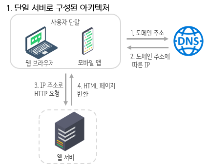
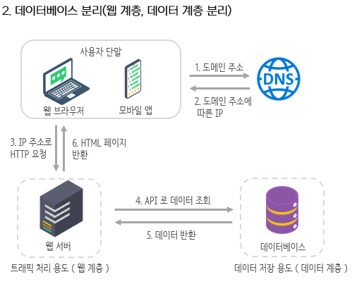
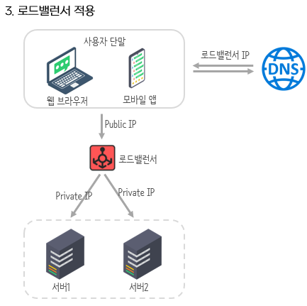
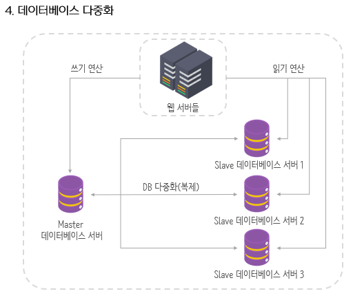
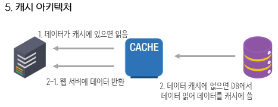
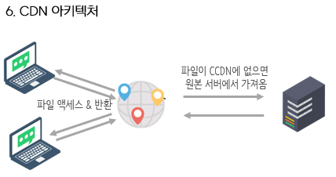
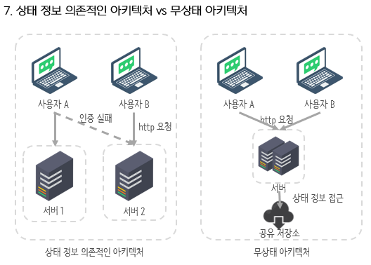

# 1장. 사용자 수에 다른 규모 확장성

## 단일 서버

> 단일 서버
- 모든 컴포넌트가 단 한 대의 서버에서 실행되는 간단한 시스템
> 

### [ 시스템 구조 ]

- **사용자 요청 처리 흐름**
    1. 도메인 이름을 이용해 웹사이트 접속
        
        → 접속을 위해선 도메인 이름을 도메인 이름 서비스(DNS)에 질의해 IP로 변환
        
        → DNS는 보통 제3 사업자가 제공하는 유료 서비스 사용함
        
    2. DNS 조회 결과로 IP 반환
    3. 해당 IP 주소로 HTTP 요청 전달
    4. 요청을 받은 웹 서버는 HTML 페이지나 JSON  형태의 응답 반환
- **사용자 요청이 오는 단말 종류**
    - 웹 애플리케이션
        
        → 비즈니스 로직, 데이터 저장 등을 처리하기 위해 서버 구형용 언어를 사용
        
        → 프로젠테이션 용으로는 클라이언트 구현용 언어 사용
        
    - 모바일 앱
        
        → 모바일 앱과 웹 서버 간 통신을 위해 HTTP 프로토콜 이용
        
        → HTTP 프로토콜을 통해 반환될 응답 데이터의 포맷은 보통 JSON
        

## 데이터 베이스

- 서버를 용도에 따라 분리해 독립적으로 확장해 나갈 수 있게 함
    - 웹, 모바일 트래픽 처리 서버 = 웹 계층
    - 데이터베이스 서버 = 데이터 계층

### [ 데이터베이스 종류 ]

- 관계형 데이터베이스
    - MySQL, 오라클 데이터베이스, PostgreSQL 등
    - 관리 시스템이라고도 부름 (RDBMS)
    - 자료를 테이블과 열, 칼럼으로 표현함
    - SQL을 사용하면 여러 테이블에 있는 데이터를 그 관계에 따라 조인하여 합칠 수 있음
- 비 관계형 데이터베이스
    - CouchDB, HBase, Amazon DynamoDB, Neo4j 등
    - 네 부류로 나눌 수 있음 (키-값 저장소, 그래프 저장소, 칼럼 저장소, 문서 저장소)
    - 일반적으로 조인을 지원하지 않음
- 비 관계형 데이터베이스가 바람직한 선택의 경우
    - 아주 낮은 응답 지연시간(latency)이 요구됨
    - 다루는 데이터가 비정형이라 관계형이 아님
    - 뎅디터를 직렬화하거나 역직렬화 할 수 있기만 하면 됨
    - 아주 많은 양의 데이터를 저장할 필요가 있음

## 수직적 규모 확장 vs 수평적 규모 확장

- 수직적 규모 확장
    - 스케일 업으로 서버에 고사양 자원을 추가하는 행위
    - 서버로 유입되는 트래픽의 양이 적을 때 좋은 선택 (단순하기 때문)
- 수평적 규모 확장
    - 스케일 아웃으로 더 많은 서버를 추가하여 성능을 개선하는 행위

### [ 수직적 규모 확장의 단점 ]

- 확장에 한계가 있음
    - 한 대의 서버에 CPU나 메모리 무한대로 증설할 방법 없음
- 장애에 대한 자동복구 방안이나 다중화 방안을 제시하지 않음
    - 서버에 장애 발생 시 서비스 완전히 중단

### [ 로드밸런서 ]

> 로드밸런서
- 부하 분산 집합에 속한 웹 서버들에게 트래픽 부하를 고르게 분산하는 역할
- 웹 서버의 자동복구, 다중화 지원하는 구성
> 

1. 사용자는 로드밸런서의 공개 IP 주소로 접속
    
    → 웹 서버는 클라이언트의 접속을 직접 처리하지 않음
    
2. 보안을 위해, 로드밸런서와 서버 간 통신에는 사설 IP 주소로 접속
    
    > 사설 IP 주소
    - 같은 네트워크에 속한 서버 사이의 통신에만 쓰일 수 있는 IP주소로, 인터넷을 통해서 접속 불가능
    > 
- 장애 자동복구하지 못하는 문제 해결 가능 ( 웹 계층의 가용성 향상)
    - 서버1이 다운
        
        → 모든 트래픽 서버 2로 전송되고, 부하 나누기 위해 새로운 서버 추가 가능
        
    - N대의 서버로 트래픽 감당 어려움
        
        → 로드밸런서가 있으므로 웹 서버 계층에 서버를 추가하면 자동적으로 트래픽 분산해줌
        

### [ 데이터베이스 다중화 ]

> 데이터베이스 다중화
- 많은 데이터베이스 관리 시스템이 다중화를 지원한다. 보통은 서버 사이에 주(master)-부(slave) 관계를 설정하고 데이터 원본은 주 서버에, 사본은 부 서버에 저장하는 방식
- 데이터베이스 서버의 자동복구, 다중화 지원하는 구성
> 
- 쓰기 연산 ( write operation )
    
    → insert, delete, update 연산은 마스터에서만 지원
    
    → 슬레이브는 마스터에게서 사본을 전달 받음
    
- 읽기 연산 ( read operation )
    
    → 마스터, 슬레이브에서 지원
    
    → 대부분의 애플리케이션은 읽기 연산의 비중이 더 높기 때문에 슬레이브 서버가 더 많음
    

- 데이터베이스 다중화의 장점
    - 더 나은 성능 ( 병렬로 처리될 수 있는 질의수가 늘어남 )
    - 안정성 ( 데이터를 지역적으로 떨어진 여러 장소에 다중화 가능 )
    - 가용성 ( 데이터를 여러 지역에 복제해, 장애 발생해도 서비스 지속 가능 )
- 장애 자동복구하지 못하는 문제 해결 가능
    - 부 서버 한 대 일 때, 부 서버 한 대 다운
        
        → 읽기 연산은 한시적으로 모두 주 데이터베이스에 전달 후, 즉시 새로운 부 데이터베이스가 장애 서버 대체
        
    - 부 서버 여러 대 일 때, 부 서버 한 대 다운
        
        → 읽기 연산은 나머지 부 데이터베이스 서버들로 분산 후, 새로운 부 데이터베이스 서버가 장애 서버 대체
        
    - 마스터 서버 다운 시, 부 서버 한대
        
        → 부 데이터베이스 서버가 새로운 주 서버로 승격 후, 모든 연산 주 서버에서 일시적 실행 후 새로운 부 서버 추가
        
        → 이때, 없는 데이터는 복구 스크립트를 돌리고, 다중 마스터나 원형 다중화 방식을 도입하면 도움됨
        

## 캐시

> 캐시
- 값비싼 연산 결과 또는 자주 참조되는 데이터를 메모리 안에 두고, 뒤 이은 요청이 보다 빨리 처리될 수 있도록 하는 저장소
- 응답 시간을 개선할 수 있음
> 

- 애플리케이션의 성능은 데이터베이스를 얼마나 자주 호출하느냐에 크게 좌우되는데, 이를 캐시가 해결 가능

### [ 캐시 계층 ]

> 캐시 계층(cache tier)
- 데이터가 잠시 보관되는 곳으로 데이터베이스보다 훨씬 빠름
> 
- 장점
    - 데이터베이스의 부하를 줄일 수 있음
    - 캐시 계층의 규모를 독립적으로 확장시키는 것 가능
- 캐시 전략
    - 캐시할 데이터 종류, 크기, 액세스 패턴에 맞는 캐시 전략 선택하면 됨
- 캐시 서버 이용 방법
    - 대부분의 캐시 서버들이 일반적으로 널리 쓰이는 프로그래밍 언어로 API 제공함

### [ 캐시 사용 시 유의할 점 ]

- 캐시는 어떤 상황에 바람직한가?
    
    → 데이터 갱신은 자주 일어나지 않지만, 참조가 빈번하게 일어나는 상황
    
- 어떤 데이터를 캐시에 두어야 하는가?
    
    → 영속적으로 보관할 데이터는 적합하지 않음 (중요한 데이터는 지속적 저장소에 두기)
    
    - 캐시 = 데이터를 취발성 메모리에 둠 = 캐시 서버가 재시작되면 캐시 내의 모든 데이터는 사라짐
- 캐시에 보관된 데이터는 어떻게 만료 되는가?
    
    → 관련한 정책을 마련해, 만료된 데이터는 캐시에서 삭제되어야 함
    
    - 만료 기한 너무 짧음 : 데이터베이스 너무 자주 읽게 됨
    - 만료 기한 너무 김 : 데이터가 원본과 차이가 날 가능성 높아짐
- 일관성은 어떻게 유지되는가?
    
    → 저장소의 원본을 갱싱하는 연산과 캐시를 갱신하는 연산이 단일 트랜잭션으로 이루어져야함
    
    > 일관성 : 데이터 저장소의 원본과 캐시 내의 사본이 같은지 여부
    > 
- 장애에는 어떻게 대처할 것인가?
    
    → SPOF를 피하귀 위해 여러 지역에 걸쳐 캐시 서버 분산해 장애 발생 피해야함
    
    - 캐시 서버를 한 대만 두는 경우 해당 서버는 단일 장애 지점(SPOF)가 됨
        
        > SPOF  : 어떤 특정 지점에서의 장애가 전체 시스템의 동작을 중단시켜버릴 수 있는 경우
        > 
- 캐시 메모리는 얼마나 크게 잡을 것이가?
    
    → 캐시 메모리는 과할당 해야함
    
    - 캐시 메모리가 작으면 액세스 패턴에 따라 데이터가 자주 캐시에서 밀려나버림
- 데이터 방출 정책은 무엇인가?
    
    > 데이터 방출 정책 : 캐시가 다 차면 추가로 캐시 데이터를 넣기 위해 기존 데이터 내보냄
    > 
    - LRU(Least Recently Used) : 마지막으로 사용된 시점이 가장 오래된 데이터 내보내는 정책
    - LFU(Least Frequently Used) : 사용된 빈도가 가장 낮은 데이터를 내보내는 정책
    - FIFO(First in First Out) : 가장 먼저 캐시에 들어온 데이터를 가장 먼저 내보내는 정책
    
    → 방출 정책은 경우에 맞게 적용 가능
    

## 콘텐츠 전송 네트워크(CDN)

> CDN
- 정적 콘텐츠를 전송하는 데 쓰이는, 지리적으로 분산된 서버의 네트워크로 이미지, 비디오, CSS, JavaScript 파일 등을 캐시할 수 있다.
> 

### [ CDN 동작 방식 ]

1. 사용자 웹사이트 방문 해 정적 콘텐츠 접근 (이미지 URL 등)
    
    → 해당 URL의 도메인은 CDN 서비스 사업자가 제공함
    
2. CDN 서버의 캐시에 해당 파일 없을 경우, 원본 서버에 요청해 파일 가져옴
    
    → 원본 서버 = 웹 서버 or 온라인 저장소(AWS S3)
    
3. 원본 서버가 파일을 CDN 서버에 반환
    
    → 응답 HTTP 헤더에 해당 파일의 캐시 만료 정보(TTL) 값 같이 전달
    
4. CDN 서버는 파일을 캐싱
    
    → 해당 파일은 TTL에 명시된 시간까지 유효함
    
    → 만료 전까지는 같은 파일 요청에 대해 캐시를 통해 처리함
    
5. 사용자에게 가장 가까운 CDN 서버가 정적 콘텐츠 사용자에게 전달
    - 사용자와 CDN 서버 가까움 = 웹 사이트 빠르게 로딩
    - 사용자와 CDN 서버 멈 = 웹 사이트 천천히 로딩

### [ CDN 사용 시 고려해야 할 사항 ]

- 비용
    - CDN은 보통 제3 사업자에 의해 운영되어, CDN으로 발생하는 데이터 전송에 따라 요금 나옴
- 적절한 만료 시한 설정
    - 만료 시점이 길면 콘텐츠의 신선도는 떨어지고, 짧으면 원본 서버에 빈번한 접속이 발생함
- CDN 장애에 대한 대처 방안
    - CDN 자체가 죽었을 경우, 서비스가 어떻게 동작해야 하는지 고려해야 함
- 콘텐츠 무효화(invaildation) 방법
    - 만료되지 않은 콘텐츠를 CDN에서 제거하는 방법 필요
        - CDN 서비스 사업자가 제공하는 API 이용해 콘텐츠 무효화
        - 오브젝트 버저닝 이용

## 무상태(stateless) 웹 계층

- 웹 계층을 수평적으로 확장하기 위해선 상태 정보를 웹 계층에서 제거해야 함

> 무상태 웹 계층
- 상태 정보를 웹 계층(서버)에서 분리해 관계형 데이터베이스나 NoSQL 같은 지속성 저장소에 보관하고, 필요할 때 가져오는 것
> 

### [ 상태 정보 의존적인 아키텍처 ]

- 상태를 보관하는 서버 = 클라이언트 정보를 상태를 유지하여 요청들 사이에 공유되도록 함
    
    → 같은 사용자의 HTTP 요청은 항상 같은 서버로 전송되어야 함
    
- 로드밸런서의 고정 세션(sticky session) 기능으로 해결가능하지만, 로드밸런서에 부담

### [ 무상태 아키텍처 ]

- 상태 정보는 웹 서버로부터 물리적으로 분리되어 있음
    
    → 사용자로부터의 HTTP 요청은 어떤 웹 서버로도 전달 가능
    
- 상태 정보가 필요할 경우 공유 저장소로부터 데이터 가져옴

## 데이터 센터

> 지리적 라우팅
- 장애가 없는 상황에서 사용자는 가장 가까운 데이터 센터로 안내됨
> 

> geoDNS
- 사용자의 위치에 따라 도메인 이름을 어떤 IP 주소로 변환할지 결정할 수 있도록 해주는 DNS 서비스
> 
- 다중 데이터 센터 중 장애 발생 시, 모든 트래픽은 장애가 없는 데이터 센터로 전송

### [ 다중 데이터 센터 기술적 난제 ]

- 트래픽 우회
    
    → 올바른 데이터 센터로 트래픽을 보내는 효과적인 방법 찾아야 함
    
    → GeoDNS도 하나의 예시
    
- 데이터 동기화
    
    → 데이터 센터 별 별도의 데이터베이스 사용한다면, 장애가 자동으로 복구되어 트래픽 우회 시 데이터 상이할 수 있음
    
    → 데이터를 여러 데이터센터에 걸쳐 다중화 해야 함
    
- 테스트와 배포
    
    → 웹 사이트 또는 애플리케이션을 여러 위치에서 테스트 필요
    
    → 자동화된 배포 도구 사용하면 모든 데이터 센터에 동일한 서비스가 설치 될 수 있음
    

## 메시지 큐

> 메시지 큐
- 메시지의 무손실(메시지  큐에 보관된 메시지는 소비자가 꺼낼 때까지 안전히 보관한다는 특성)을 보장하는, 비동기 통신을 지원하는 컴포넌트
- 메시지의 버퍼 역할을 하며, 비동기적으로 메시지 전송
> 
- 장점
    - 규모확장성 보장 : 서비스 또는 서버 간 결합이 느슨해짐
    - 생산자 : 소비자 프로세스가 다운되어 있어도 메시지 발행 가능
    - 소비자 : 생산자 서비스가 가용한 상태가 아니더라도 메시지 수신 가능

### [ 메시지 큐 기본 아키텍처 ]

1. 생산자(발행자) 라는 입력 서비스가 메시지 생성해 메시지 큐에 발행함
2. 큐에 연결된 소비자(구독자) 서버 or 서비스는 메시지를 받아 그에 맞는 동작 수행함

→ 시간이 오래 걸릴 수 있는 프로세스는 비동기적으로 처리

## 로그, 메트릭 그리고 자동화

- 로그
    - 시스템의 오류와 문제들을 쉽게 찾기 위한 에러 모니터링 중요
    - 에러 로그 : 서버 단위도 좋지만, 단일 서비스로 모아주는 도구 활용하기
- 메트릭
    - 잘 수집 시, 사업 현황에 관한 유용한 정보, 시스템의 현재 상태 손쉽게 파악 가능
    - 호스트 단위 메트릭(CPU, 메모리), 종합 메트릭(DB 성능, 캐시 성능), 핵심 비즈니스 메트릭(재방문 등)
- 자동화
    - 생상성 높이기 위해 지속적 통합을 도와주는 도구 필요
    - 빌드, 테스트, 배포 등의 절차 자동화 해야 함

## 데이터베이스의 규모 확장

- 두 가지 접근법 존재
    - 수직적 규모 확장법
    - 수평적 규모 확장법

### [ 수직적 확장 ]

- 기존 서버에 더 많은, 또는 고성능의 자원을 증설하는 방법
- 단점
    - 데이터베이스 서버 하드웨어에는 한계가 있음 → 무한 증설 불가
    - SPOF(Single Point Of Failure)로 인한 위험성 큼
    - 비용이 많이 듦

### [ 수평적 확장 ]

- 데이터베이스의 수평적 확장은 샤딩이라고 부르고, 더 많은 서버를 추가함으로써 성능 향상

> 샤딩
- 대규모 데이터베이스를 샤드(shard)라고 부르는 작은 단위로 분할하는 기술로 데이터베이스 규모 확장을 실험하는 기술
- 모든 샤드는 같은 스키마를 쓰지만 샤드에 보관되는 데이터 상에는 중복이 없음
> 
- 샤딩 전략 구현 시 샤딩 키를 어떻게 정하느냐 가장 중요
    
    > 샤딩 키(sharding key)
    - 파티션 키라고도 부루며, 데이터가 어떻게 분산될지 정하는 하나 이상의 칼럼으로 구성됨
    > 
    - 샤딩 키를 통해 올바른 데이터베이스에 질의를 보내어 데이터 조회나 변경 처리하므로 효율 높임
- 샤딩 사용 시 문제점
    - 데이터의 재 샤딩
        
        → 재 샤딩이 필요한 경우 존재 (데이터 많아져서 하나의 샤드로 감당 불가) (샤드 간 데이터 분포 균등하지 못해, 공간 소모 진행 속도가 다를 때 = 샤드 소진)
        
        → 해결 위해선, 샤드 키를 계산하는 함수 변경 후, 데이터 재 배치 필요
        
    - 유명인사 문제
        
        → 핫스팟 키 문제라도고 불리며, 특정 샤드에 질의가 집중되어 서버에 과부하 걸리는 문제
        
    - 조인과 비정규화
        
        → 여러 샤드에 걸친 데이터를 조인하는 것 어려움
        
        → 해결 위해선, 데이터베이스를 비정규화해 하나의 테이블에서 질의 수행
        

## 백만 사용자, 그리고 그 이상

> 시스템의 규모를 확장하는 것은 지속적이고 반복적인 과정
> 
- 웹 계층은 무상태 계층으로
- 모든 계층에 다중화 도입
- 가능한 한 많은 데이터 캐시할 것
- 여러 데이텉 센터를 지원할 것
- 정적 콘텐츠는 CDN을 통해 서비스할 것
- 데이터 계층은 샤딩을 통해 그 규모를 확장할 것
- 각 계층은 독립적 서비스로 분화할 것
- 시스템을 지속적으로 모니터링하고, 자동화 도구들을 활용할 것
