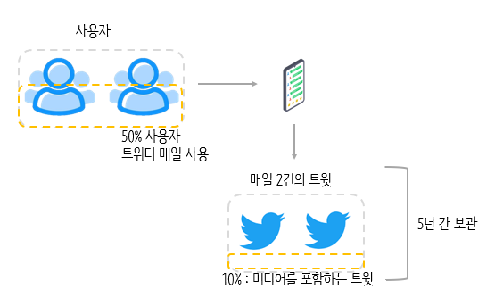

# 2장. 개략적인 규모 추정

> 개략적인 규모 추정
-  보편적으로 통용되는 성능 수치상에서 사고 실행을 행하여 추정치를 계산하는 행위
- 어떤 설계가 요구사항에 부합할 것이지 보기 위한 것
> 
- 개략적 규모 추정 효과적으로 해내기 위해선, 규모 확장성을 표한하는 데 필요한 기본기에 능숙해야 함
    - 2의 제곱수
    - 응답 지연 값
    - 가용성에 관계된 수치들

## 2의 제곱수

- 데이터 볼륨의 단위를 2의 제곱수로 표현
    - 최소 단위 : 1Byte(8bit)
    - ASCII 문자 하나 : 1Byte

## 응답지연 값

- 구글의 제프 딘이 공개한 통상적이 컴퓨터에서 구현된 연산들의 응답지연 값

→ 메모리는 빠르지만 디스크는 아직도 느리다.

→ 디스크 탐색은 가능한 한 피하라.

→ 단순한 압축 알고리즘은 빠르다.

→ 데이터를 인터넷으로 전송하기 전에 가능하면 압축하가.

→ 데이터 센터는 보통 여러 지역에 분산되어 이쏙, 센터들 간에 데이터를 주고받는 데는 시간이 걸린다.

## 가용성에 관계된 수치들

> 고가용성(high availability)
- 시스템이 오랜 시간 동안 지속적으로 중단 없이 운영될 수 있는 능력을 지칭하는 용어
- 표현하는 값 : 퍼센트
> 
- 고가용성이 100 % = 시스템이 단 한 번도 중단된 적이 없었음
    - 대부분의 서비스 99% ~ 100% 유지

> SLA(Service Level Agreement)
- 서비스 사업자가 보편적으로 사용하는 용어로, 서비스 사업자와 고객 사이에 맺어진 합의를 의미
> 
- 서비스 사업자가 제공하는 서비스의 가용시간이 공식적으로 합의되어 있음

### [ 개수와 시스템 장애시간 사이의 관계 ]

## 예제 : 트위터 QPS와 저장소 요구향 추정

### [ 가정 ]

- 월간 능동 사용자 = 3억명
- 50%의 사용자가 트위터 매일 사용
- 평균적으로 각 사용자는 매일 2건의 트윗을 올림
- 미디어를 포함하는 트윗은 10%
- 데이터는 5년 보관

### [ 추정 ]

- QPS(Query Per Second) 추정치
    - 일간 능동 사용자 = `3억명 * 50% = 1.5억`
    - QPS = `1.5억 * 2트윗 / 24시간 / 3600초 = 3500`
        - 최대 QPS = `2 * QPS = 700`
- 미디어 저장을 위한 저장소 요구량
    - 평균 트윗 크기
        - tweet_id : `64Byte`
        - text : `140Byte`
        - media : `1MB`
    - `1.5억 * 2(트윗) * 10% * 1MB = 30TB/일`
        
        > 일간 능동 사용자(1.5억) * 트윗 갯수(2개) * 미디어를 포함하는 트윗(10%) * media 크기(1MB)
        > 
- 5년간 미디어 보관을 위한 저장소 요구량
    - `30TB * 365 * 5 = 55PB`
        
        > 미디어 저장을 위한 저장소 요구량(30TB) * 1년(365) * 5
        > 

## 팁

- 개략적인 규모 추정과 관계된 면접 = 올바른 절차를 밟느냐가 결과를 내는 것보다 중요!
- 단위를 붙이는 습관 들이기
- 개략적 규모 추정 문제는 QPS, 최대 QPS, 저장소 요구량, 캐시 요구량, 서버 수 등을 추정하는 것