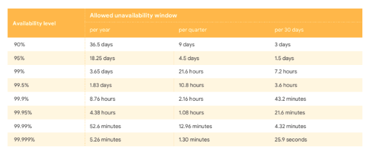

# 02장. 개략적인 규모 추정

확장성을 표현하는 데 필요한 기본기에 능숙해야 한다.

- 2의 제곱수
- 응답지연(latency) 값
- 가용성에 관계된 수치들

# 2의 제곱수

- 2^10 = 1천(thousand) = 1킬로바이트(Kilobyte) = 1KB
- 2^20 = 1백만(million) = 1메가바이트(Megabyte) = 1MB
- 2^30 = 10억(billion) = 1기가바이트(Gigabyte) = 1GB
- 2^40 = 1조(trillion) = 1테라바이트(Terabyte) = 1TB
- 2^50 = 1000조(quadrillion) = 1페타바이트(Petabyte) = 1PB

# 모든 프로그래머가 알아야 하는 응답지연 값

- 메모리는 빠르지만 디스크는 아직도 느리다.
- 디스크 탐색(seek)은 가능한 한 피하라.
- 단순한 압축 알고리즘은 빠르다.
- 데이터를 인터넷으로 전송하기 전에 가능하면 압축하라.
- 데이터 센터는 보통 여러 지역에 분산되어 있고, 센터들 간에 데이터를 주고받는 데는 시간이 걸린다.

# 가용성에 관계된 수치들

- 고가용성
    - 시스템이 오랜 시간 동안 지속적으로 중단 없이 운영될 수 있는 능력
    - 퍼센트 단위로 표현한다.
        - 100%: 한 번도 중단된 적이 없었음
        - 대부분의 서비스는 99%~100%



# 예제: 트위터 QPS와 저장소 요구량 추정

- 가정
    - MAU는 3억명
    - 50% 사용자가 매일 사용
    - 평균적으로 사용자는 매일 2건의 트윗을 올린다.
    - 이 중 미디어를 포함하는 트윗은 10%
    - 데이터는 5년간 보관된다.
- 추정
    - QPS(Query Per Second) cnwjdcl
        - 일간 능동 사용자(DAU)=3억*50%=1.5억(150million)
        - QPS=1.5억*2트윗 / 24시간 / 3600초 = 약 3500
          
            ```
            Q. 읽기 쿼리는 제외하고 Insert 쿼리만 계싼하는 것인가?
            ```
            
        - 최대 QPS = 2 * QPS = 약 7000
          
            ```
            Q. 원래 최대 QPS를 구할 때에는 *2를 하는건가?
            ```
        
    - 미디어 저장을 위한 저장소 요구량
        - 평균 트윗 크기
            - tweet_id에 64바이트
            - 텍스트에 140바이트
            - 미디어에 1MB
        - 미디어 저장소 요구량: 1.5억 * 2(하루에 올리는 트윗) * 10% * 1MB = 30TB/일
        - 5년간 미디어를 보관하기 위한 저장소 요구량: 30TB*365*5 = 약 55PB
    
    # 팁
    
    - 면접장에서 복잡한 계산은 어렵다. 그러니 적절한 근사치로 시간을 절약하자
        - 99987 / 9.1 (X)
        - 100000 / 10 (O)
    - 가정들은 나중에 살펴볼 수 있도록 적어두자
    - 단위를 붙여라. 5라고 적으면 KB인지 MB인지 알 수 없다.
    - 많이 출제되는 규모 추정 문제
        - QPS
        - 최대 QPS
        - 저장소 요구량
        - 캐시 요구량
        - 서버 수