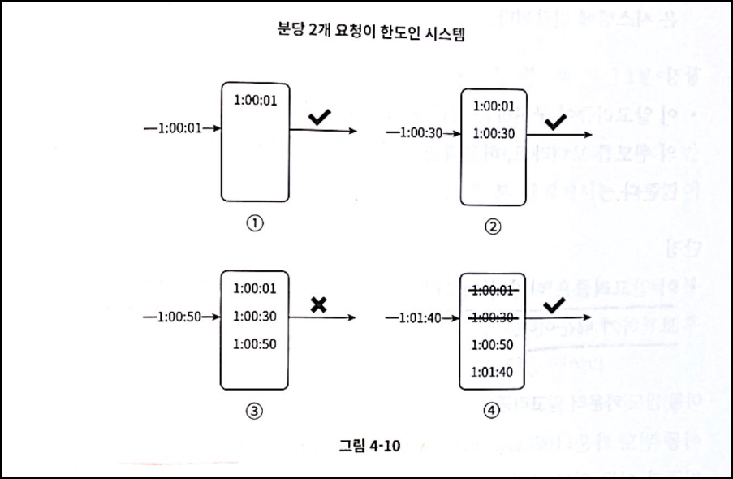

# 4장. 처리율 제한 장치의 설계

> 처리율 제한 장치(reate limiter)
- 클라이언트 또는 서비스가 보내는 트래픽의 처리율(rate)를 제어하기 위한 장치
> 
- 사용자는 초당 2회 이상 새 글을 올릴 수 없다.
- 같은 IP 주소로는 하루에 10개 이상의 계정을 생성할 수 없다.
- 같은 디바이스로는 주당 5회 이상 리ㅝ드를 요청할 수 없다.

### [ API에 처리율 제한 장치 두었을 때의 장점 ]

- DoS(Denial of Service) 공격에 의한 자원 고갈을 방지할 수 있다.
    - 추가 요청에 대해서는 처리를 중단함으로써 DoS 공격을 방지함
- 비용을 점감한다.
    - 우선순위가 높은 API에 더 많은 자원 할당 가능
    - 처리율 제한은 제 3자(third-party) API에 사용료를 지불하고 있는 회사들에게 좋음
- 서버 과부하를 막음
    - 사용자의 잘못된 이용 패턴으로 유발된 트래픽 걸러냄

## 1단계 문제 이해 및 설계 범위 확정

### [ 요구사항 ]

- 어디 처리율 제한 장치를 설계해야할까?
    - 클라이언트
    - 서버
- 어떤 기준으로 설계할까?
    - IP 주소
    - 사용자 ID
    - 그 외 다양한 형태의 제어 규칙
- 시스템 규모?
    - 스타트업
    - 큰 기업
- 처리율 제한 장치는 어떤 서비스?
    - 독립된 서비스
    - 애플리케이션 코드에 포함
- 면접 시 키 포인트
    - 설정된 처리율을 초과하는 요청은 정확하게 제한
    - 가능한 한 적은 메모리 사용
    - 낮은 응답시간
        
        ```
        🤵 면접관 : 서버측 API를 위한 장치를 설계합니다.
        ```
        
    - 분산형 처리율 제한
        
        ```
        🤵 면접관 : 시스템은 분산환경에서도 동작해야 합니다.
        ```
        
    - 예외 처리
        
        ```
        🤵 면접관 : 사용자의 요청이 처리율 제한 장치에 의해 걸러진 경우 사용자에게 사실을 알려야 합니다.
        ```
        
    - 높은 결함 감내성
        
        ```
        🤵 면접관 : 설계할 시스템은 대규모 요청을 처리할 수 있어야 합니다.
        ```
        

## 2단계 개략적 설계안 제시 및 동의 구하기

- 기본적인 클라이언트-서버 통신 모델 사용

### [ 처리율 제한 장치는 어디에 둘 것인가? ]

- 클라이언트 측
    - 클라이언트는 처리율 제한을 안정적으로 걸 수 있는 장소 X
    - 요청이 쉽게 위변조 가능해, 모든 클라이언트의 구현 통제 어려움
- 서버 측
    - 서버 측에 처리율 제한 장치를 두는 방법
        
        
        
    - 처리율 제한 장치를 API 서버 말고, 미들웨어로 만들어 API 서버로 가는 요청 통제하는 방법
        
        
        
        → 보통, API 게이트웨이 컴포넌트에 구현됨
        
        > API 게이트웨이 (gateway)
        - 처리율 제한, SSL 종단, 사용자 인증, IP 허용 목록 관리 등을 지원하는 완전 위탁관리형 서비스로, 클라우드 업테가 유지 보수를 담당하는 서비스
        > 
- 일반적으로 적용 가능한 지침
    - 현재 사용하고 있는 기술 스택 점검 해, 서버 측 구현을 지원하기 가능한 효율인지 확인
    - 사업에 맞는 처리율 제한 알고리즘 선택 (제3 사업자 제공 게이트웨이 사용 시 선택지 제한)
    - API 게이트웨이가 설계에 있다면 처리율 제한 기능 또한 게이트웨이에 포함
    - 구현하기에 충분한 인력 없다면 상용 API 게이트웨이 사용

### [ 처리율 제한 알고리즘 ]

> 처리율 제한 알고리즘의 기본 아이디어
- 얼마나 많은 요청이 접수되었는지를 추적할 수 있는 카운터를 추적 대상별로 두고, 카운터의 값이 어떤 한도를 넘어서면 한도를 넘어 도착한 요청은 거부하는 것
> 
- 토큰 버킷 알고리즘 (token bucket)
- 누출 버킷 알고리즘  (leaky bucket)
- 고정 윈도 카운터 (fixed window counter)
- 이동 윈도 로그 (sliding window log)
- 이동 윈도 카운터 (sliding window counter)

### ( 토큰 버킷 알고리즘 )


- 처리율 제한에 폭넓게 이용되며 간단하고, 알고리즘에 대한 세간의 이해도가 높음 편
- 동작 원리
    
    ```
    사전 정보
    - 토큰 버킷 = 지정된 용량을 갖는 컨테이너
    - 버킷에는 사전 설정된 양의 토큰이 주기적으로 채워짐
    - 토큰이 꽉 찬 버킷에는 더 이상의 토큰은 추가되지 않음 (추가되는 토큰은 버려짐)
    ```
    
    1. 각 요청은 처리될 떄마다 하나의 토큰 사용
    2. 요청 도착 시 버킷에 충분한 토큰 존재 검사
    3. 토큰 존재 : 버킷에서 토큰 꺼낸 후 요청을 시스템에 전달
    4. 토큰 비 존재 : 요청 버려짐 (dropped)
- 알고리즘 사용 인자
    - 버킷 크기 : 버킷에 담을 수 있는 코튼의 최대 개수
        
        → 공급 제한 규칙에 따라 버킷 개수 달라짐
        
    - 토큰 공급률 (refill rate) : 초당 몇 개의 토큰이 버킷에 공급되는가
- 장점
    - 구현이 쉬움
    - 메모리 사용 측명에서 효율적
    - 짧은 시간 집중되는 트래픽 처리 가능
- 단점
    - 버킷 크기와 토큰 공급률 인자 적절하게 튜닝 까다로움

### ( 누출 버킷 알고리즘 )


- 토큰 버킷 알고리즘과 비슷하지만 요청 처리율이 고정되어 있다는 점이 다름
- 동작 원리
    
    ```
    사전 정보
    - 보통 FIFO 큐로 구현
    ```
    
    1. 요청 도착 시 큐 사이즈 확인
        1. 빈자리가 있는 경우 : 큐에 요청 추가
        2. 큐가 가득 차 있는 경우 : 새 요청 버림
    2. 지정된 시간마다 큐에서 요청을 꺼내어 처리
- 알고리즘 사용 인자
    - 버킷 크기 : 큐 사이즈와 같은 값 ( 큐에는 처리될 항목들이 보관됨)
    - 처리율 (outflow rate) : 지정된 시간당 몇 개의 항목을 처리할지 지정하는 값 (보통 초 단위)
- 장점
    - 큐의 크기 제한되어 있어, 메모리 사용량 측면에서 효율적
    - 고정된 처리율 갖고 있어, 안정적 출력(stable outflow rate) 필요한 경우 적합
- 단점
    - 단시간에 많은 트래픽은 큐에 오래된 요청 쌓이게 되고, 요청 처리 못해 최근 요청 버려짐
    - 두 개의 인자, 올바르게 튜닝 까다로움

### ( 고정 윈도 카운터 알고리즘 )


- 동작 방식
    1. 타임라인을 고정된 간격의 윈도로 나누고, 각 윈도마다 카운터 붙임
    2. 요청이 접수될 때마다 카운터의 값 1씩 증가
    3. 카운터의 값이 사전에 설정된 임계치에 도달 시, 새로운 요청 새 윈도가 열릴 때 까지 버림
- 장점
    - 메모리 효율이 좋음
    - 이해하기 쉬움
    - 윈도가 닫히는 시점에 카운터 초기화 하는 방식 = 특정한 트래픽 패턴 처리하기에 적합
- 단점
    - 윈도 경계 부근에 일시적으로 많은 트래픽 몰릴 경우, 시스템의 처리 한도보다 많은 양 요청 처리됨

### ( 이동 윈도 로깅 알고리즘 )



- 고정 윈도 카운터 알고리즘의 한계 극복
- 동작 원리
    1. 요청의 타임스탬프를 추적해 레디스의 정렬 집합 같은 캐시에 보관
    2. 새 요청 오면, 만료된 타임스탬프 제거
    3. 새 요청의 타임 스탬프를 로그에 추가
        1. 로그의 크기 ≤ 허용치 = 요청 시스템에 전달
        2. 로그의 크기 > 허용치 = 요청 처리 거부
- 장점
    - 처리율 제한 메커니즘 정교하게 구현함
    - 윈도의 허용되는 요청의 개수는 시스템의 처리율 한도 넘지 않음
- 단점
    - 다량의 메모리 사용 (거부된 요청의 타임스탬프도 보관)

### ( 이동 윈도 카운터 알고리즘 )


- 고정 윈도 카운터 알고리즘 + 이동 윈도 로깅 알고리즘
    - 현재 윈도우와 현재 시간을 보고, 들어온 요청의 비율을 따져서 처리할지 판단하는 알고리즘
- 동작 원리
    - `현재 1분간의 요청 수 + 직전 1분간의 요청 수 * 이동 윈도와 직전 1분이 겹치는 비율`
    - 위 `비율`과 처리율 비교 해 응답 버릴 지 결정
- 장점
    - 짧은 시간에 몰리는 트래픽에 잘 대응함 (이전 시간대의 평균 처리율에 따라 현재 윈도 상태 계산 하기 때문)
    - 메모리 효율 좋음
- 단점
    - 요청이 균등하게 분포되어 있다고 가정한 상태에서 추정치를 계산 → 느슨함

### [ 카운터 저장 위치 ]

- 카운터는 메모리상에서 동작하는 캐시에 저장 ( 시간에 기반한 만료 정책 존재 )
    - DB : 디스크 접근으로 느림
    - 캐시 :  TTL 지원으로 적합
- 레디스는 메모리 기반 저장장치로서, INCR과 EXPIRE 명령어 지원 (처리율 제한 장치 구현시 자주 사용)
    - INCR : 메모리에 저장된 카운터의 값을 1만큼 증가시킴
    - EXPIRE : 카운터에 타임아웃 값을 설정 ( 설정한 시간 지나면 카운터 자동으로 삭제 )

### [ 개략적인 아키텍처 ]


- 동작 원리
    1. 클라이언트가 처리율 제한 미들웨어에게 요청 보냄
    2. 레디스의 지정 버킷에서 카운터 가져와 한도 도달 검사
        1. 한도 도달 O : 요청 거부
        2. 한도 도달 X : 요청은 API 서버로 전달
    3. 미들웨어는 카운터의 값 증가 후 다시 레디스에 저장

## 3단계 상세 설계

```
🤔 처리율 제한 규칙은 어떻게 만들어지고 어디에 저장되는가?
🤔 처리가 제한된 요청들은 어떻게 처리되는가?
```

### [ 처리율 제한 규칙 ]

- 보통 설정 파일(configuration file) 형태로 디스크에 저장함

### [ 처리율 한도 초과 트래픽의 처리 ]

- API는 HTTP 429 응답을 클라이언트에게 보냄
    - 클라이언트는 HTTP 응답 헤더에 있는 값을 가지고 처리율 제한 걸리는지 감지 가능
    
    ```
    X-Ratelimit-Remaing : 윈도 내에 남은 처리 가능 요청의 수
    X-Ratelimit-Limit : 매 윈도마다 클라이언트가 전송할 수 있는 요청의 수
    X-RateLimit-Retry-After : 한도 제한에 걸리지 않으려면 몇 초 뒤에 요청을 다시 보내야 하는지 알림.
    ```
    
    → 429 오류를 `X-Ratelimit-Retry-After`헤더와 함께 반환!
    
    →  `X-Forwarded-For` 도 많이 사용함
    
- 경우에 따라, 제한 걸린 메시지 나중에 처리 위해 큐에도 보관 가능

### [ 상세 설계 ]


→ 처리율 제한 규칙 : 디스크에 보관

→ 작업 프로세스 : 수시로 규칙을 디스크에서 읽어 캐시에 저장

1. 클라이언트 요청 서버에 보내면 요청 처리율 제한 미들웨어에 도달
2. 미들웨어는 제한 규칙, 카운터, 마지막 요청의 타임 스탬프 가져옴
    - 제한 규칙 : 캐시
    - 카운터, 마지막 요청 타임 스탬프 : 레디스 캐시
3. 가져온 값들을 근거 해 요청 처리여부 결정
    - 처리율 제한 안 걸림 : API 서버로 요청 보냄
    - 처리율 제한 걸림 : 429 에러를 클라이언트에게 보냄 (메시지 큐에 보관할 수도 있음)

### [ 분산 환경에서의 처리율 제한 장치의 구현 ]

- 경쟁 조건
- 동기화 이슈

→ 시스템 확장 시 여러 대의 서버와 병렬 스레드 지원 시 문제점

### ( 경쟁 조건 )

```
문제점👀 - 카운터 값 증가에 대한 멀티 스레드 간 경쟁 조건 이슈 발생
```

- 해결법
    
    → 락 사용해도 되지만 시스템의 성능 떨어뜨림
    
    - 루아 스크립트
    - 레디스 자료구조 정렬 집합

### ( 동기화 이슈 )

```
문제점👀 - 웹 계층은 무상태이므로 클라이언트는 각기 다른 제한 장치로 요청 보낼 수 있음
```

- 해결법
    - 고정 세션 활용 → 확장 가능하지 않고 유연하지 않아 비추천
    - 레디스와 같은 중앙 집중형 데이터 저장소 사용

### ( 성능 최적화 )

```
문제점👀 - 여러 데이터센터 지원 시 처리율 제한 장치 지연 시간 증가, 데이터 동기화 문제
```

- 해결법
    - 세계 곳곳에 에지 서버(edge server) 심어놓아, 사용자의 트래픽을 가장 가까운 에지 서버로 전달해 지연시간 줄임
    - 제한 장치 간에 데이터 동기화할 떄 최종 일관성 모델 사용

### ( 모니터링 )

- 처리율 제한 자치 설치 후, 효과적 동작 확인 위해 모니터링 필요
    - 채택된 처리율 제한 알고리즘 효과적
    - 정의한 처리율 제한 규칙 효과적
- 비효율적으로 동작 시, 트래픽 패턴 잘 처리 가능한 알고리즘으로 바꾸는 것 고려해야 함

## 4단계 마무리

- 💡 경성(hard) 또는 연성(soft) 처리율 제한
    - 경성 처리율 제한 : 요청의 개수는 임계치를 절대 넘어설 수 없다.
    - 연성 처리율 제한 : 요청 개수는 잠시 동안은 임계치를 넘어설 수 있다.
- 💡 다양한 계층에서의 처리율 제한
    - 물리 계층 : 주어진 채널 및 물리 매개변수에 대해 달성할 수 있는 최대 처리량 제공 (속도와 사용자 경험과는 거리가 멈)
    - 데이터 링크 계층
    - 네트워크 계층 : Iptables사용하면 지정된 범위의 IP 주소에 처리율 제한 적용
    - 전송 계층 : TCP와 같은 전송 프로토콜의 오버헤드 고려
    - 세션 계층 : 심층 패킷 검사를 사용해 필텅링 해 처리율 제한 적용
        
        > 심층 패킷 검사
        - 컴퓨터 네트워크를 통해 전송되는 데이터를 자세히 검사하는 데이터 처리 유형
        > 
    - 표현 계층
    - 애플리케이션 계층 : 지금까지 다룬 내용을 바탕으로 처리율 제한 적용
- 💡 처리율 제한을 회피하는 방법
    - 클라이언트 측 캐시를 사용해 API 호출 횟수 줄임
    - 처리율 제한의 임계치 이해 (짧은 시간 동안 너무 많은 메시지 X)
    - 예외나 에러 처리 코드 도입해 클라이언트 예외적 상황으로부터 복구 가능케
    - 재시도 로직 구현 시 충분한 백오프 시간 주기