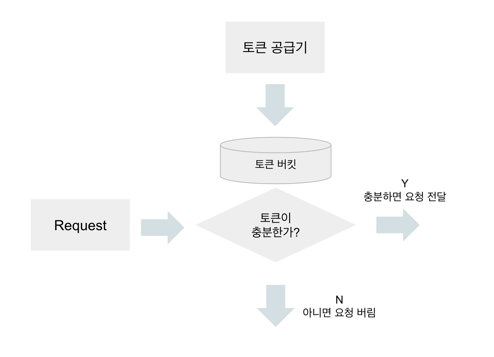
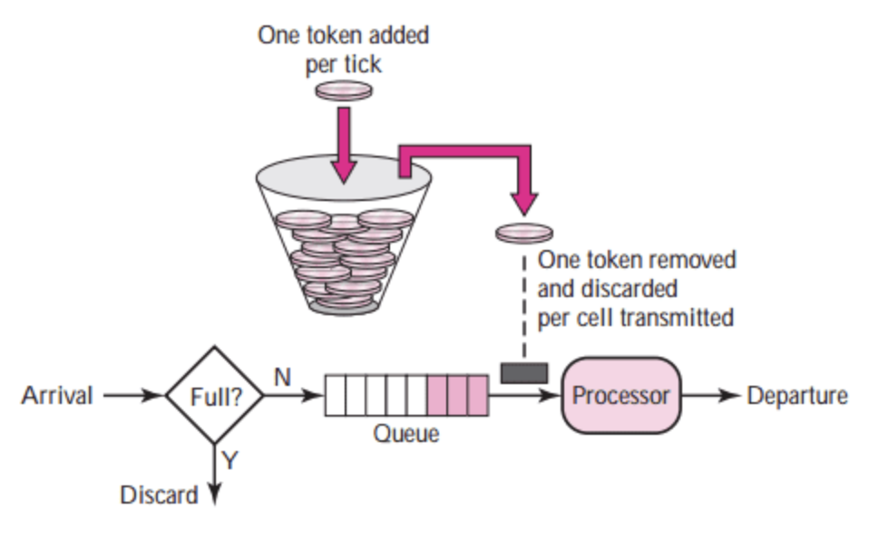
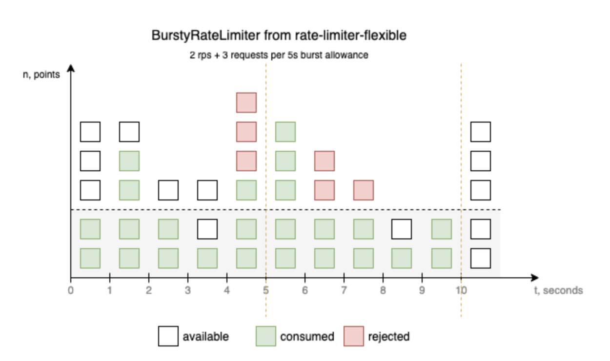
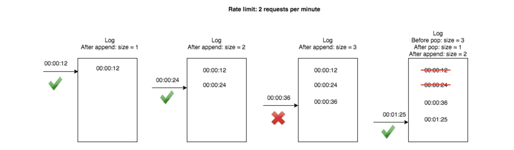
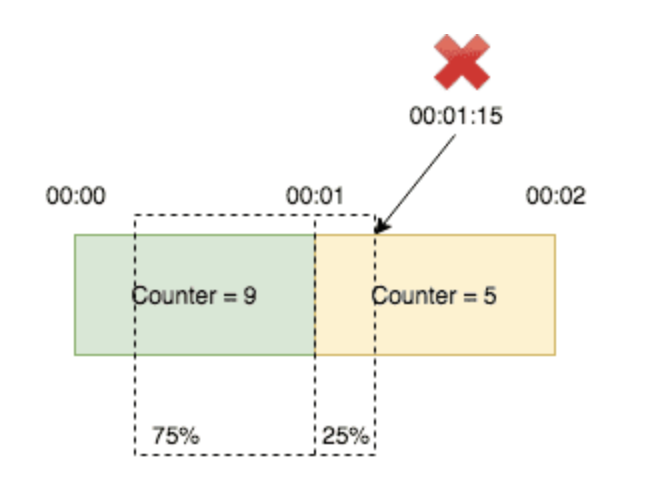

# 04장. 처리율 제한 장치의 설계

> 처리율 제한 장치(rate limiter)는 클라이언트/서비스가 보내는 트래픽의 처리율(rate)을 제어하기 위한 장치이다.
> 

ex.

- 사용자는 초당 2회 이상 새 글을 올릴 수 없다.
- 같은 IP 주소로는 하루에 10개 이상의 계정을 생성할 수 없다.

그렇다면 왜?? 처리율 제한 장치를 두어야할까? 🤔

- 디도스 공격을 방어
- 비용 절감
- 서버 과부하 방어

# 1단계. 문제 이해 및 설계 범위 확정

- 어디 처리율 제한 장치를 설계해야할까?
    - 클라이언트
    - 서버
- 어떤 기준으로 설계할까?
    - IP 주소
    - 사용자 ID
    - 그 외 다양한 형태의 제어 규칙
- 시스템 규모?
    - 스타트업
    - 큰 기업
- 처리율 제한 장치는 어떤 서비스?
    - 독립된 서비스
    - 애플리케이션 코드에 포함

책에 나온 요구사항...

- 설정된 처리율을 초과하는 요청은 정확하게 제한한다.
- 낮은 응답시간: 처리율 제한 장치는 HTTP 응답시간에 나쁜 영향을 주면 안 된다.
- 가능한 한 적은 메모리를 써야 한다.
- 분산형 처리율 제한: 하나의 처리율 제한 장치를 여러 서버, 프로세스에서 공유할 수 있어야 한다.
- 예외 처리: 요청이 제한되었을 때는 그 사실을 사용자에게 분명하게 보여주어야 한다.
- 높은 결함 감내성: 제한 장치에 장애가 생기더라도 전체 시스템에 영향을 주어서는 안 된다.

# 2단계. 개략적 설계안 제시 및 동의 구하기

## 어디에 둘 것인가?

- 클라이언트
    - 쉽게 위변조가 가능하다.
    - 모든 클라이언트의 구현을 통제하는 것도 어렵다.
- 서버
- API 앞에 둠 (미들웨어)

→ 보통은 API Gateway에 구현된다. 단, 현재 상황에 따라 달라질 수도 있다.

## 처리율 제한 알고리즘

- 토큰 버킷(token bucket)
    - 폭넓게 이용된다.
    - 토큰 버킷은 지정된 용량을 갖는 컨테이너이다. 여기에는 사전 설정된 양의 토큰이 주기적으로 채워지고, 꽉차면 더 이상 토큰이 추가되지 않는다.
    
    
    
    - 토큰 공급률이 분당 4라면 ...
        - 4개의 토큰이 1분마다 생긴다. 요청 1개당 토큰 1개가 소진되며 토큰이 없는 상태에서 요청이 오면 요청을 버린다.
    - 이 알고리즘은 인자 2개를 받는다.
        - 버킷에 담을 수 있는 토큰의 최대 개수
        - 초당 몇 개의 토큰이 버킷에 공급되는가
    - 버킷을 몇 개나 사용해야할까?
        - 통상적으로 API Endpoint마다 별도의 버킷을 둔다.
        - IP 주소별로 처리율 제한을 적용해야 한다면 IP 주소마다 버킷을 하나씩 할당한다.
        - 시스템의 처리율을 초당 10000개 요청으로 제한하고 싶다면, 모든 요청이 하나의 버킷을 공유하게 한다.
    - 장점
        - 구현이 쉽다.
        - 메모리 사용 측면에서 효율적이다.
        - 짧은 시간에 집중되는 트래픽에도 처리가 가능하다. 버킷에 남은 토큰이 있기만 하면 요청은 시스템에 전달된다.
    - 단점
        - 인자의 값을 적절하게 튜닝하는게 까다롭다.
- 누출 버킷(leaky bucket)
    - 토큰 버킷 알고리즘과 비슷하지만, 요청 처리율이 고정되어있다.
    - 동작 원리 (FIFO)
        - 요청이 동작하면 큐가 가득 차 있는지 보고, 빈자리가 있으면 큐에 요청을 추가한다.
        - 큐가 가득차있으면 새 요청은 버린다.
        - 지정된 시간마다 큐에서 요청을 꺼내어 처리한다.
        
        
        
    - 이 알고리즘은 인자 2개를 받는다.
        - 큐 사이즈. 큐에는 처리될 항목들이 보관된다.
        - 지정된 시간당 몇 개의 항목을 처리할지 지정하는 값
    - 장점
        - 큐의 크기가 제한되어있기 때문에 메모리 사용량 측면에서 효율적
        - 고정된 처리율이 있기 때문에 안정적이다.
    - 단점
        - 단시간에 많은 트래픽이 몰릴 때 오래된 요청이 쌓이고, 최신 요청은 버려진다.
        - 인자들을 올바르게 튜닝하기 까다롭다
- 고정 윈도 카운터(fixed window counter)
    - 타임라인(timeline)을 고정된 간격의 윈도(window)로 나누고, 각 윈도마다 카운터(counter)를 붙인다.
    - 요청이 접수될 때마다 카운터의 값을 1씩 증가한다.
    - 카운터가 임계치에 도달하면 새로운 요창은 새 윈도가 열릴 때까지 버려진다.
      
        
        
    - 장점
        - 메모리 효율이 좋다.
        - 이해하기 쉽다.
        - 윈도가 닫히는 시점에 카운터를 초기화하는 방식은 특정한 트래픽 패턴을 처리하기에 적합하다.
    - 단점
        
        - 경계 부근에 순간적으로 많은 트래픽이 집중될 경우, 할당된 양보다 더 많은 요청이 처리될 수 있다.
- 이동 윈도 로그(sliding window log)
    - 위에 있는 트래픽 문제를 해결한다.
    - 동작 원리
        - 요청의 타임스탬프를 추적한다. 이 데이터는 보통 레디스의 정렬 집합(sorted set) 같은 캐시에 보관한다.
        - 새 요청이 오면 만료된 타임스탬프는 제거한다.
            - 만료된 타임스탬프 = 윈도의 시작 시점보다 오래된 타임스탬프
            - 새 요청의 타임스탬프를 로그(log)에 추가한다.
            - 로그의 크기가 허용치보다 같거나 작으면 요청을 시스템에 전달한다. 그렇지 않은 경우에는 처리하지 않는다.
        
        
        
        - 장점
            - 매커니즘이 정교하기 때문에 처리율 한도를 넘지 않는다.
        - 단점
            - 거부된 요청의 타임스탬프도 보관하기 때문에 다량의 메모리를 사용한다.
- 이동 윈도 카운터(sliding window counter)
    - 고정 윈도 카운터 알고리즘 + 이동 윈도 로깅 알고리즘
      
        
        
        - 장점
            - 이전 시간대의 평균 처리율에 따라 현재 윈도의 상태를 계산하므로 짧은 시간에 몰리는 트래픽에도 잘 대응한다.
            - 메모리 효율이 좋다.
        - 단점
            - 직전 시간대에 도착한 요청이 균등하게 분포되어있다고 가정한 상태에서 추정치를 계산하기 때문에 다소 느슨하다. (하지만 생각보다 심각하진 않음)
        

이외 더 자세한 내용은

[https://www.mimul.com/blog/about-rate-limit-algorithm/](https://www.mimul.com/blog/about-rate-limit-algorithm/)

여기 또는 책 참고!! (56~65p)

## 개략적인 아키텍처

카운터는 어디에 보관? 🤔

DB → 디스크 접근때문에 느리다.

캐시 → 빠르고 TTL을 지원하기 때문에 적합하다.

실제로 레디스는 처리율 제한 장치를 구현하기 위한 두 가지 명령어를 지원한다.

- INCR
    - 메모리에 저장된 카운터의 값을 1만큼 증가시킨다.
- EXPIRE
    - 카운터에 타임아웃 값을 설정한다.
    - 설정된 시간이 지나면 카운터는 자동으로 삭제된다.

실제 동작원리

- 클라이언트가 처리율 제한 미들웨어에게 요청을 보낸다.
- 처리율 제한 미들웨어는 레디스의 지정 버킷에서 카운터를 가져와서 한도에 도달했는지 아닌지를 검사한다.
    - 한도에 도달했다면 요청은 거부된다.
    - 한도에 도달하지 않았다면 요청은 API 서버로 전달된다. 미들웨어는 카운터의 값을 증가시킨 후 다시 레디스에 저장한다.

# 3단계

## 처리율 제한 규칙

보통 설정 파일(configuration file) 형태로 디스크에 저장된다.

## 처리율 한도 초과 트래픽에 처리

- HTTP 429 응답을 클라이언트에게 보낸다.
- 나중에 처리하기 위해 큐에 보관할 수도 있다.

### 처리율 제한 장치가 사용하는 HTTP 헤더

처리율 제한 장치는 다음의 HTTP 헤더를 클라이언트에게 보낸다.

- X-Ratelimit-Remaining
    - 윈도 내에 남은 처리 가능 요청의 수
- X-Ratelimit-Limit
    - 매 윈도마다 클라이언트가 전송할 수 있는 요청의 수
- X-Ratelimit-Retry-After
    - 한도 제한에 걸리지 않으려면 몇 초 뒤에 요청을 다시 보내야 하는지 알림

사용자가 너무 많은 요청을 보내면 429 응답과 함께 X-Ratelimit-Retry-After 헤더와 함께 반환한다.

## 상세 설계

- 처리율 제한 규칙은 디스크에 보관한다.
    - 작업 프로세스는 수시로 규칙을 디스크에서 읽어 캐시에 저장한다.
- 클라이언트가 요청을 서버에 보내면 요청은 처리율 제한 미들웨어로 도착한다.
- 미들웨어는 ...
    - 제한 규칙을 캐시에서 가져온다.
    - 카운터, 마지막 요청의 타임스탬프는 레디스 캐시에서 가져온다.
    - 가져온 값들에 근거해서 다음과 같은 결정을 내린다.
        - 해당 요청이 처리율 제한에 걸리지 않는 경우에는 API로 보낸다.
        - 해당 요청이 처리율 제한에 걸렸다면 429 에러를 보낸다.
            - 요청은 버릴 수도 있다.
            - 요청은 메시지 큐에 보관할 수도 있다.

## 분산 환경에서의 처리율 제한 장치의 구현

처리율 제한 장치를 여러 대의 서버와 병렬 스레드로 지원하도록 시스템을 확장하려면 두 가지 문제를 풀어야 한다.

- 경쟁 조건
- 동기화

### 경쟁 조건

- 레디스에서 카운터의 값을 읽는다.
- counter+1의 값이 임계치를 넘는지 본다.
- 넘지 않는다면 counter++

하지만 멀티 스레드라면 두 개의 스레드가 동시에 같은 값을 변경할 수도 있다.

→ 락을 사용할 수 있지만, 성능을 떨어트린다.

이걸 해결하려면

- 루아 스크립트를 사용한다.
    - [https://stripe.com/blog/rate-limiters](https://stripe.com/blog/rate-limiters)
- 정렬 집합이라고 불리는 레디스 자료구조를 사용한다.
    - [https://engineering.classdojo.com/blog/2015/02/06/rolling-rate-limiter/](https://engineering.classdojo.com/blog/2015/02/06/rolling-rate-limiter/)

### 동기화 이슈

처리율 제한 장치를 여러 대 두면 동기화가 필요해진다.

- 고정 세션을 활용하여 같은 클라이언트는 항상 같은 처리율 제한 장치로 보낼 수 있다.
    - 추천X. 규모면에서 확장 가능하지도 않고, 유연하지도 않다.
- 레디스와 같은 중앙 집중형 데이터 저장소를 쓰는 것
    - Good
    

클라이언트1 → 처리율 제한 장치1 → 레디스

클라이언트2 → 처리율 제한 장치2 → 레디스

### 성능 최적화

- 여러 데이터센터를 지원하는 문제는 처리율 제한 장치에 매우 중요한 문제이다.
- 제한 장치 간에 데이터를 동기화할 때 최종 일관성 모델을 사용하라.

### 모니터링

모니터링으로 확인해보려는 것

- 채택된 처리율 제한 알고리즘이 효과적이다.
- 정의한 처리율 제한 규칙이 효과적이다.

# 4단계. 마무리

다뤘던 알고리즘

- 토큰 버킷
- 누출 버킷
- 고정 윈도 카운터
- 이동 윈도 로그
- 이동 윈도 카운터

이외에도 ...

- hard, soft 처리율 제한
    - hard: 무조건!! 임계치를 넘을 수 없음
    - soft: 잠시동안은 임계치를 넘을 수 있음
- 다양한 계층에서의 처리율 제한
    - 지금까지 본 것은 7계층에서의 처리율 제한
    - iptables를 사용하면 3계층인 IP에서 처리율 제한을 적용하는 것이 가능하다.
- 처리율 제한을 회피하는 방법
    - 클라이언트 측 캐시를 사용하여 API 호출 횟수를 줄인다.
    - 짧은 시간 동안 너무 많은 메시지를 보내지 않도록 한다.
    - 예외나 에러를 처리하는 코드를 도입하여 graceful하게 복구될 수 있도록 한다.
    - retry 로직을 구현할 대에는 충분한 back-off 시간을 둔다.