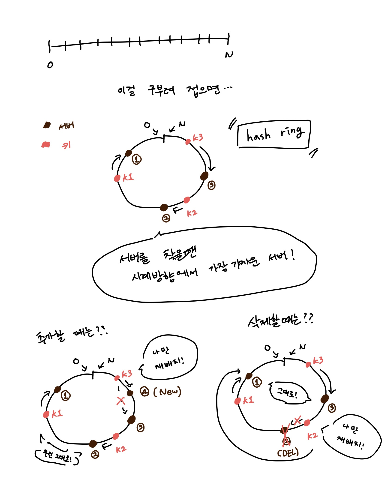
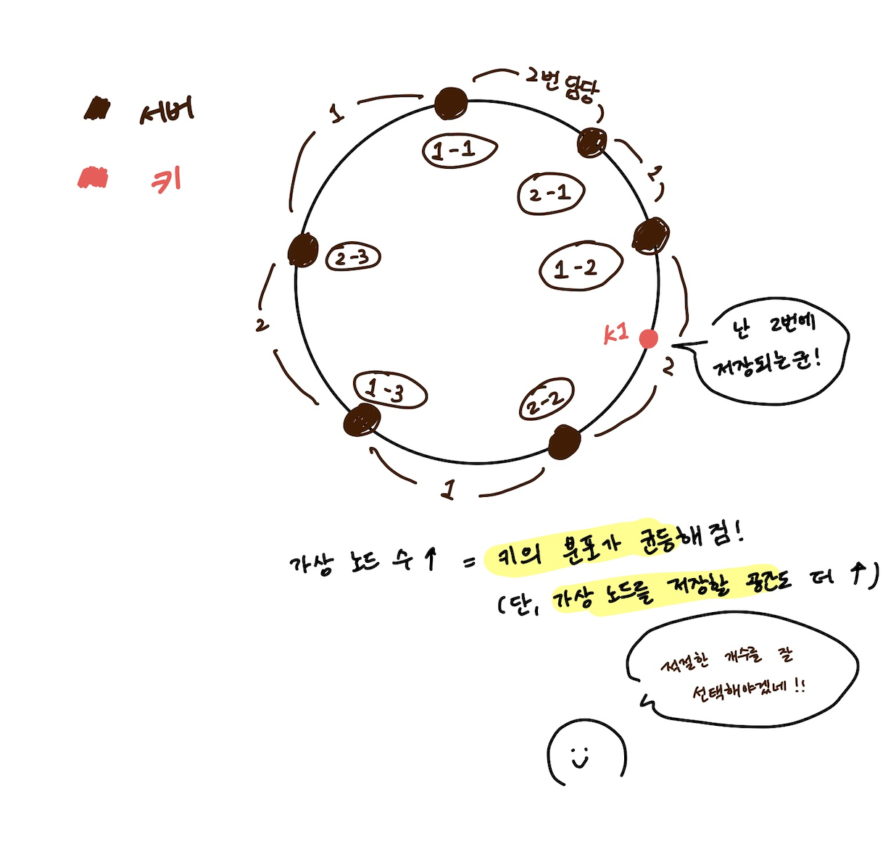

# 05장. 안정 해시 설계

# 해시 키 재배치(rehash) 문제

> N개의 캐시 서버에 부하를 균등하게 나누는 방법은?
> 

보편적인 방법

`serverIndex=hash(key)%N(N = 서버개수)`

예를 들어 

key0(183586)

key1(130391)

key2(391932)

...

이런식으로 있고 서버의 대수가 4대면 hash의 값%4를 해서 각각의 서버에 분포를 하는 것!

🙂 Good!

- 서버 풀(server pool)이 고정되어 있을 때
- 데이터 분표가 균등할 때

😞 Bad ...

- 서버가 추가되거나 기존 서버가 삭제될 때
    - 엉뚱한 서버에 접속할 수 있게 되고, 대규모 캐시 미스(cache miss)가 발생한다.
    
    → 안정해시를 사용하면 문제 해결 가능!
    

# 안정 해시

> 해시 테이블 크기가 조정될 때, 평균적으로 k/n개의 키만 재배치하는 해시 기술
k = 키의 개수
n = 슬롯의 개수
> 

## 해시 공간과 해시 링

## 기본 구현법의 두 가지 문제

- 서버와 키를 균등하게 분포하는 해시 함수를 사용해 해시 링에 배치한다.
- 키의 위치에서 링을 시계 방향으로 탐색하다 만나는 최초의 서버가 키가 저장될 서버다

😞 문제!!

1. 서버 추가/삭제되는 상황을 감안하면 파티션(partition)의 크기를 균등하게 유치하기가 어렵다.
    - 파티션 = 인접한 서버 사이의 해시 공간
    - 예를 들어 위 그림에서 2번 서버가 삭제되어 1번 서버의 타피션이 다른 파티션에 비해 매우 커진다.
2. 균등하게 분포하기가 어렵다.
   
    → 이걸 해결하기 위해 나온게 가상 노드(virtual node) (또는 replica라고 불리기도 함)
    

## 가상 노드

실제 노드 또는 서버를 가리키는 노드. 하나의 서버는 링 위에 여러 개의 가상 노드를 가진다.

# 마치며

안정 해시의 이점

- 서버가 추가되거나 삭제될 때 재배치되는 키의 수가 최소화된다.
- 데이터가 보다 균등하게 분포하게 되므로 수평적 규모 확장성을 달성하기 쉽다.
- 핫스팟(hotspot) 키 문제를 줄인다. 특정한 샤드(shard)에 대한 접근이 지나치게 빈번하면 서버 과부하 문제가 생길 수 있다.