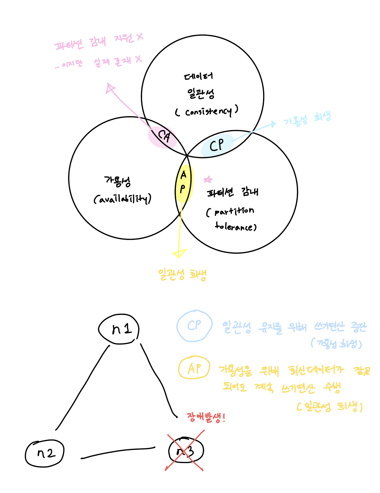
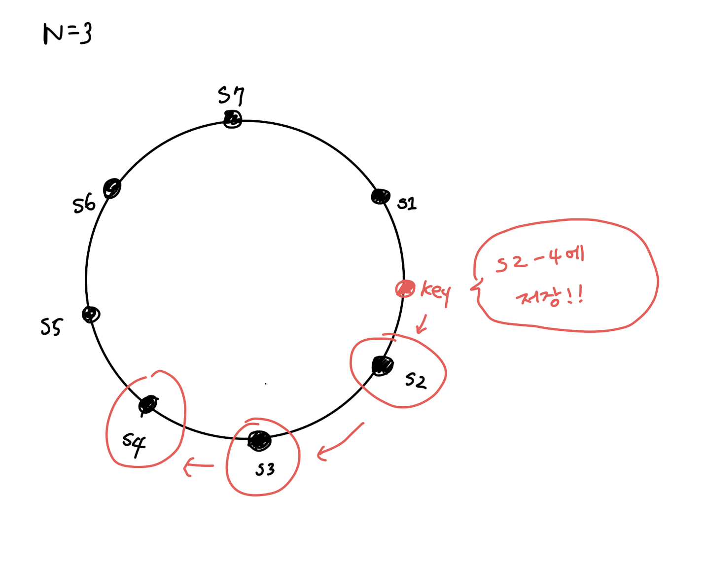
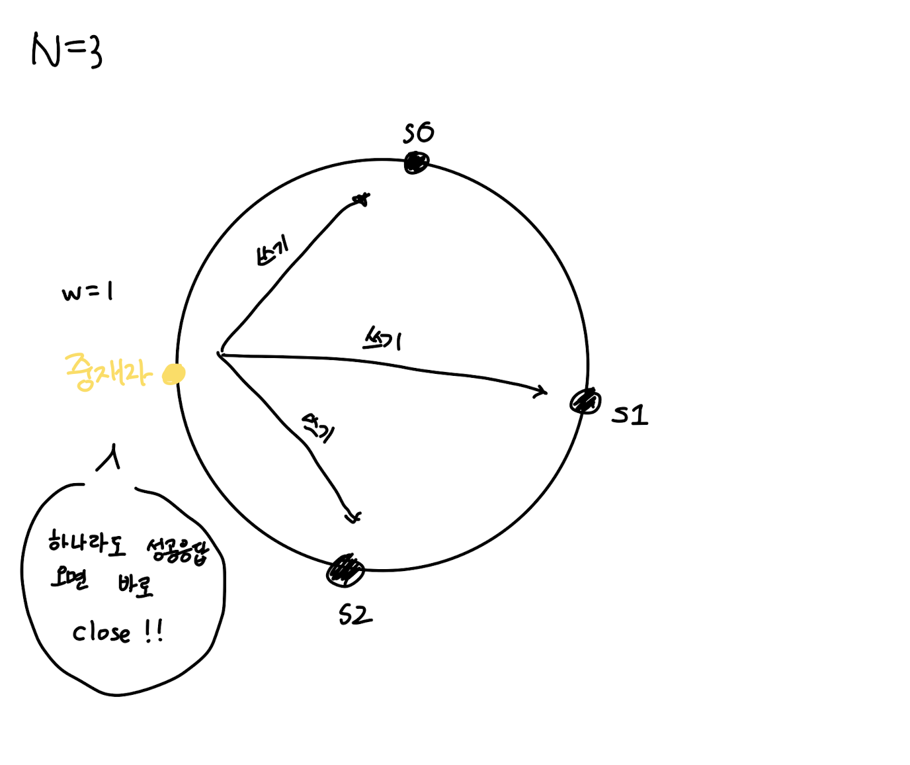
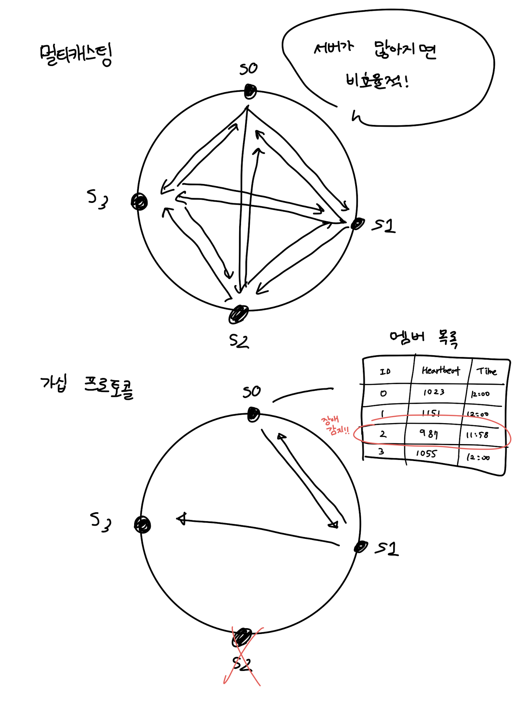

# 06장. 키-값 저장소 설계

키-값 쌍에서 키는 유일해야 하며, 값은 키를 통해 접근할 수 있다. 성능 상의 이유로 키는 짧을 수록 좋다.

`put()`, `get()`을 지원하는 키-값 저장소를 설계해보자!

# 문제 이해 및 설계 범위 확정

- 키-값 쌍의 크기는 10KB 이하
- 큰 데이터를 저장할 수 있어야 한다.
- 높은 가용성을 제공해야 한다. (장애가 있더라도 빠른 응답)
- 높은 규모의 확장성을 제공해야한다. (자동적인 서버 증설/삭제)
- 데이터 일관성 수준은 조정이 가능해야 한다.
- 응답 지연시간(latency)이 짧아야 한다.

# 단일 서버 키-값 저장소

키-값 쌍 전부를 메모리에 해시 테이블로 저장?

→ 빠르지만 모든 데이터를 메모리 안에 두는 것이 불가능할 수도 있다.

그래서 이 문제를 해결하기 위해 ...

- 데이터 압축
- 자주 쓰는 데이터만 메모리에 두고 나머지는 디스크에 저장

이렇게 해도 한 대 서버로는 부족하다. 분산 키-값 저장소가 필요하다.

# 분산 키-값 저장소

## CAP 정리

> 데이터 일관성(consistency), 가용성(availability), 파티션 감내(partition tolerance)라는 세 가지 요구사항을 동시에 만족하는 분산 시스템을 설계하는 것은 불가능하다.
> 

- 데이터 일관성
    - 어느 노드에 접속했는지 상관없이 같은 데이터를 봐야한다.
- 가용성
    - 일부 노드에 장애가 발생하더라도 항상 응답을 받아야 한다.
- 파티션 감내
    - 노드 사이에 통신 장애가 발생하더라도 시스템은 계속 동작해야한다.

## 데이터 파티션

전체 데이터를 한 대 서버에 넣기란 불가능하기 때문에 데이터를 파티션들로 분할한 다음에 여러 대 서버에 저장하는 것이 좋다.

고려해 보아야할 점

- 데이터를 여러 서버에 고르게 분산할 수 있는가
- 노드가 추가되거나 삭제될 때 데이터의 이동을 최소화할 수 있는가

→ 안정해시를 사용하면 좋다.

안정해시를 사용하면?

- 규모 확장 자동화가 가능하다.
- 서버의 용량에 맞게 가상 노드의 수를 조정할 수 있다. 즉, 고성능 서버는 더 많은 가상 노드를 갖도록 설정할 수 있다.

## 데이터 다중화

비동기로 N개 서버에 비동기적으로 다중화할 수도 있다. (N=튜닝 가능한 값)

N개 서버를 선정하는 방법

1. 키를 해시 링 위에 배치한다.
2. 시계 방향으로 링을 순회하며 만나는 첫 N개 서버에 데이터 사본을 보관한다.

하지만, **가상 노드를 사용한다면 선택된 N개 노트가 대응될 실제 물리 서버의 개수 N보다 작아질 수도 있다!!**

→ 같은 물리 서버를 중복 선택하지 않도록 하면 된다.

## 데이터 일관성

다중화된 데이터는 적절히 동기화되어야 한다. 이 때 정족수 합(Quorum Consensu) 프로토콜을 사용하면 읽기/쓰기 연산 모두 일관성을 보장할 수 있다.

N = 사본 개수

W = 쓰기 연산에 대한 정족수 (쓰기 연산이 성공되었다고 간주하려면 W개 이상의 서버로부터 쓰기 연산이 성공했다는 응답을 받아야 함)

R = 읽기 연산에 대한 정족수 (읽기 연산이 성공되었다고 간주하려면 R개 이상의 서버로부터 읽기 연산이 성공했다는 응답을 받아야 함)

W, R의 값이 높아질 수록 일관성이 보장되지만 응답 속도가 낮아진다.

- R = 1, W = N
    - 빠른 읽기 연산에 최적화된 시스템
- W = 1, R = N
    - 빠른 쓰기 연산에 최적화된 시스템
- W + R > N
    - 강한 일관성이 보장됨 (보통 N=3, W=R=2)
- W + R ≤ N
    - 강한 일관성이 보장되지 않음

요구되는 일관성 수준에 따라 W, R, N 값을 조정하면 된다.

### 일관성 모델

- 강한 일관성(strong consistency)
    - 모든 읽기 연산은 가장 최근에 갱신된 결과를 반환한다.
    - 클라이언트는 절대 예전 데이터를 보지 못한다.
    - 고가용성 시스템에 적합하지 않다.
- 약한 일관성(weak consistency)
    - 읽기 연산은 예전 데이터를 반환할 수도 있다.
- 최종 일관성(eventual consistency)
    - 약한 일관성의 한 형태
    - 갱신 결과가 결국에는 모든 사본에 동기화 되는 모델
    - 다이나모, 카산드라에서 채택
    - 클라이언트에서 데이터의 버전 정보를 활용하면 깨진 데이터를 읽지 않도록 할 수 있다.

### 비 일관성 해소 기법: 데이터 버저닝

- 버저닝
    - 데이터를 변경할 때마다 데이터의 새로운 버전을 만듬
- 벡터 시계
    - [서버, 버전]의 순서쌍을 데이터에 매단 것
    - D([S1, v1], [S2, v2], ... [Sn, vn])
        - D: 데이터
        - v: 버전 카운터
        - S: 서버 번호
        - 동작 방식
            1. [Si, vi]가 있으면 v1를 증가
            2. 그렇지 않으면 새 항목 [Si, 1]를 만듬
    - 단점
        - 충돌 감지 및 해소 로직이 클라이언트에 들어가야 한다.
        - [서버: 버전]의 순서쌍 개수가 굉장히 빨리 늘어난다.

### 장애 감지

<가십 프로토콜>

1. 각 노드는 멤버 목록을 가지고 있는다.
2. 각 노드는 주기적으로 박동 카운터를 증가시킨다.
3. 각 노드는 무작위로 선정된 노드들에게 주기적으로 박동 카운터 목록을 보낸다.
4. 박동 카운터 목록을 받은 노드는 멤버십 목록을 최신 값으로 갱신한다.
5. 어떤 멤버의 박동 카운터 값이 지정된 시간동안 갱신되지 않으면 장애 상태로 판단한다.

### 일시적 장애 처리

- 엄격한 정족수(strict quorum)
    
    - 데이터의 일관성을 위해 읽기/쓰기 연산을 금지한다.
- 느슨한 정족수(sloppy quorum)
    - 쓰기 연산을 수행할 W개의 건강한 서버, 읽기 연산을 수행할 R개의 건강한 서버를 해시링에서 고른다.
    - 장애 상태인 서버로 가는 요청은 다른 서버가 맡아 처리한다.
    - 변경사항을 저장해두고 복구되었을 때 일관 반영한다.
    
    → 임시 위탁(hinted handoff)
    

### 영구 장애 처리

- 반-엔트로피(anti-entropy) 프로토콜
    - 사본 간의 일관성이 망가진 상태를 탐지하고 전송 데이터 양을 줄이기 위해 머클(Merkle) 트리를 사용하다. (그림 보기 p.108)
        1. 키 공간을 버킷으로 나눈다.
        2. 버킷에 포함된 키에 균등 분포 해시 함수를 적용해서 해시 값을 계산한다.
        3. 해당 해시 값을 레이블로 갖는 노드를 만든다.
        4. 자식 노드의 레이블로부터 새로운 해시 값을 계산하여, 이진 트리를 상향식으로 구성해 나간다.
        5. 루트 노드의 값을 확인하고 다르면 아래로 내려가서 다른 데이터를 갖는 버킷을 동기화한다.

### 데이터 센터 장애 처리

여러 데이터 센터에 다중화한다.

## 시스템 아키텍처 다이어그램

- 클라이언트는 키-값 저장소가 제공하는 두 가지 단순한 API, 즉 get(key) 및 put(key, value)와 통신한다.
- 중재자(coordinator)는 클라이언트에게 키-값 저장소에 대한 프락시(proxy) 역할을 하는 노드다.
- 노드는 안정 해시(consistent hash)의 해시 링(hash ring) 위에 분포한다.
- 노드를 자동으로 추가/삭제할 수 있도록 시스템은 완전히 분산된다. (decentralized)
- 데이터는 여러 노드에 다중화된다.
- 모든 노드가 같은 책임을 지므로, SPOF는 존재하지 않는다.
- 모든 노드는 제시된 기능을 모두 지원한다.
    - 클라이언트 API
    - 장애 감지
    - 데이터 충돌 해소
    - 장애 복구 매커니즘
    - 다중화
    - 저장소 엔진
    - ...

## 쓰기 경로

쓰기 요청이 들어오면?

1. 쓰기 요청이 커밋 로그 파일에 기록된다. (디스크)
2. 데이터가 메모리 캐시에 기록된다. (메모리)
3. 메모리 캐시가 가득차거나 사전에 정의된 어떤 임계치에 도달하면 데이터는 디스크에 있는 SSTable(Sorted-String Table)에 기록된다. 
    - <키, 값> 순서쌍을 정렬된 리스트 형태로 관리하는 테이블
    - [https://www.igvita.com/2012/02/06/sstable-and-log-structured-storage-leveldb/](https://www.igvita.com/2012/02/06/sstable-and-log-structured-storage-leveldb/)

## 읽기 경로

읽기 요청이 들어오면?

1. 메모리 캐시를 살펴보고 있으면 결과를 반환해준다.
2. 없다면 블룸 필터(Bloom filter) 방식을 흔히 사용한다.
    - [https://en.wikipedia.org/wiki/Bloom_filter](https://en.wikipedia.org/wiki/Bloom_filter)
    1. 데이터가 메모리에 없으므로 블룸 필터를 검사한다. (디스크)
    2. 블룸 필터로 어떤 SSTable에 키가 보관되어 있는지 알아낸다.
    3. SSTable에서 데이터를 가져온다.
    4. 해당 데이터를 클라이언트에게 반환한다.

# 요약

대규모 데이터 저장 → 안정 해시를 사용해 서버들에 부하 분산

읽기 연산에 대한 높은 가용성 보장 → 데이터를 여러 데이터센터에 다중화

쓰기 연산에 대한 높은 가용성 보장 → 버저닝 및 벡터 시계를 사용한 충돌 해소

데이터 파티션 → 안정 해시

점진적 규모 확장성 → 안정 해시

다양성(heterogeneity) → 안정 해시

조절 가능한 데이터 일관성 → 정족수 합의(quorum consensus)

일시적 장애 처리 → 느슨한 정족수 프로토콜과 단서 후 임시 위탁

영구적 장애 처리 → 머클 트리

데이터 센터 장애 대응 → 여러 데이터 센터에 걸친 데이터 자동화