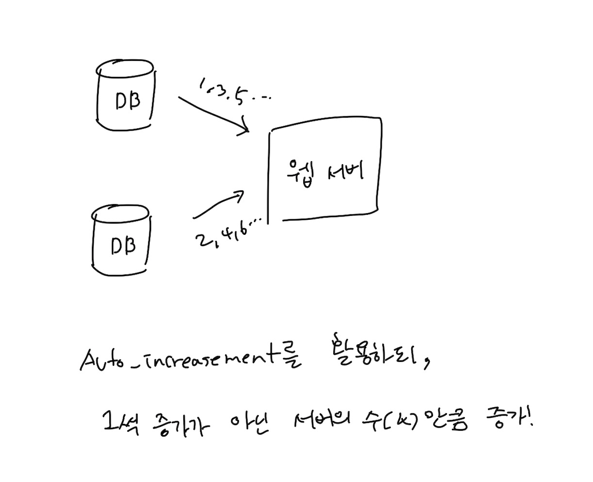
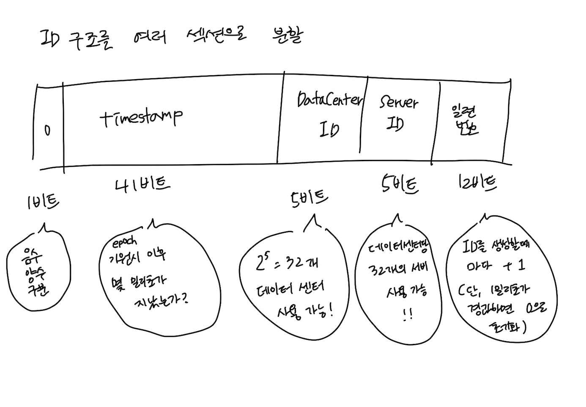

# 07장. 분산 시스템을 위한 유일 ID 생성기 설계

auto_increment 속성이 설정된 관계형 데이터베이스의 기본키를 쓰면 안되나?

→ DB 서버 한 대로는 요구를 감당할 수 없고, 지연 시간을 낮추기도 힘들다.

# 1단계. 문제 이해 및 설계 범위 확정

- ID는 유일해야 한다.
- ID는 숫자로만 구성되어야 한다.
- ID는 64비트로 표현될 수 있어야 한다.
- ID는 발급 날짜에 따라 정렬 가능해야 한다.
- 초당 10,000개의 ID를 만들 수 있어야 한다.

# 2단계. 개략적 설계안 제시 및 동의 구하기

## 다중 마스터 복제(multi-master-replication)

- 여러 데이터 센터에 걸쳐 규모를 늘리기 어렵다.
- ID의 유일성은 보장되겠지만 그 값이 시간 흐름에 맞추어 커지도록 보장할 수 없다.
- 서버를 추가하거나 삭제할 때도 잘 동작하게 만들기 어렵다.

## UUID

장점

- 만들기가 단순하다.
- 독립적이기 때문에 규모 확장도 쉽다.

단점

- 요구사항과 맞지 않다. (128비트)
- 시간 순으로 정렬이 불가능하다.
- 숫자(numberic)가 아닌 값이 포함될 수 있다.

## 티켓 서버

[https://code.flickr.net/2010/02/08/ticket-servers-distributed-unique-primary-keys-on-the-cheap/](https://code.flickr.net/2010/02/08/ticket-servers-distributed-unique-primary-keys-on-the-cheap/)

auto_increment 기능을 갖춘 데이터 베이스 서버를 둔다.

장점

- 유일성이 보장되는 숫자로만 구성된 ID를 쉽게 만들 수 있다.
- 구현이 쉽고, 중소 규모 애플리케이션에 적합하다.

단점

- SPOF가 된다.

## 트위터 스노플레이크 접근법

[https://blog.twitter.com/engineering/en_us/a/2010/announcing-snowflake](https://blog.twitter.com/engineering/en_us/a/2010/announcing-snowflake)

# 3단계. 상세 설계

트위터 스노플레이크 접근법으로 설계를 해보자!

[시스템이 시작할 때 결정되며, 일반적으로 운영 중에는 바뀌지 않는 값]

- 데이터 센터 ID
- 서버 ID

→ 잘못 변경하면 ID 충돌이 발생할 수도 있다.

[ID 생성기가 돌 때 만들어지는 값]

- 타임스탬프
- 일련번호

## 타임스탬프

41비트로 표현할 수 있는 타임스탬프의 최댓값은 69년.

따라서 69년 이후에는 기원시각을 바꾸거나 ID 체계를 다른 것으로 마이그레이션 해야한다.

## 일련번호

4096개의 값을 가질 수 있다.

같은 밀리초동안 하나 이상의 ID를 만들어낸 경우만 0보다 큰 값을 갖는다.

# 4단계. 마무리

그 외로 논의해볼 수 있는 내용

- 시계 동기화(clock synchronization)
    - 서버들이 다른 시계를 사용할 수도 있다.
    - NTP(Network Time Protocol)이 가장 보편적인 수단이다.
    - [https://ko.wikipedia.org/wiki/네트워크_타임_프로토콜](https://ko.wikipedia.org/wiki/%EB%84%A4%ED%8A%B8%EC%9B%8C%ED%81%AC_%ED%83%80%EC%9E%84_%ED%94%84%EB%A1%9C%ED%86%A0%EC%BD%9C)
- 각 섹션의 길이 최적화
    - 동시성이 낮고 수명이 길다면 일련번호를 줄이고 타임스탬프의 길이를 늘릴 수도 있다.
    - ID 생성기는 무조건 고가용성을 제공해야한다,