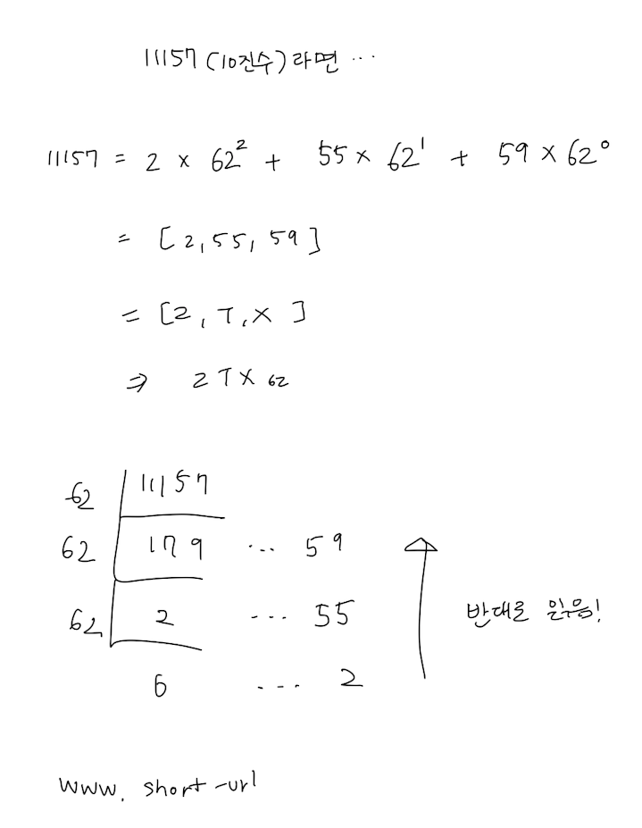

# 08장. URL 단축기 설계

# 1단계. 문제 이해 및 설계 범위 확정

**기본적인 기능**

- URL 단축
- URL 리디렉션 (요청이 오면 원래 URL로 이동)
- 높은 가용성, 규모 확장성, 장애 감내

**개략적 추정**

- 쓰기 연산
    - 매일 1억 개의 단축 URL 생성
- 초당 쓰기 연산
    - 1억(100m)/24/3600 = 1160
- 읽기 연산
    - 쓰기 연산보다 10배 많다. 측, 초당 11,600번의 요청
- 10년간 운영한다면?
    - 1억 * 365 * 10 = 3650억개의 레코드를 보관
    - 축약 전 URL 길이가 100byte라면, 3650억 * 100바이트 = 36.5TB의 용량이 필요
    

# 2단계. 개략적 설계안 제시 및 동의 구하기

## API 엔드포인트

RESTful API

1. URL 단축용 엔드포인트
   
    ```java
    POST /api/v1/data/shorten
    - 인자: {longUrl: longURLstring}
    - 반환: 단축 URL
    ```
    
2. URL 디리렉션용 엔드포인트
   
    ```java
    GET /api/v1/shortUrl
    - 반환: HTTP 리디렉션 목적지가 될 원래 URL
    ```
    

## URL 리디렉션

상태코드는 301, Location은 원래 URL

- 301 Permanently Moved
    - 처리 책임이 영구적으로 Location 헤더에 반환된 URL로 이전했다.
    - 브라우저가 응답을 캐시한다.
    - 서버 부하를 줄일 수 있다.
- 302 Found
    - 일시적으로 Location 헤더가 지정하는 URL에 의해 처리되어야 한다.
    - 언제나 단축 URL 서버에 먼저 보내진 후에 원래 URL로 리디렉션 된다. (캐싱X)
    - 트래픽 분석이 가능하다.

## URL 단축

긴 URL을 해시 값을 대응시킬 해시 함수 fx는 ... (도메인 패스 뒤에 붙는 값)

- 입력으로 주어지는 긴 URL이 다른 값이면 해시 값도 달라져야 한다.
- 계산된 해시 값은 원래 입력으로 주어졌던 긴 URL로 복원될 수 있어야 한다.

# 3단계. 상세 설계

## 데이터 모델

해시 테이블보다는 관계형 데이터베이스에 넣는게 더 좋다.

## 해시 함수

원래 URL을 단축 URL로 변환하는데 쓰이는 함수.

### 해시 값 길이

단축 URL 값은 0-9, a-z, A-Z로 구성되기 때문에 10+26+26 = 62개의 문자를 사용할 수 있다.

$62^7$이면 3.5조개의 URL을 만들 수 있다.

해시 함수 구현에 쓰이는 기술

- 해시 후 충돌 해소
- base-62 변환

### 해시 후 충돌 해소

대표적인 해시 함수 CRC32, MD5, SHA-1 모두 7자를 넘는다.

7자까지만 이용하면 해시 결과가 충돌될 확률이 높다.

물론 DB에 있는지 검사를 한 후에 충돌이 나면 재생성을 하는 방법도 있지만, 오버헤드가 크다.

이 때 DB 대신 블룸 필터를 사용하면 성능을 높일 수 있다.

([블룸 필터](https://en.wikipedia.org/wiki/Bloom_filter): 어떤 집합에 특정 원소가 있는지 검사할 수 있는, 확률론에 기초한 공간 효율이 좋은 기술)

### base-62 변환

62진법을 쓰는 이유는 사용할 수 있는 문자의 개수가 62개이기 때문이다.



### 두 접근법 비교

| 해시 후 충돌 해소 전략 | base-62 변환 |
| --- | --- |
| 단축 URL 길이 고정 | URL 길이 가변적 (ID 값이 커짐에 따라 길이 길어짐) |
| 유일성이 보장되는 ID 생성기 필요 X | 유일성이 보장되는 ID 생성기 필요 O |
| 충돌 해소 전략 필요 | 충돌이 될 일 없음 |
| 다음에 쓸 수 있는 URL 예측 불가능 (보안 문제 X) | ID 값을 통해 계산하면 URL 예측 가능 (보안 문제 O) |

7장에서 분산 ID 생성기를 구현하는 몇 가지 방법도 살펴보았다.

## URL 리디렉션 상세 설계

1. 사용자가 단축 URL을 클릭한다.
2. 로드밸런서가 해당 클릭으로 발생한 요청을 웹 서버에게 전달한다.
3. 캐시에 있는 경우 바로 클라이언트에게 전달한다.
4. 없는 경우 데이터베이스에서 꺼낸다.
5. 캐시에 넣은 후에 클라이언트에게 전달한다.

# 4단계. 마무리

이 외에도 이야기 해볼 수 있는 내용

- 처리율 제한 장치
    - IP 주소를 비롯한 필터링 규칙을 이용해 요청을 걸러낼 수 있다.
    - 4장에서 다뤘다.
- 웹 서버의 규모 확장
    - 웹 계층은 무상태이므로 자유롭게 증설/삭제가 가능하다.
- 데이터베이스의 규모 확장
    - 다중화하거나 샤딩하면 규모 확장성 달성이 가능하다.
- 데이터 분석 솔루션
    - 을 추가하면 어느 링크를 많이 클릭했고, 주로 언제 클릭했는지 등을 알 수 있다.
- 가용성, 데이터 일관성, 안정성
    - 1장에서 다뤘다.