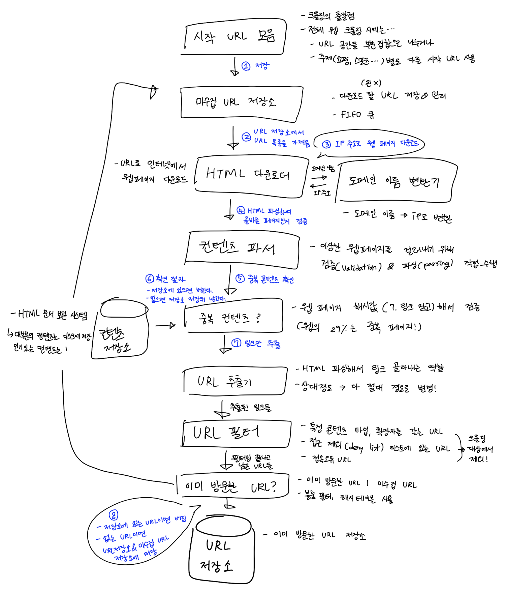
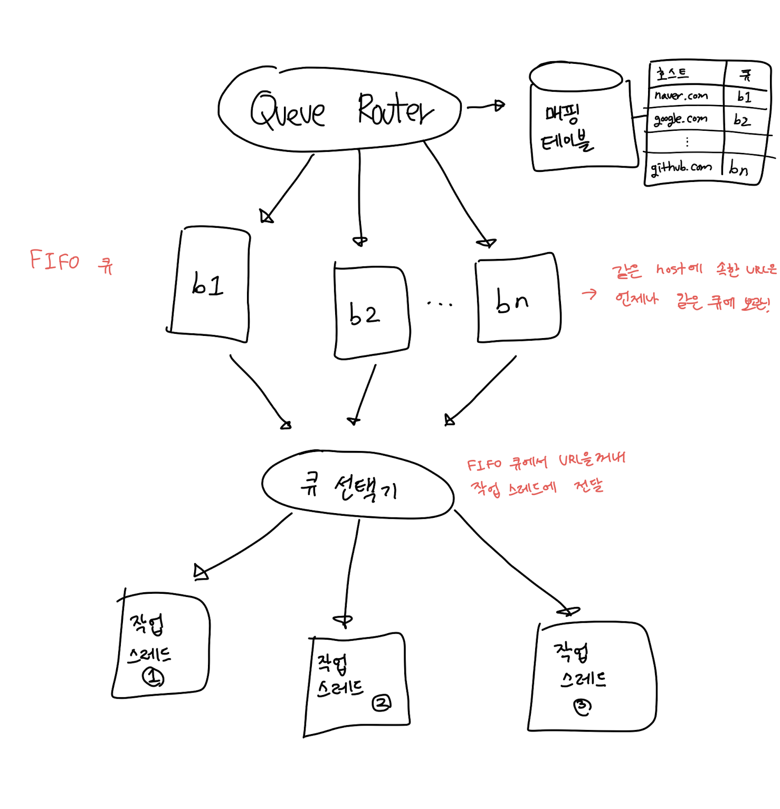
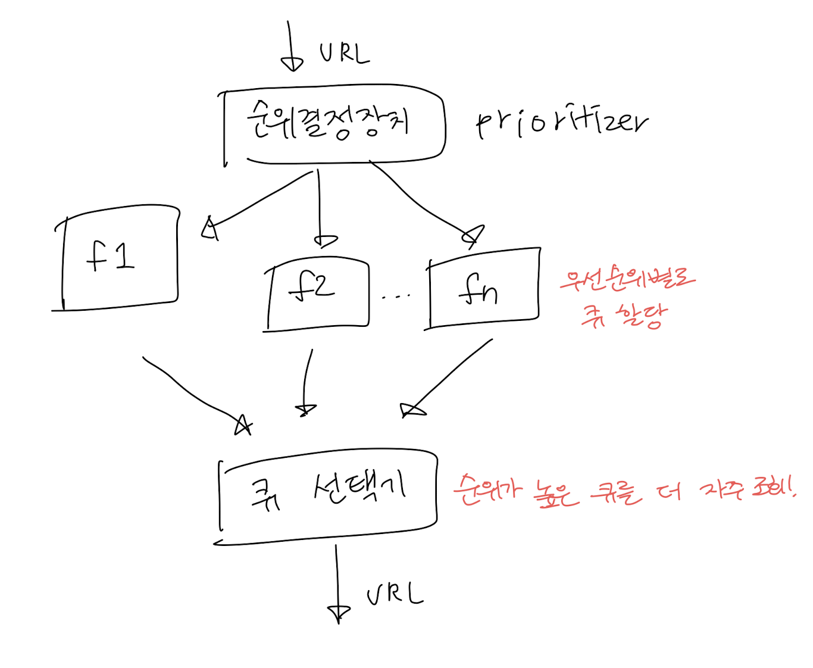

# 09장. 웹 크롤러 설계

크롤러는 다양하게 사용된다.

- 검색 엔진 인덱싱(search engine indexing)
    - 웹 페이지를 모아 검색 엔진을 위한 로컬 인덱스를 만든다.
    - ex. Googlebot
- 웹 아카이빙(web archiving)
    - 장기보관하기 위해 웹에서 모으는 절차
    - ex. EU 웹 아카이브
- 웹 마이닝(web mining)
    - 데이터 마이닝을 통해 인터넷에서 유용한 지식을 도출해낼 수 있다.
    - ex. 주주 총회 자료를 받아 기업의 핵심 사업 방향 알아내기
- 웹 모니터링(web monitoring)
    - 저작권, 상표권 침해되는 사례 모니터링 가능
    - ex. 디지마크사의 크롤러로 해적판 저작물 찾기
    

# 1단계. 문제 이해 및 설계 범위 확정

### 기본 알고리즘

1. URL 집합이 입력으로 주어지면, URL들이 가리키는 웹 페이지를 모두 다운로드한다.
2. 다운받은 웹 페이지에서 URL을 추출한다.
3. 추출된 URL들을 다운로드할 URL 목록에 추가하고 과정을 처음부터 반복한다.

### 좋은 웹 크롤러가 만족시켜야할 속성

- 규모 확장성
    - 병행성(parallelism)을 활용하면 효과적으로 웹 크롤링이 가능하다.
- 안정성(robustness)
    - 잘못 작성된 HTML, 장애, 악성 코드에 안정적으로 대응할 수 있어야 한다.
- 예절(politeness)
    - 짧은 시간에 너무 많은 요청을 보내면 안 된다.
- 확장성(extensibility)
    - 새로운 형태의 콘텐츠를 지원하기 쉬워야 한다.
    

## 개략적 규모 추정

- 매달 10억 개의 웹 페이지를 다운로드한다.
- QPS = 10억 / 30일 / 24시간 / 3600초 = 대략 400페이지/초
- 최대(Peak) QPS = 2 * QPS = 800
- 웹 페이지의 크기 평균은 500k
- 10억 페이지 * 500k = 500TB/월, 5년간 저장하려면 30PB

# 2단계. 개략적 설계안 제시 및 동의 구하기

1. [https://en.wikipedia.org/wiki/Rabin_fingerprint](https://en.wikipedia.org/wiki/Rabin_fingerprint)

# 3단계. 상세 설계

- DFS vs BFS
- 미수집 URL 저장소
- HTML 다운로더
- 안정성 확보 전략
- 확장성 확보 전략
- 문제 있는 콘텐츠 감지 및 화피 전략

## DFS vs BFS

웹은 directd graph = 페이지는 노드이고, URL은 에지(edge) 

→ DFS는 그래프가 클 경우 성능이 급격하게 나빠지므로 **보통 BFS를 사용**한다.

### BFS

FIFO 큐를 사용한다. 한 쪽으로는 탐색할 URL을, 다른 한 쪽으로는 꺼내기만 하면 된다. 그런데 문제점이 있다.

- 같은 호스트에 속한 링크들을 한꺼번에 너무 많이 다운 받으면 페이지가 과부하가 걸린다. (
  
    → 예의 없는(impolite) 크롤러가 됨
    
- BFS는 우선순위를 두지 않지만, 크롤러는 우선순위가 중요하다. (by 페이지 순위, 트래픽 양, 업데이트 빈도)

## 미수집 URL 저장소

위의 문제를 해결할 수 있다.

구현 방법에 대해서는 아래 링크를 참고하자!

- [http://infolab.stanford.edu/~olston/publications/crawling_survey.pdf](http://infolab.stanford.edu/~olston/publications/crawling_survey.pdf)
- [https://www.ics.uci.edu/~djp3/classes/2009_01_02_INF141/Lectures/Lecture05.pdf](https://www.ics.uci.edu/~djp3/classes/2009_01_02_INF141/Lectures/Lecture05.pdf)

### 예의

너무 많은 요청을 보내는 것은 무례하고(impolite), Dos 공격으로 간주되기도 한다.

동일 웹 사이트에 대해서는 한 번에 한 페이지만 요청하고, 같은 웹 사이트 페이지를 다운받는 태스크는 시간차를 두자.

→ 웹사이트의 호스트와 다운로드를 수행하는 worker thread 사이의 관계를 유지하면 된다.

### 우선순위

페이지 랭크, 트랙픽 양, 갱신 빈도(update frequency) 등을 척도로 URL의 우선순위를 나눈다.

- [http://infolab.stanford.edu/~olston/publications/crawling_survey.pdf](http://infolab.stanford.edu/~olston/publications/crawling_survey.pdf)
- [http://ilpubs.stanford.edu:8090/422/1/1999-66.pdf](http://ilpubs.stanford.edu:8090/422/1/1999-66.pdf)

그래서 결국에는 ... (155p)

- 전면 큐
    - 우선순위 결정 과정 처리
- 후면 큐
    - 크롤러가 예의 바르게 동작하도록 보증
    

### 신선도

다운로드한 페이지라도 주기적으로 재수집하여 변경된 내용도 반영한다. 하지만 모든 것을 재수집하긴 어려우니 전략을 사용하여 최적화한다.

- 웹 페이지 변경 이력(update history) 활용
- 우선순위를 활용하여 중요한 페이지는 좀 더 자주 재수집

### 미수집 URL 저장소를 위한 지속적 저장장치

검색 엔진 같은경우에는 URL이 수억개라 전부 디스크에 저장하는 것도 부담이 되는 경우에는...

→ 대부분은 URL은 디스크에 두지만, IO 비용을 줄이기 위해 메모리 버퍼에 큐를 둔다. 버퍼에 있는 데이터는 주기적으로 디스크에 기록.

### HTML 다운로더

### Robots.txt

크롤러가 수집해도 되는 페이지 목록이 들어가있다.

웹 사이트를 긁기 전에 이 규칙을 먼저 확인해야 한다.

이 파일은 주기적으로 다시 다운 받아 캐시에 보관한다.

### 성능 최적화

1. 분산 크롤링
    - 크롤링 작업을 여러 서버에 분산
    - URL 공간을 작은 단위로 분할하고, 각 서버는 일부의 다운로드 담당
2. 도메인 이름 변환 결과 캐시
    - DNS 요청 ~ 결과 받기까지 동기적이다. (10ms ~ 200ms 정도 소요)
    - DNS 결과로 얻어진 도메인 이름 + IP 주소 사이의 관계를 캐싱하고, cron job 등으로 갱신해놓으면 좋다.
3. 지역성
    - 지역적으로 가까우면 페이지 다운로드 시간이 줄어든다.
    - 크롤 서버, 캐시, 큐, 저장소 등 대부분의 컴포넌트에 적용 가능
4. 짧은 타임 아웃
    - 최대 얼마나 기다릴지를 정한다.
    - 타임 아웃이 되면 다운로드를 중단하고 다음 페이지로 넘어간다.
    

### 안정성

- 안정 해시(consistent hashing)
    - 다운로더 해시를 쉽게 추가/삭제할 수 있다.
    - 5장 참고
- 크롤링 상태 및 수집 데이터 저장
    - 크롤링 상태와 수집된 데이터를 지속적 저장장치에 기록하는게 좋다.
    - 중단되었던 크롤링 재시작도 쉽다.
- 예외 처리
    - 예외가 발생해도 전체 시스템이 중단되면 안 된다.
- 데이터 검증
    - 시스템 오류 방지
    

### 확장성

URL 추출기뿐만 아니라 PNG 다운로더, 웹 모니터도 지원할 수 있게 설계해야한다. (159p)

### 문제 있는 콘텐츠 감지 및 회피

1. 중복 콘텐츠
    - 해시나 체크섬(check-sum)을 사용하자
    - [https://dl.acm.org/doi/10.1145/362686.362692](https://dl.acm.org/doi/10.1145/362686.362692)
2. 거미 덫
    - 크롤러를 무한 루프에 빠뜨리도록 설계한 웹 페이지
    - 만능 해결책은 없다.
        - URL 최대 길이를 제한한다.
        - 사람이 수작업으로 덫을 확인하고 찾아낸 후에 덫이 있는 사이트를 크롤러 탐색 대상에서 제외하거나 URL 필터 목록에 걸어둔다.
3. 데이터 노이즈
    - 광고, 스팸 URL은 제외해야한다.
    

# 4단계. 마무리

추가로 논의해보면 좋을 것

- 서버 측 렌더링
    - 링크를 즉석으로 만들기 때문에 그대로 다운받으면 동적으로 생성되는 링크를 발견하기 어렵다.
    - 파싱하기 전에 서버 측 렌더링을 적용하면 해결이 가능하다.
    - [https://developers.google.com/search/docs/advanced/javascript/dynamic-rendering](https://developers.google.com/search/docs/advanced/javascript/dynamic-rendering)
- 원치 않는 페이지 필터링
    - 스팸 방지 컴포넌트를 두어 스팸성인 페이지를 걸러내면 좋다.
    - [https://www.researchgate.net/publication/220846821_Tracking_Web_Spam_with_Hidden_Style_Similarity](https://www.researchgate.net/publication/220846821_Tracking_Web_Spam_with_Hidden_Style_Similarity)
    - [https://irl.cse.tamu.edu/people/hsin-tsang/papers/www2008.pdf](https://irl.cse.tamu.edu/people/hsin-tsang/papers/www2008.pdf)
- 데이터베이스 다중화 및 샤딩
    - 적용하면 데이터 계층의 가용성, 규모 확장성, 안정성이 향상된다.
- 슈평적 규모 확장성
    - 무상태 서버로 만들기!
- 가용성, 일관성, 안정성
    - 1장에서 다룸
- 데이터 분석 솔루션
    - 중요하다.
    

생산성 후달린다. 큰 공수를 안들이고 개발하기 위해! 빠르면 좋다.

전자결제라는 문서 채번할때 부서 ID랑 문서에 대한 ID 연도로 채번을 함! 그 번호가 공문에도 들어가고 함