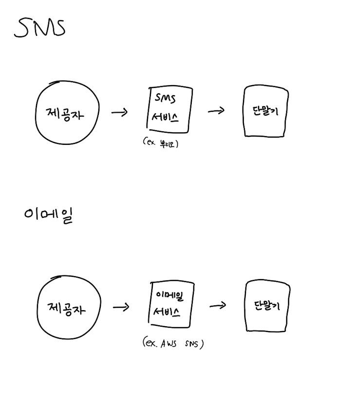
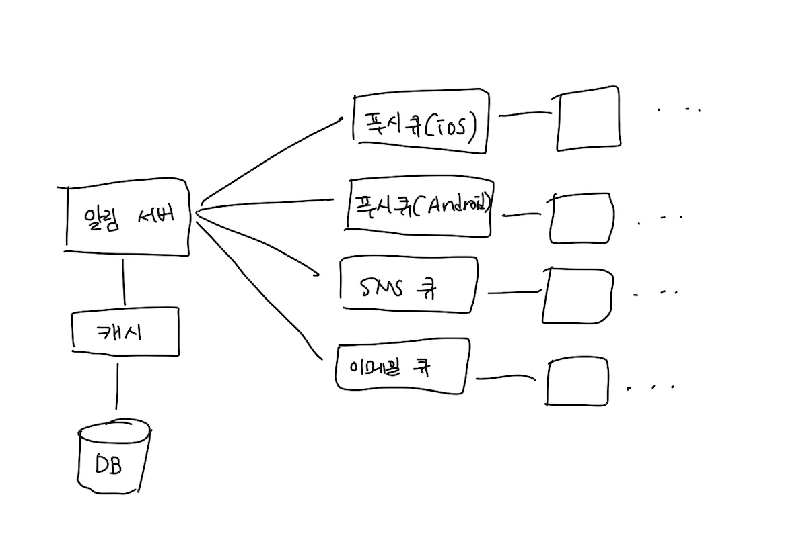
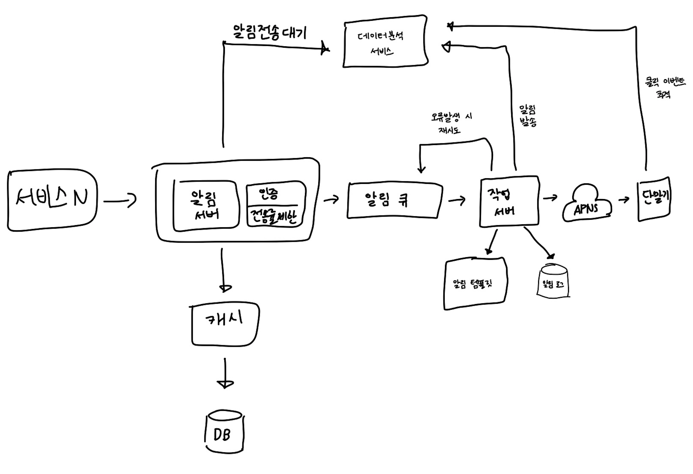

# 10장. 알림 시스템 설계

# 1. 문제 이해 및 설계 범위 확정

- 푸시 알림, SMS 메세지, 이메일을 지원한다.
- soft real-time 시스템이다. (ASAP이지만 부하가 걸리면 약간의 지연이 있어도 괜찮음)
- iOS, 안드로이드, 데스크탑을 지원한다.
- 하루에 천만 건의 모바일 푸시, 백만 건의 메세지, 5백만건의 이메일을 보낸다.

# 2. 개략적 설계안 제시 및 동의 구하기

- 알림 유형별 지원 방안
- 연락처 정보 수집 절차
- 알림 전송 및 수신 절차

## 알림 유형별 지원 방안

## 연락처 정보 수집 절차

앱을 설치하거나 계정을 등록하면 정보를 수집하여 DB에 저장한다.

## 알림 전송 및 수신 절차

알림 시스템을 하나의 서버로 두는 것을 최초의 설계안으로 잡으면 몇 가지 문제가 생긴다.

- 알림 서버가 SPOF가 됨
- 데이터베이스나 캐시 같은 중요 컴포넌트의 규모를 개별적으로 늘릴 수 없음
- 성능 병목이 생김

### 개선된 버전

- 데이터베이스, 캐시를 알림 시스템의 주 서버에서 분리한다.
- 알림 서버를 증설하고 자동으로 스케일 아웃이 가능하게 한다.
- 메세지 큐를 이용해 컴포넌트 사이의 결합을 끊는다.

1. 알림 서버로 요청을 보낸다.
2. 알림 서버는 사용자 정보, 단말 토큰, 알림 설정 같은 메타데이터를 캐시나 데이터베이스에서 가져온다.
3. 알림 이벤트를 만들어 큐에 넣는다.
4. 작업 서버는 메시지 큐에서 알림 이벤트를 꺼낸다.
5. 작업 서버는 알림을 제 3자 서비스로 보낸다.
6. 제 3자 서비스는 사용자 단말로 알림을 전송한다.

# 3. 상세 설계

- 안정성(reliability)
- 추가로 필요한 컴포넌트 고려사항
    - 알림 템플릿
    - 알림 설정
    - 전송률 제한(rate limiting)
    - 재시도 매커니즘(retry machanism)
    - 보안(security)
    - 큐에 보관된 알림에 대한 모니터링과 이벤트 추적
- 개선된 설계안

## 안정성

### 데이터 손실 방지

데이터가 손실되면 절대 안된다.

그러기 위해 큐에서 알림 이벤트를 꺼내는 작업 서버에 로그 데이터베이스를 유지하는 것도 한 가지 방법이 될 수 있다.

### 알림 중복 전송 방지

중복 탐지 매커니즘을 추가한다.

- 보내야 할 알림의 ID를 검사하여 이미 보낸 알림인지 살핀다. 보내지 않은 알림인 경우에는 발송한다.
- 중복 전송을 100% 방지하는 것이 불가능한 이유
    - [https://bravenewgeek.com/you-cannot-have-exactly-once-delivery/](https://bravenewgeek.com/you-cannot-have-exactly-once-delivery/)

## 추가로 필요한 컴포넌트 및 고려사항

### 알림 템플릿

자주 쓰는 알림 템플릿을 설정하면 형식을 일관성 있게 유지할 수 있고, 오탈자 가능성과 시간을 줄일 수 있다.

### 알림 설정

알림 설정 테이블을 반드시 검사해서 알림을 off한 사용자에게는 보내지 않게한다.

### 전송률 제한

한 사용자가 받을 수 있는 알림의 빈도를 제한할 수 있다. 너무 많이 보내면 알림을 끌 수도 있기 때문이다.

### 재시도 방법

알림 전송에 실패하면 재시도 전용 큐에 넣고 n회 이상 실패할시 개발자에게 alert을 보낸다.

### 푸시 알림과 보안

푸시는 appKey와 appSecret을 사용하여 보안을 유지한다. 그래야 인증된 클라이언트만 알림을 보낼 수 있다.

### 큐 모니터링

큐에 쌓인 알림 개수를 확인하고 적절하게 증설해야한다.

### 이벤트 추적

알림 시스템을 만들면 데이터 분석 서비스와도 통합해야한다.

# 4. 마무리

- 안정성
    - 메시지 전송 실패율을 낮추기 위해 안정적인 재시도 매커니즘을 도입하였다.
- 보안
    - 인증된 클라이언트만이 알림을 보낼 수 있도록 appKey, appSecret을 추가하였다.
- 이벤트 추적 및 모니터링
    - 각 단계마다 이벤트를 추적하고 모니터링할 수 있는 시스템을 통합하였다.
- 사용자 설정
    - 알림을 보내기 전 반드시 해당 설정을 확인하도록 하였다.
- 전송률 제한
    - 사용자에게 알림을 보내는 빈도를 제한할 수 있도록 하였다.