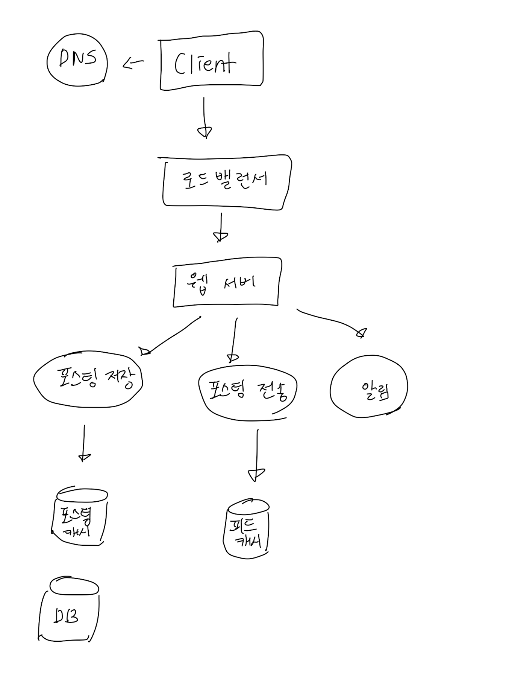
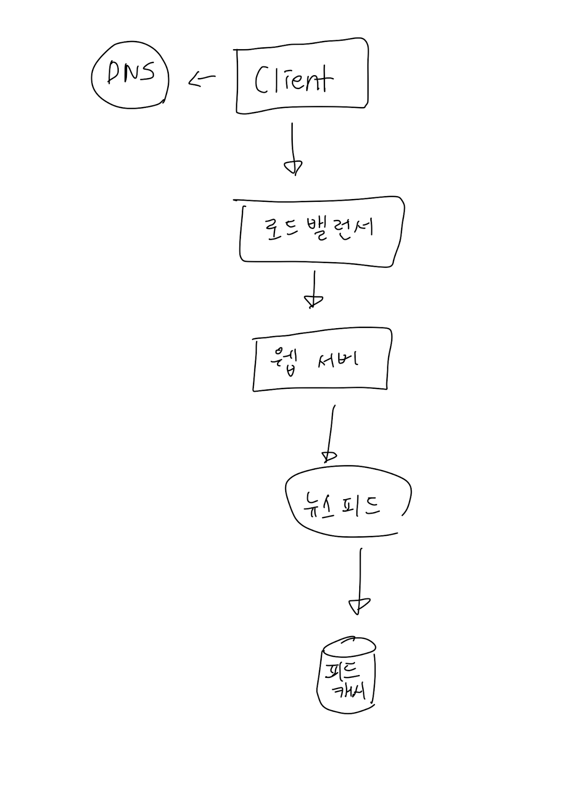
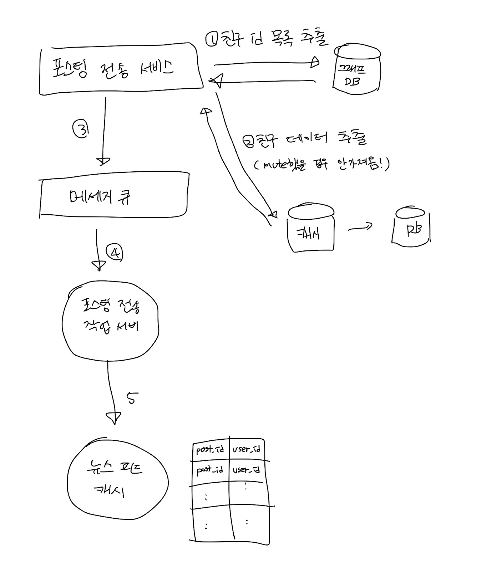

# 11장. 뉴스 피드 시스템 설계

# 1. 문제 이해 및 설계 범위 확정

- 앱, 웹 모두 지원해야 한다.
- 사용자는 뉴스 피드에 친구들만 볼 수 있는 새로운 스토리를 올릴 수 있다. 스토리는 시간 흐름 역순으로 표시된다.
- 사용자는 최대 5,000명의 친구를 가질 수 있다.
- 10M DAU
- 스토리는 이미지, 비디오 등의 미디어 파일도 포함될 수 있다.

# 2. 개략적 설계안 제시 및 동의 구하기

- 피드 발행
    - 사용자가 스토리를 포스팅하면 데이터를 캐시&DB에 저장한다.
    - 친구의 뉴스 피드에도 전송된다.
- 뉴스 피드 생성
    - 모든 친구의 포스팅을 시간 흐름 역순으로 모아서 만든다.

## 뉴스 피드 API

클라이언트가 서버와 통신하기 위해 사용하는 수단.

- 피드 발행 API
- 피드 읽기 API

### 피드 발행

### 뉴스 피드 생성

# 3. 상세 설계

## 피드 발행 흐름 상세 설계

### 웹 서버

- 인증
    - 인증 토큰을 Authorization 헤더에 넣는다.
- 처리율 제한
    - 일정 기간 동안 한 사용자가 올릴 수 있는 포스팅 수에 제한을 둔다.

### 포스팅 전송(팬아웃) 서비스

- 사용자의 새 포스팅을 친구관계에 있는 서비스에게 전달하는 과정
    - 쓰기 시점에 팬아웃 (push)
        - 포스팅이 완료되면 사용자의 캐시에 포스팅 기록
        - 장점
            - 피드가 실시간으로 갱신됨
            - 피드를 읽는 시간이 빨라짐
        - 단점
            - 친구가 많은 경우 많은 시간 소요됨 (핫키)
            - 서비스를 자주 사용하지 않는 사용자의 피드까지 갱신해야하므로 자원 낭비
    - 읽기 시점에 팬아웃 (pull)
        - 피드를 읽는 시점에 피드를 갱신한다.
        - 장점
            - 컴퓨팅 자원을 절약할 수 있다.
            - 핫키 문제가 생기지 않는다.
        - 단점
            - 피드를 읽는데 많은 시간이 소요될 수 있다.

→ 대부분의 사용자에게는 push. 친구가 많은 사용자의 경우에는 팔로워가 pull할 때 사용 + 안정해시

그래프 DB?

- [https://www.usenix.org/system/files/conference/atc13/atc13-bronson.pdf](https://www.usenix.org/system/files/conference/atc13/atc13-bronson.pdf)

## 캐시 구조

핵심 컴포넌트. 다섯 계층으로 나눈다.

- 뉴스 피드: 피드의 ID를 보관한다.
- 콘텐츠: 포스팅 데이터를 보관한다. 인기 콘텐츠는 따로 보관한다.
- 소셜 그래프: 사용자 간 관계 정보를 보관한다.
- 행동: 포스팅에 대한 사용자 행위에 관한 정보를 보관한다. 좋아요, 답글 등
- 횟수: 좋아요 횟수, 답글 횟수, 팔로잉 수 등의 정보를 보관한다.

# 4. 마무리

더 다루면 좋을만한 것들

### 데이터베이스 규모 확장

- 수직적 규모 확장 vs 수평적 규모 확장
- SQL vs NoSQL
- master-slave 다중화
- 복제본(replica)에 대한 읽기 연산
- 일관성 모델
- 데이터베이스 샤딩

추가로

- 웹 계층을 무상태로 운영하기
- 가능한 한 많은 데이터 캐시하는 방법
- 여러 데이터 센터 지원하는 방법
- 메시지 큐를 사용해서 컴포넌트 사이의 결합도 낮추기
- 핵심 메트릭에 대한 모니터링. 트래픽이 몰리는 시간의 QPS, 뉴스 피드 새로고침 지연시간 등!