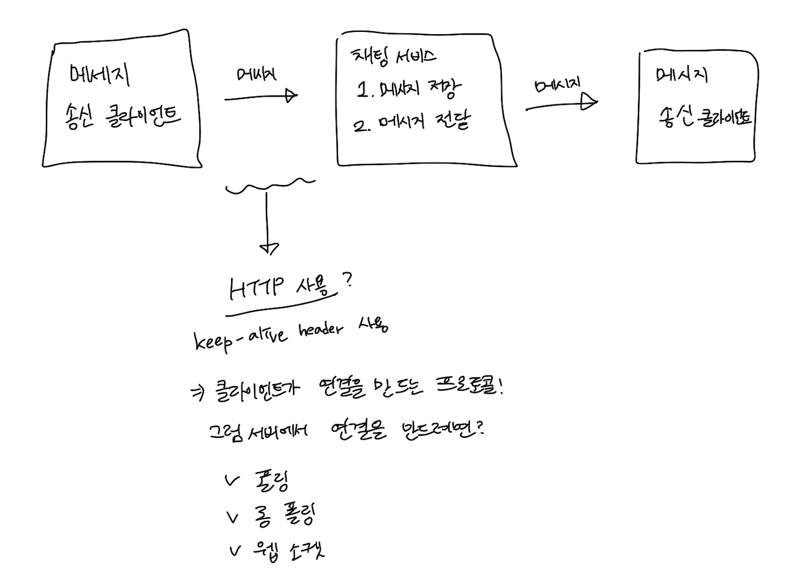
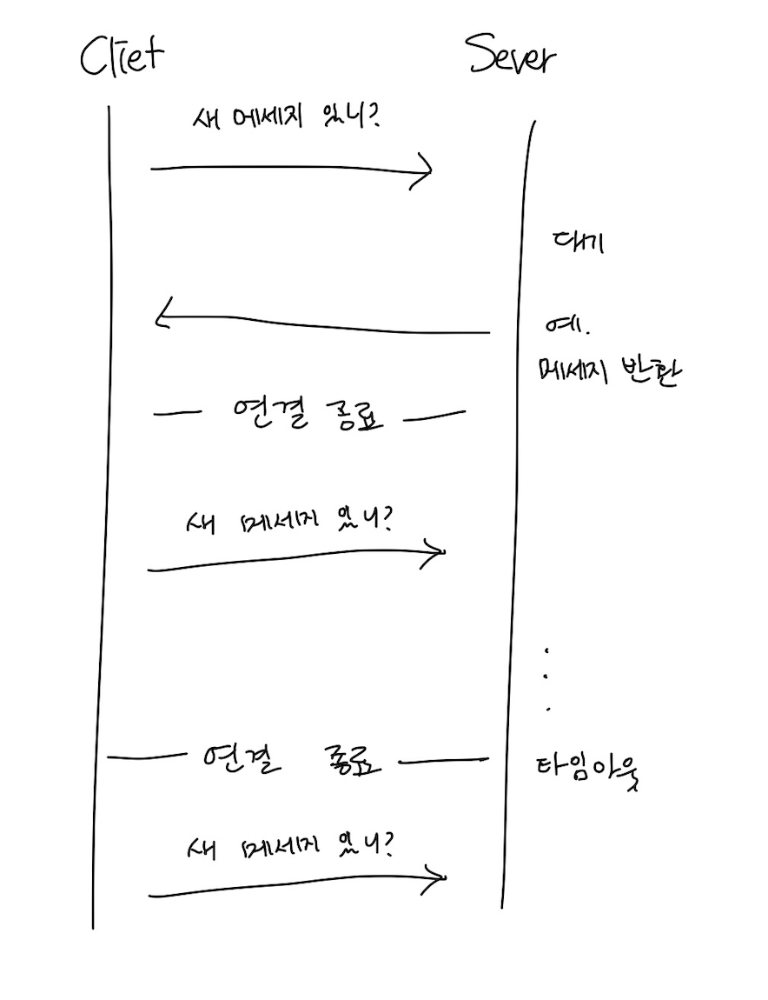

# 12장. 채팅 시스템 설계

# 1. 문제 이해 및 설계 범위 확정

- 응답지연이 낮은 일대일 채팅 기능
- 최대 100명까지 참여할 수 있는 그룹 채팅 기능
- 사용자의 접속상태 표시 기능
- 다양한 단말 지원. 하나의 계정으로 여러 단말에 동시 접속 지원
- 푸시 알림
- 5천만 DAU 처리

# 2. 개략적 설계안 제시 및 동의 구하기

## 폴링

주기적으로 클라이언트가 서버에게 새 메시지가 있는지 물어보는 방법. 

폴링 비용은 폴링 주기가 짧을수록 올라간다.

## 롱 폴링

새 메세지가 반환되거나 타임아웃될때까지 연결을 유지한다.

새 메세지를 받으면 기존 연결을 종료하고 새로운 요청을 보낸다.

### 단점

- 메세지를 보내는 클라이언트와 수신하는 클라이언트가 다른 채팅 서버에 있을 수도 있다. 로드밸런싱을 위해 라운드 로빈 알고리즘을 사용하는 경우, 메세지를 받은 서버는 해당 메시지를 수신할 클라이언트와의 롱 폴링 연결을 가지고 있지 않을수도 있다.
- 클라이언트가 연결을 해제있는지 아닌지 서버에서 알 수 있는 좋은 방법이 없다.
- 메세지를 받지 않아도 타임아웃이 일어날때마다 서버에 다시 접속하기 때문에 비효율적이다.

## 웹소켓

서버가 클라이언트에게 비동기 메시지를 보낼때 가장 널리 사용한다.

한 번 연결을 맺는다. (항구적이며 양방향인 연결)

처음에는 HTTP 연결이지만, 특정 핸드셰이크 절차를 거치면 웹소켓 연결로 업그레이드 된다.

→ 기본 포트번호를 그대로 쓰기 때문에 방화벽이 있는 환경에서도 잘 동작한다. HTTP에 양방향 메시지 전송까지 가능하게 하므로 최선의 선택이다.

## 개략적 설계안

205p

로그인, 회원가입, 프로필 표시같이 전통적인 요청/응답 서비스 → 무상태 서비스이며 로드밸런서 뒤에 위치

채팅 서비스 → 상태 유지 서비스

푸시 → 제 3자 서비스 연동

## 규모 확장성

클라이언트는 채팅 서버와 웹소켓 연결을 끊지 않고 유지한다.

## 저장소

채팅 시스템이 다루는 데이터

1. 사용자 프로필, 설정, 친구 목록같은 일반적인 데이터
    - 안정성을 보장하는 RDB.
    - 다중화, 샤딩을 사용하여 가용성과 규모확장성을 보증한다.
2. 채팅 이력
    - 키-값 저장소
    - 수평적 규모확장이 쉽고, 접근 지연시간이 낮다.
    

# 3. 상세 설계

## 서비스 탐색

클라이언트에게 가장 적합한 채팅 서버를 추천하는 역할을 한다.

→ 아파치 주키퍼(Apache Zookeeper)가 널리 쓰인다.

## 접속상태 표시

웹소캣 연결이 맺어진다 → 접속상태 서버는 사용자의 상태와 마지막 활동 시간의 타임스탬프 값을 키-값 저장소에 보관한다. (접속중인 상태로 표시)

로그아웃 → 상태가 바뀐다.

## 접속 장애

주기적으로 heartbeat 검사를 해서 결과를 서버로 보내고, 마지막 이벤트를 받은지 x초 이내에 또 다른 박동 이벤트 메세지를 받으면 접속상태를 온라인으로 유지한다.

ex. 5초마다 서버로 보내는데, 30초동안 timeout이 나면 오프라인으로 변경한다.

## 상태 정보의 전송

사용자 A

사용자 B

사용자 C가 있고, A의 정보를 알고 싶다면

접속상태서비스는

채널 A-B, A-C를 만들고 사용자(B, C)는 각각 채널을 구독해서 상태를 확인한다.

# 4. 마무리

- 채팅 앱을 확장하여 사진이나 비디오 등의 미디어를 지원하는 방법
    - 압축 방식
    - 클라우드 저장소
    - 썸네일 생성
- 종단 간 암호화
    - [https://faq.whatsapp.com/general/security-and-privacy/end-to-end-encryption/?lang=kr](https://faq.whatsapp.com/general/security-and-privacy/end-to-end-encryption/?lang=kr)
- 캐시
    - 캐시해두면 주고받는 데이터 양을 줄일 수 있다.
- 로딩 속도 개선
    - 슬랙의 사용자의 데이터, 채널 등을 지역적으로 분산하는 네트워크를 구축해서 앱 로딩 속도를 개선했다.
    - [https://slack.engineering/flannel-an-application-level-edge-cache-to-make-slack-scale/](https://slack.engineering/flannel-an-application-level-edge-cache-to-make-slack-scale/)
- 오류 처리
    - 오류나면 서비스 탐색 기능이 동작해서 새로운 서버를 클라이언트에게 배정하고 다시 접속할 수 있게 해야한다.
- 메세지 재전송
    - 재시도나 큐는 안정적 전송을 보장할 수 있다.