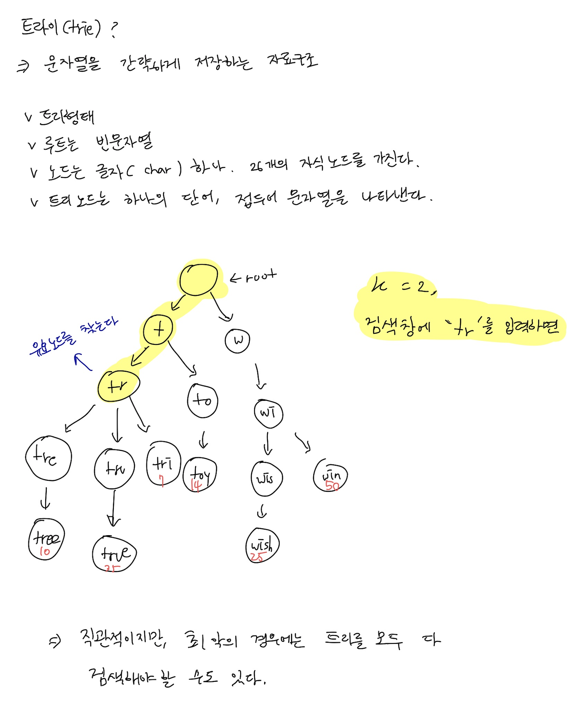
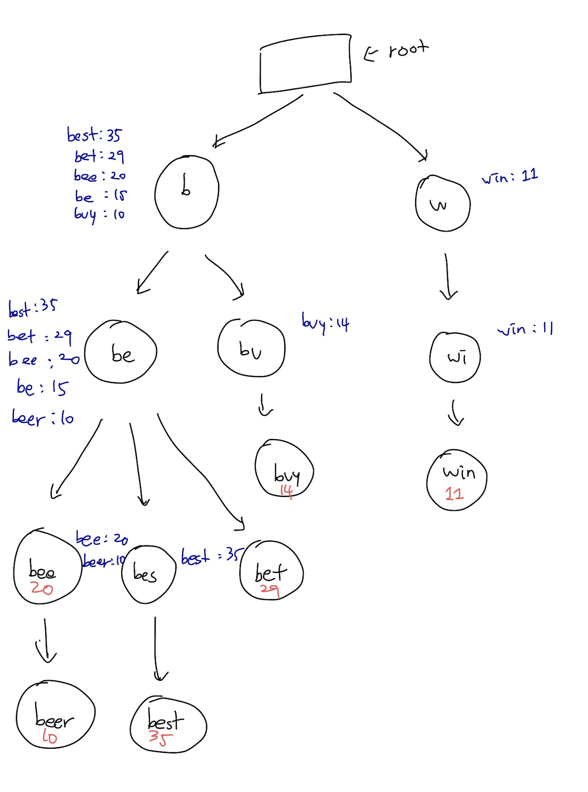
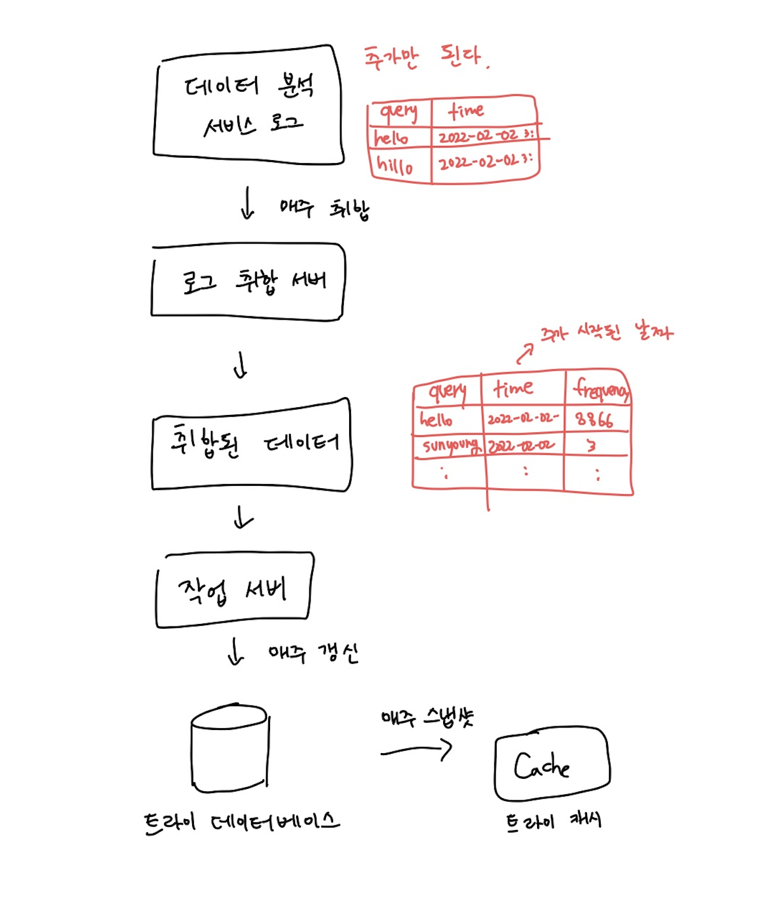

# 13장. 검색어 자동완성 시스템

# 1. 문제 이해 및 설계 범위 확정

### 요구사항

- 빠른 응답 속도
    - 100밀리초 이내
- 연관성
    - 입력한 단어와 연관된 것이어야 한다.
- 정렬
    - 인기도 등의 순위 모델을 활용한다.
- 규모 확장성
    - 트래픽을 감당할 수 있어야 한다.
- 고가용성
    - 일부에 장애가 발생해도 사용 가능해야 한다.
    

### 개략적 규모 추정

- DAU 1000만명
- 한 사용자는 매일 10건의 검색 수행
- 질의할 때마다 평균 20바이트의 데이터 입력
    - 1문자 = 1바이트
    - 평균 4개 단어로 구성
    - 단어는 평균적으로 다섯 글자로 구성
    - 4 * 5 = 20바이트
- 1회 검색당 20건의 요청이 백엔드로 전달된다.
    - ex. dinner → d, di, din, dinn, dinne, dinner
    - 24,000 QPS
        - 10,000,000사용자 * 10질의 / 일 * 20자 / 24시간 / 3600초
    - 최대 QPS = QPS * 2 = 대략 48,000
- 질의 중에서 20%는 신규 검색어이다.
    - 매일 0.4GB가 시스템에 추가된다.
    - = 10,000,000 사용자 * 10질의 / 일 * 20자 * 20%

# 2. 개략적 설계안 제시 및 동의 구하기

- 데이터 수집 서비스
    - 사용자가 입력한 질의 실시간 수집
- 질의 서비스
    - 다섯 개의 인기 검색어를 정렬해 내놓는 서비스

## 데이터 수집 서비스

단어마다 질의가 몇 번 되어있는지 기록하는 테이블

## 질의 서비스

데이터 수집 서비스에서 질의문을 사용한다.

```
SELECT *
FROM frquency_table
WHERE query LIKE 'prefix%'
ORDER BY frequency DESC
LIMIT 5
```

→ 데이터가 많아지면 병목이 생길 수 있다.

# 3. 상세 설계

- 트라이(trie) 자료 구조
- 데이터 수집 서비스
- 질의 서비스
- 규모 확장이 가능한 저장소
- 트라이 연산

## 트라이 자료 구조



문제를 해결하기 위해

1. 접두어의 최대 길이 제한
2. 각 노드에 인기 검색어 캐시

### 접두어 최대 길이 제한

정수값이면 된다.

검색어의 최대 길이를 제한할 수 있다면 접두어 노드를 찾는 단계의 시간 복잡도는 O(p)에서 O(작은 상숫값) = O(1)로 바뀔 것이다.

### 노드에 인기 검색어 캐시

노드에 캐시하면 질의 시간을 낮출 수 있다.

하지만 각 노드에 질의어를 저장할 공간이 많이 필요해진다.



1. 접두어 노드를 찾는 시간 복잡도는 O(1)로 바뀐다.
2. 최고 인기 검색어 5개를 찾는 질의의 시간 복잡도는 O(1)로 바뀐다. (캐시)

## 데이터 수집 서비스

→ 타이핑 할 때마다 실시간으로 데이터가 수정되어야 한다.

- 질의가 입력될때마다 트라이를 갱신하면 너무 느려진다.
- 인기 검색어는 그다지 자주 바뀌지 않기 때문에 자주 갱신할 필요 없다.



## 질의 서비스

최적화 방안

- AJAX 요청
- 브라우저 캐싱 (제안된 검색어 캐싱)
- 데이터 샘플링 (N개 중 1개만 로깅)

## 트라이 연산

### 트라이 생성

데이터 분석 서비스의 로그나 DB로부터 취합된 데이터를 이용한다.

### 트라이 갱신

1. 매주 한 번 갱신
    - 새로운 트라이를 만들고 대체
2. 각 노드를 개별적으로 갱신
    - 트라이가 작을때 고려해볼만 하다.

## 검색어 삭제

API 서버와 트라이 캐시 사이에 필터 계층을 둔다.

## 저장소 규모 확장

첫 글자 기준으로 샤딩이 가능하다.

→ 서버가 최대 26대로 제한된다. (영어 알파벳 개수 26자)

→ 균등하게 나누기가 불가능하다. (x로 시작하는 것보다 c로 시작하는게 월등히 많다.)

→ 검색어 대응 샤드 관리자를 두어 어떤 검색어가 어느 저장소 서버에 저장되는지 정보를 관리한다.

# 4. 마무리

- 다국어 지원?
    - 트라이에 유니코드 데이터를 저장한다.
- 국가별로 인기 검색어 순위가 다르다면?
    - 국가별로 다른 트라이를 사용한다.
    - 트라이를 CDN에 저장하여 응답속도를 높인다.
- 실시간으로 변하는 검색어의 추이
    - 지금 설계는 적절하지 않다. 단, 너무 복잡하니 아이디어만 준다면
        - 샤딩을 통해 데이터 양을 줄인다.
        - 순위 모델을 바꾸어 최근 검색어에 보다 높은 가중치를 준다.
        - 데이터 스트리밍될 수도 있다. (ex. 하둡, 카프카 등 사용)