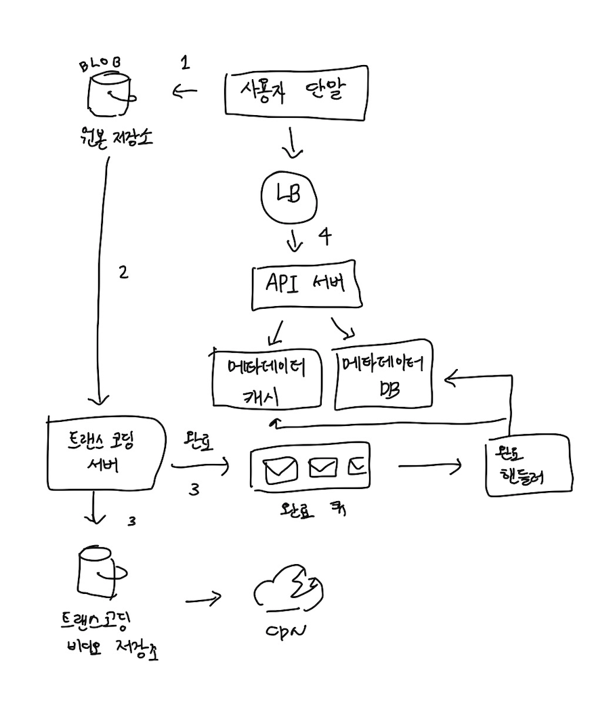

# 14장. 유튜브 설계

# 1. 문제 이해 및 설계 범위 확정

- 빠른 비디오 업로드
- 원활한 비디오 재생
- 재생 품질 선택 가능
- 낮은 인프라 비용
- 높은 가용성과 규모 확장성, 그리고 안정성
- 지원 클라이언트: 모바일 앱, 웹브라우저, 스마트 TV

### 개략적 규모 추정

- DAU는 5백만
- 한 사용자는 하루에 평균 5개의 비디오 시청
- 10%의 사용자가 하루에 1비디오 업로드
- 비디오 평균 크기는 300MB
- 비디오 저장을 위해 매일 새로 요구되는 저장용량 = 5백만 * 10% * 300MB = 150TB
- CDN 이용
    - 클라우트 프론트 ⇒ 1GB당 0.02달러
    - 5백만 * 5비디오 * 0.3GB * 0.02달러 ⇒ 15만 달러

# 2. 개략적 설계안 제시 및 동의 구하기

비디오 스트리밍은 CDN에,

나머지는 API 서버에 요청한다.

## 비디오 업로드 절차

1. 트랜스코딩이 완료되면 저장소에 업로드 & 완료 큐에 삽입을 동시에 한다.
2. API 서버가 단말에게 비디오 업로드가 끝나서 스트리밍 준비 되었음을 알린다.

## 메타데이터 갱신

원본 저장소에 파일이 업로드되는 동안 메타데이터(이름, 크기, 포맷 등) 갱신 요청을 API에게 보낸다.

## 비디오 스트리밍 절차

스트리밍 프로토콜 → 비디오 스트리밍을 위해 데이터를 전송할 때 쓰이는 표준화된 통신방법

- MPEG-DASH
- HLS
- MS Smooth Streaming
- Adobe HDS

[https://www.dacast.com/blog/video-streaming-protocol/](https://www.dacast.com/blog/video-streaming-protocol/)

비디오는 CDN에서 바로 스트리밍 된다.

# 3. 상세 설계

## 비디오 트랜스코딩

특정 포맷의 비디오가 다른 단말에서 순조롭게 재생되기 위해 비트레이트(bitrate)와 포맷으로 저장되어야 한다.

비트레이트 → 비디오를 구성하는 비트가 얼마나 빨리 처리되어야 하는지를 나타내는 단위 (높으면 고화질)

비디오 트랜스 코딩이 중요한 이유

- 원본 비디오 용량이 너무 크다
- 단말마다 특정 비디오 포맷만 지원하는 경우가 있기 때문에 여러 포맷으로 인코딩해둬야 된다.
- 화질별로 분류를 해놔야 화질 자동 설정 가능

인코딩 포맷의 구성

- 컨테이너 → 비디오 파일, 오디오, 메타데이터를 담는 바구니. 포맷은 .avi, .mov, .mp4 등이 있다.
- 코덱 → 화질 압축 및 압축 해제 알고리즘. H.264, VP9,HEVC 등이 있다.

## 비디오 트랜스 코딩 아키텍처

1. 전처리기
    - 비디오 분할: GOP 단위로 쪼갠다.
    - DAG 생성: 클라이언트 프로그래머가 작성한 설정 파일에 따라 DAG를 만든다.
    - 데이터 캐시
2. DAG 스케줄러
    - 그래프를 몇 단계로 분할한 뒤에 작업 큐에 집어넣는다.
3. 자원 관리자
    - 자원 배분을 효과적으로 수행하는 역할을 담당한다.
    - 우선순위 높은 작업 꺼냄 → 작업 서버 고름 → 작업 실행 지시 → 정보를 실행 큐에 넣음 → 끝나면 실행 큐에서 제거
    - 작업 큐: 실행할 작업이 보관되어 있는 우선순위 큐
    - 작업 서버 큐: 작업 서버의 가용 상태 정보가 보관되어있는 큐
    - 작업 스케줄러: 최적의 작업/서버 조합을 골라, 작업을 수행하도록 지시하는 역할 담당
4. 작업 서버
    - DAG에서 정의된 작업 수행
- 임시 저장소도 있음 (작업 서버 이후에 또는 전처리기 이후에 사용)
1. 인코딩된 비디오
    - 최종 결과물

## 시스템 최적화

### 속도 최적화

- GOP로 쪼개서 비디오 병렬 업로드
- 업로드 센터를 사용자 근거리에 지정
- 모든 절차를 병렬화
    - 메세지 큐 도입

### 안정성 최적화

- 미리 사인된 업로드 URL 이용
- 비디오 저작권 보호
    - 디지털 저작권 관리 시스템 도입
    - AES 암호화
    - 워터마크

### 비용 최적화

- 인기 비디오는 CDN, 다른 비디오는 비디오 서버를 통해 재생
- 비인기 비디오는 인코딩 X. 짧은 비디오는 필요할 때 인코딩
- 지역 특화 비디오는 굳이 다른 지역에 옮기기 X
- CDN 직접 구축 (초대형 프로젝트)

### 오류 처리

- 업로드 오류 → 몇 회 재시도
- 비디오 분할 오류 → 전체 비디오를 서버로 전송 & 서버에서 비디오 분할
- 트랜스코딩 오류 → 재시도
- 전처리 오류 → DAG 그래프 재생성
- DAG 스케줄러 오류 → 작업 다시 스케줄링
- 자원 관리자 큐에 장애 발생 → 레플리카 사용
- 작업 서버 장애 → 다른 서버에서 재시도
- API 서버 장애 → 다른 API로 우회
- 메타데이터 캐시 서버 장애 → 새로운 것으로 교체
- 메타데이터 데이터베이스 서버 장애 → 레플리카로 교체

# 4. 마무리

- API 계층의 규모 확장성 확보 방안 → 스케일 아웃 방법
- 데이터베이스 계층의 규모 확장성 확보 방안 → 다중화, 샤딩
- 라이브 스트리밍
- 비디오 삭제