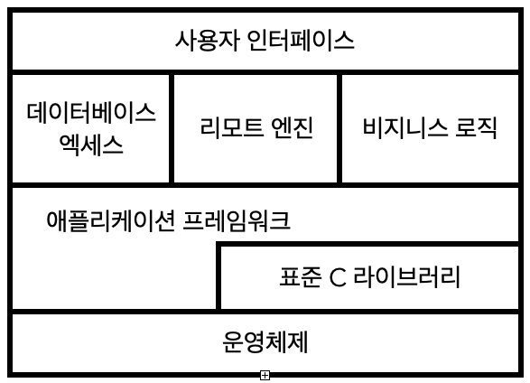

# 2장. 실용주의 접근법

# 7. 중복의 해악

지식은 고정적이지 않다. 요구사항이 당장 내일 바뀔 수도, 테스트가 돌아가지 않을 수도 있다. 즉, 우리는 유지보수하는데 많은 시간을 보내게 된다. 유지보수는 별개의 활동이 아니며, 전체 개발 과정의 일상적인 부분이다. 

소프트웨어를 신뢰성 높게 개발하고, 개발을 이해하고 유지보수하기 쉽게 만드는 유일한 길은 DRY를 따르는 것이다.

> Tip 11. 
DRY - 반복하지 마라(Don't Repeat Yourself)

## 어떻게 중복이 생기는가?

- **강요된 중복** - 다른 선택이 없고, 환경이 중복을 요구하는 것처럼 보이는 것
- **부주의한 중복** - 중복이 있는지 모르는 것
- **참을성 없는 중복** - 중복이 있는지 알지만 게을러서 중복을 하게 되는 것
- **개발자간의 중복** - 여러 사람이 동일한 정보를 중복하는 것

### 강요된 중복

- 프로젝트 표준
- 중복 정보가 생기는 문서를 요구
- 여러 플랫폼 지원

하지만 여기서도 DRY 원칙을 지킬 수 있다.

1. 정보의 다양한 표현양식
    - 클라이언트, 서버에서 언어는 다르지만 같은 구조 사용
    - 데이터베이스 테이블과 객체도 같은 구조 사용
    - **필터나 코드 생성기**를 사용하면 중복 제거 가능
        - 여러개의 언어에 걸쳐 있는 구조를 만들어낼 수 있다.
2. 코드내의 문서화
    - 주석은 필연적으로 낡게 되기 때문에 지양하자
3. 문서화와 코드
    - 클라이언트가 명세를 수정하면 테스트가 자동 생성할 수 있게 할 수 있다.

### 부주의한 중복

'선'을 표현하는 클래스의 경우, 아래와 같이 설계할 수 있다.

```java
class Line {
	public:
		Point start;
		Point end;
		double length;
};
```

그러나 이 클래스는 중복이 있다. 여기서 길이는 선언하는 것 보다는 계산되는 필드로 만드는 것이 낫다. 점을 하나라도 바꾸게 된다면 길이를 항상 바꿔야하기 때문이다.

```java
class Line {
	public:
		Point start;
		Point end;
		double length() { return start.distanceTo(end); }
};
```

### 참을성 없는 중복

👀 전체 소스를 복사하고 필요한 것만 살짝 바꿀까 ... ?

지금 당장은 몇 초를 절약할 수 있을지라도, 나중에는 몇 시간을 잃게 될 수도 있다.

### 개발자간의 중복

가장 최선책은 개발자간에 적극적이고 빈번한 소통을 장려하는 것이다.

> Tip 12.
재사용하기 쉽게 만들어라

재사용에 실패한다면 지식 중복의 위험을 각오해야 한다.

# 8. 직교성

## 직교성이란

하나가 바뀌어도 나머지에 어떤 영향도 주지 않으면 서로 직교한다고 말한다.

## 직교적인 시스템

> Tip 13.
관련 없는 것들 간에 서로 영향이 없도록 하라.

컴포넌트들이 각기 격리되어 있으면 어느 하나를 바꿀 때 나머지 것들을 걱정하지 않아도 된다. 직교적인 시스템을 작성하면 두 가지 장점이 있다.

- 생산성 향상
- 리스크 감소

### 생산성 향상

- 변경할 부분이 줄어드니 개발 시간과 테스트 시간이 줄어든다.
- 재사용을 할 수 있다. 컴포넌트끼리 느슨하게 결합되어있을 수도 재사용하기 쉽다.
- 직교적인 컴포넌트를 결합하면 단위 노력당 더 많은 기능을 얻을 수 있다.

### 리스크 감소

- 감염된 코드를 격리시킬 수 있다.
- 해당 컴포넌트들에 대해 테스트를 설계하고 실행하기 쉽다.
- 특정 벤더나 제품, 플랫폼에 덜 종속적이다.

## 프로젝트 팀

그룹의 직교성 역시도 낮으면 낮을 수록 좋다. 요청된 개별 변화에 대해 토론에 참여할 필요가 있는 사람이 몇 명인지 보자. 숫자가 클수록 그룹의 직교성이 낮은 것이다.

## 설계

레이어식 접근은 직교적 시스템을 설계하는 강력한 방법이다. 레이어들은 자기 밑에 있는 레이어들이 제공하는 추상화만을 사용하기 때문에 코드에 영향을 끼치지 않으면서 아래에 있는 다른 구현들을 바꾸는 높은 유연성을 얻을 수 있다. 종속성이 빨리 늘어나는 위험도 감소시킨다.



🧐 특정 기능에 대한 요구사항을 극적으로 변경했을 경우, 몇개의 모듈이 영향을 받을까?

직교적인 시스템이라면 1개여야 한다.

자신의 힘으로 제어할 수 없는 속성에 의존하지 마라.

## 툴킷과 라이브러리

툴킷이나 라이브러리를 도입할 때, 시스템의 직교성을 보존할 수 있는지 주의 깊게 살펴보자! 코드에 있어서는 안 될 변화를 강요하고 있다면, 사용을 다시 검토해보자.

객체 영속 방식이 투명하다면, 직교적이다. 하지만 특별한 방식으로 객체를 생성하고 접근해야 한다면 그렇지 않다.

## 코딩

직교성을 유지하기 위해 사용할 수 있는 방법들

- 코드의 결합도 줄이기
    - 부끄러움 타는 코드를 작성하라. 즉, 불필요한 어떤 것도 다른 모듈에게 보여주지 않으며, 다른 모듈의 구현에 의존하지 않는 코드를 작성하라.
    - 디미터 법칙을 따르려 노력해보자.
- 전역 데이터를 피하라
    - 해당 데이터를 공유하는 다른 컴포넌트와 묶이게 된다.
    - 싱글톤을 사용할 때에는 주의를 기울여라. 싱글톤은 불필요한 링크를 유도한다.
- 유사한 함수를 피하라
    - 스트래티지 패턴을 사용하여 더 나은 구현을 할 수는 없는지 고려해보자

자신이 작성하는 코드를 항상 비판적으로 검토해보는 습관을 가져야한다.

## 테스트

직교적으로 설계된 시스템은 각각의 모듈 수준에서 수행하면 되기 때문에 테스트하기 더 쉽다. 만약 단위 테스트를 빌드하기 위해 이런 저런 시스템을 빌드하고 링크가 되어야 한다면 결합도를 적절히 줄이지 못한 것이다.

버그를 수정할 때, 얼마나 지역화되어있는지 확인해보자. 버그를 수정하고 태그를 붙이면 영향 받는 소스 파일의 개수에 대해 경향을 분석한 리포트를 받을 수 있는데, 이걸 통해 직교적으로 더 개선해보자.

## 직교적으로 살아가기

DRY와 비슷하다. 

- DRY : 시스템 내부의 중복을 최소화시키자
- 직교성 : 시스템 컴포넌트 간의 상호 의존드를 줄인다.

→ DRY 원리로 무장하고 직교성 원리를 충분히 사용한다면 개발하고 있는 시스템이 더 유연하고, 이해하기 쉽고 또한 디버그, 테스트, 유지도 쉬워질 것이다.

# 9. 가역성

## 가역성

결정이 돌에 새겨지는 것이라고 가정하고, 발생할지도 모를 우연한 사건들에 대해 준비하지 않은 데에서 실수가 나온다. 결정이 돌에 새겨진 것이 아니라 해변가의 모래 위에 쓰인 글씨라 생각해 보자. 언제든지 큰 파도가 글씨를 지워버릴 수 있다.

> Tip. 14
최종 결정이란 없다.

## 유연한 아키텍처

추상화를 잘 시키고, 의존성을 한데 모으자. 누구도 미래에 대해서 알 수 없고 우리라도 예외는 아니다.

# 10. 예광탄

## 어둠 속에서 빛을 내는 코드

요구사항으로부터 최종 시스템의 일부 측면에까지 빨리, 눈에 보이게, 반복적으로 도달해줄 무언가를 찾아야 한다.

> Tip. 15
목표물을 찾기 위해 예광탄을 써라.

빨리 눈에 보이는 전체 플로우를 만들어 내는 것이 중요하다. 물론 완전한 기능을 넣을 필요는 없다. 하지만 빠른 피드백을 내 놓을 수 있게 하고, 빠른 생산성을 낼 수 있게 하는 효과가 있다. 또한 전체 상태에 대해 쉽게 파악할수도 있다.

예광탄 코드 접근 방법의 장점

- 사용자들은 뭔가 작동되는 것을 일찍부터 보게 된다.
- 개발자들은 들어가서 일할 수 있는 구조를 얻는다.
- 통합 작업을 수행할 기반이 생긴다.
- 보여줄 것이 생긴다.
- 진전 상황에 대해 더 정확하게 감을 잡을 수 있다.

## 예광탄이 언제나 목표물을 맞추는 것은 아니다

사용자가 원하던게 아닐 수도 있고, 성능에 문제가 있을 수도 있다. 하지만 코드의 크기가 작기 때문에 관성도 작고, 피드백을 통해 더 정확한 버전을 만들 수 있다.

## 예광탄 코드 vs 프로토타이핑

- 프로토타입
    - 최종 시스템의 특정한 측면을 탐사해 보는 것이 목표
    - **나중에 버릴 수 있는 코드를 만든다.**
- 예광탄 코드
    - 어플리케이션이 전체적으로 어떻게 연결되는지를 알고 싶은게 목표
    - **기능은 별로 없지만 완결된 코드, 최종 시스템 골격의 일부를 이룬다.**

# 11. 프로토타입과 포스트잇

프로토타입은 제한된 몇 가지 질문에 답할 목적으로 설계되기 때문에 실제 제품보다 훨씬 적은 비용으로 빠르게 개발할 수 있다.

당장 중요하지 않은 세부 사항을 무시해도 된다. 예를 들어 GUI를 프로토타이핑 하고 있다면 정확한 결과, 데이터가 필요 없고, 데이터를 프로토 타이핑하고 있다면 GUI가 아얘 없어도 된다.

만약 세부사항을 포기할 수 없다면 예광탄 코드를 고려하자.

## 프로토타입의 대상

프로토타입을 통해 조사할 대상은 위험을 수반하는 모든 것이다.

- 이전에 해본 적이 없는 것
- 최종 시스템에 매우 중요한 것
- 증명되지 않은 것
- 실험적인 것
- 의심이 가는 것
- 심적으로 편하지 않는 것

즉,

- 아키텍처
- 기존 시스템에 추가할 새로운 기능
- 외부 데이터의 구조 혹은 내용
- 써드파티 도구나 컴포넌트
- 성능 문제
- 사용자 인터페이스 설계

프로토타입은 학습 경험이며, 프로토타입의 가치는 생성된 코드에 있는게 아니라 이를 통해 배우게 되는 교훈에 있다.

> Tip. 16
프로토타입을 통해 학습하라.

## 프로토타입을 어떻게 사용할 것인가?

프로토타입을 만들 때 무시해도 좋은 세부사항으로는 뭐가 있을까?

- 정확성 : 더미데이터를 사용해도 된다.
- 완전성 : 제한된 기능만을 제공해줘도 된다.
- 안정성 : 예외 상황에 대해 불안정하고 무시될 수 있다.
- 스타일 : 주석이나 문서를 많이 적지 않아도 된다.

## 아키텍처 프로토타이핑

아키텍처 프로토타입에서 규명할 만한 사항은 이런 것들이 있다.

- 주요 컴포넌트의 책임이 잘 정의되었고 적절한가?
- 주요 컴포넌트 간의 협력관계가 잘 정의되었는가?
- 결합도는 최소화되었는가?
- 잠재적 중복을 찾아낼 수 있는가?
- 인터페이스 정의와 제약 사항은 수용할만한가?
- 각 모듈이 실행 중에 필요로 하는 데이터에 접근할 수 있는 경로를 갖고 있는가? 모듈은 데이터를 필요로 할 때 데이터에 접근할 수 있는가?
    - 이 항목은 가장 놀랍고 값진 결과를 내놓기 쉽다.

## 어떻게 프로토타입을 사용하지 않을 것인가?

프로토타입은 나중에 폐기처분할 코드를 미리 작성하고 있다는 것을 알려주어야 한다.

공감하지 못한다면 예광탄 코드를 도입하자.

프로토타입을 적절히 사용하면 많은 시간과 돈, 고통과 고생을 줄일 수 있다.

# 12. 도메인 언어

적당한 곳에 적절히 자원만 있다면, 애플리케이션 도메인에 훨씬 가깝게 프로그래밍 할 수 있다.

> Tip. 17
문제 도메인에 가깝게 프로그래밍하라.

## 쉬운 개발 아니면 쉬운 유지보수?

쉬운 유지보수. 대부분의 애플리케이션이 예상 수명보다 더 오래간다는 사실에 비추어볼 때, 현재의 고통을 참고 더 복잡하지만 가독성 좋은 언어를 채택하는게 좋다.

# 13. 추정

> Tip. 18
추정을 통해 놀람을 피하라

## 얼마나 정확한 것이 충분히 정확한 것인가?

질문자가 매우 높은 정확도의 답을 요구하는지, 단순히 큰 그림만을 요구하는건지를 먼저 파악해야 한다.

- 할머니가 나에게 집에 언제 도착하는지 물어보았다.
    - 단순하게 점심을 준비해야할지, 저녁을 준비해야할지 궁금해서 물어본 것
- 물 속에서 사고를 당한 다이버가 있다. 119가 언제 도착하는지 물었다.
    - 매우 급한 상황이고 그만큼 매우 높은 정확도를 요구하기 위해 물어본 것
- 파이값 (3.14..)
    - 장식대에 두를 가장자리 장식이 파이값이다. → 대충 3이구나.
    - 학교에서 파이값이 얼마냐고 물었다. → 3.14정도 되는구나.
    - NASA에 근무하는데 파이값이 얼마냐고 물었다. → 파이값의 소수점 이하 열두 자리까지는 말해야한다.

추정에서 사용하는 단위가 결과의 해석에 차이를 가져온다.

- "끝나는데 130일 정도 걸릴거에요!"
    - 상당히 가까운 시일 내에 끝날 것이라 생각하며 정확한 일적을 기대한다.
- "대략 6달 정도 걸릴거에요!"
    - 5~7달 사이 언젠가 끝날 것이라 여길 것이다.

기간을 추정할 때에는 아래와 같은 단위를 사용하자

- 1~15일 → 일
- 3~8주 → 주
- 8~30주 → 달
- 30주 이상 → 다시 생각해보기

## 추정치는 어디에서 오는가?

가장 좋은 방법은 이미 그 일을 해본 사람에게 물어보는 것이다.

### 1. 무엇을 묻고 있는지를 이해하자

정확도 뿐만 아니라 도메인의 범위에도 감을 잡아야 한다.

### 2. 시스템의 모델을 만들어보라

초기의 질문을 재검토하게 할 수도 있다. (이 방법으로 하면 기능이 한 개 빠지지만 기간은 반으로 줄어들 수 있습니다.)

### 3. 모델을 컴포넌트로 나누어라

각 컴포넌트가 전체 모델에 어떻게 기여하는지 에 영향을 미치는 매개 변수를 갖고 있다는 것을 알게 된다. 여기에서 매개 변수를 규명하자

### 4. 각 매개 변수에 값을 주어라

큰 영향을 주는 매개 변수가 무엇인지를 규명하고, 매개 변수의 값들을 최대한 정확히 산출해보자.

### 5. 답을 계산하라

중요 매개변수들의 값을 변경시켜 가면서 계산을 해보고, 어떤 것이 모델과 잘 들어맞는지 찾아내라. 계산 단계에서 언뜻 이상해보이는 답을 얻을 수도 있지만, 값을 쉽게 버리진 말자. 

계산이 정확하다면, 문제를 잘못 이해했거나 모델이 잘못되었을 것이다. 이는 귀중한 정보다.

### 6. 추정치를 계산하는 용기

계산한 추정치를 기록해놓고, 값이 실제 결과에 얼마나 가까운지를 평가해보는 것은 좋은 생각이다.

추정치가 잘못되었다면? 왜 달라졌는지 원인을 찾아야한다. 매개 변수를 잘못 선택했을 수도, 모델 자체가 잘못되었을 수도 있다. 원인이 무엇이든 규명하라. 나중에는 더 나아질 것이다.

## 프로젝트 일정 추정하기

점증적 개발을 연습한다면 가능하다.

- 요구사항 체크하기
- 위험 분석하기
- 설계, 구현, 통합
- 사용자와 함께 검증하기

> Tip. 19
코드와 함께 일정도 반복하며 조정하라

## 누군가 추정에 물으면 무엇이라 대답해야 할까?

"나중에 전화드릴게요"라고 하고

앞에서 기술한 단계를 밟아나가자!