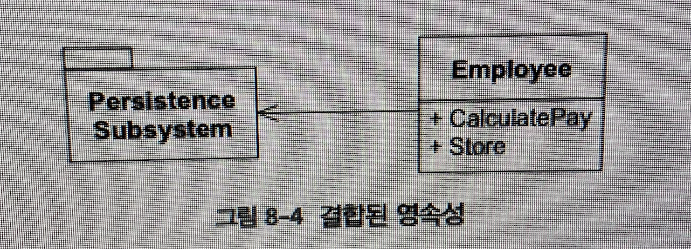

# 2. 애자일 설계

# 7. 애자일 설계란 무엇인가?

설계는 다양한 매체로 표현될 수 있지만, 최종적인 구현은 소스 코드가 된다. 결국, 소스 코드가 바로 설계다.

## 설계의 악취: 부패하고 있는 소프트웨어의 냄새

1. 경직성 : 시스템을 변경하기 어렵다. 하나를 변경하려면 다른 부분도 많이 변경해야 한다.
2. 취약성 : 변경을 하면 개념적으로 관련 없는 부분이 망가진다.
3. 부동성 : 시스템을 다른 시스템에서 재사용할 수 있는 컴포넌트로 구분하기 어렵다.
4. 점착성 : 옳은 동작을 하는 것이 잘못된 동작을 하는 것보다 더 어렵다.
5. 불필요한 복잡성 : 직접적인 효용이 전혀 없는 기반구조가 설계에 포함되어 있다.
6. 불필요한 반복 : 단일 추상 개념으로 통합할 수 있는 반복적인 구조가 설계에 포함되어 있다.
7. 불투명성 : 읽고 이해하기 어렵다. 그 의도를 잘 표현하지 못한다.

## 무엇이 소프트웨어의 부패를 촉진하는가?

계속되는 요구사항 변경 때문에 설계가 실패한다면, 우리의 설계와 방식에 문제가 있는 것이다.

이런 변경이 대해서도 탄력적인 설계를 만드는 방식을 찾아야 하고, 그것이 부패하지 않도록 보호할 수 있는 방식을 사용해야 한다.

## Copy 프로그램

> 키보드에서 프린터로 문자를 복사하는 프로그램을 만들어라!
> 

### 초기설계

                              Copy
    
              —————————

  char⬆      |                            | ⬇️char

Read Keyboard                   Write Printer

```java
void Copy() {
	int c;
	while ((c = Rdkbd()) != EOF)
			WrtPrt(c);
}
```

잘 동작한다.

### 요구사항 변경

> Copy 프로그램이 종이테이프 판독기에서도 문자를 읽을 수 있었으면 좋겠다.
> 

```java
bool ptFlag = false; // 종이테이프 판독을 위한 플래그 값
void Copy() {
	int c;
	while ((c (ptFlag ? RdPt() : = Rdkbd())) != EOF)
			WrtPrt(c);
}
```

종이테이프 판독기에서 입력을 받길 원하면 true,  끝나면 꼭 false로 바꿔야한다.

### 한 치를 주니 ...

> Copy 프로그램으로 종이테이프 천공기에 출력을 하고 싶다.
> 

```java
bool ptFlag = false; 
bool punchFlag = false; // 천공기 출력을 위한 플래그 값

void Copy() {
	int c;
	while ((c (ptFlag ? RdPt() : = Rdkbd())) != EOF)
			punchFlag ? WrtPunch(c) : WrtPrt(c);
}
```

### 변화를 예상하라

두 번의 변경만에 경직성, 취약성, 부동성, 복잡성, 반복, 불투명성의 신호를 보여주게 되었다.

요구사항은 언제나 바뀐다. 만약 설계가 요구사항 변경 때문에 퇴화한다면, 우리는 애자일 방식대로 일하고 있지 않은 것이다.

## Copy 프로그램의 애자일 설계

탄력적으로 수용할 수 있게 설계를 해보자

```java
class Reader {
	public : virtual int read() = 0;
}

class KeyboardReader : public Reader {
	public : virtual int read() {
		return RdKbd();
	}
}

KeyboardReader GdefaulthReader;

void Copy(Reader & reader = GdefaulthReader) {
	int c;
	while ((c = reader.read()) != EOF)
		WrtPrt(c);
}
```

애자일 팀은 개방 폐쇄 원칙을 따른다.

## 애자일 개발자는 해야 할 일을 어떻게 알았는가?

초기 설계는 Copy 모듈이 KeyboardReader와 PrinterWriter에 직접 의존했다. 

Copy 모듈은 상위 수준의 모듈은, 애플리케이션의 정책을 결정하고 문자를 복사하는 방법을 알고 있다.

→ 하위 수준의 세부 사항이 바뀔 때, 상위 수준의 정책이 영향을 받게 된다.

즉, Copy 모듈에서 입력 장치로 향하는 의존성을 거꾸로 뒤집어 Copy가 입력 장치에 의존하지 않도록 해야한다.

## 가능한 한 좋은 상태로 설계 유지하기

설계는 명료한 상태로 유지되어야 한다.


# 8. 단일 책임 원칙(SRP)

## 단일 책임 원칙(SRP)

> 한 클래스는 단 하나의 변경 이유만을 가져야 한다.

볼링 게임을 생각해보자. Game 객체는 두 가지 책임을 가지고 있었다.

1. 현재 프레임을 기억하는 것
2. 스코어를 계산하는 것

→ 2번을 Scorer가 맡게 바꾸었다.

책임은 변경의 축이다. 한 클래스가 하나 이상의 책임을 맡는다면, 그 클래스를 변경할 하나 이상의 이유가 있을 것이다.

예를 들어 Rectangle이라는 클래스가

1. 화면에 직사각형을 그리는 것
2. 직사각형의 넓이를 계산하는 것

의 두 가지 책임을 가지고 있으면, SRP를 위반하는 것이다.

차라리 GeometricRanctangle이라는 객체를 만들어서 넓이를 계산하는 책임을 넘겨주자!

## 책임이란 무엇인가?

```java
interface Modem {
	public void dial(String pno);
	public void hangup();
	public void send(char c);
	public char recv();
}
```

언뜻보면 문제가 없지만, 사실 문제가 있다.

dial, hangup → 모뎀의 연결을 관리

send, recv → 데이터를 주고받으며 통신

```java
interface DataChannel {
	public void send(char c);
	public char recv();
}

interface Connection {
	public void dial(String pno);
	public void hangup();
}
```

이렇게 나누는게 낫다.

단, 서로 다른 시간에 두 가지 책임의 변경을 유발하는 방식으로 바뀌지 않는다면 분리할 필요는 없다. (오히려 불필요한 복잡성이 될 수도 있다.)

변경의 축은 변경이 실제로 일어날 때만 변경의 축이다.

## 영속성



이 두 책임은 어울리지 않는다.

업무 규칙은 자주 바뀌고, 영속성은 자주 바뀌지 않는 경향이 있지만, 바뀌는 이유도 완전히 다르다.

업무 규칙과 영속성 서브 시스템을 묶는 것은 문제를 부르는 것이다.

## 결론

책임을 찾고 하나씩 분리하는 것이 설계에서 하는 일의 대부분이다. 이후에 논의할 나머지 원칙들에서도 어떤 식으로든 이 문제로 돌아온다.