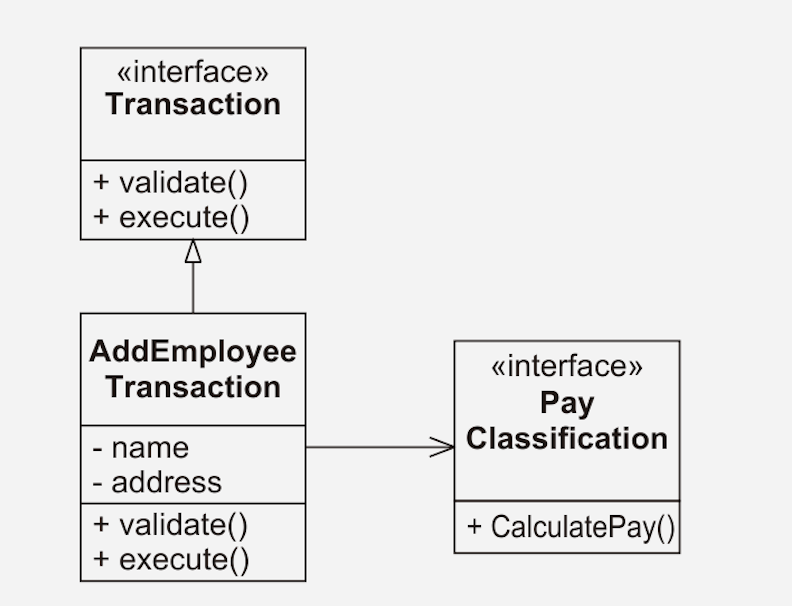

# 3. 급여 관리 사례 연구

# 13. 커맨드 액티브 오브젝트 패턴

실행될 기능을 캡슐화함으로써 주어진 여러 기능을 실행할 수 있는 재사용성이 높은 클래스를 설계하는 패턴

ref. [https://gmlwjd9405.github.io/2018/07/07/command-pattern.html](https://gmlwjd9405.github.io/2018/07/07/command-pattern.html)

커맨드 패턴은 명령의 개념을 캡슐화함으로써 연결된 장치에서 시스템의 논리적인 상호 연결을 분리해낼 수 있게 했다. 

## 트랜잭션

만약 '직원 데이터베이스'가 있다고 생각해보자. 여기에 새 직원이 추가된다면?

사용자는 성공적으로 직원 레코드를 생성하는데 필요한 모든 정보를 지정해줘야한다.

→ 그 정보가 문법적으로, 의미적으로 옳은지 검증해야하는데, 커맨드 패턴이 이 일을 도와줄 수 있다.

coomand 객체는  ...

1. 검증되지 않은 데이터를 위한 저장소 역할을 한다.
2. 검증 메서드를 구현한다.
3. 트랜잭션을 실행하는 메서드를 구현한다.



AddEmployeeTransaction 객체는 ...

1. Employee가 포함하고 있는 것과 똑같은 데이터 필드를 갖고 있다.
    - 검증되지 않은 데이터를 위한 저장소 역할을 한다.
2. PayClassification 객체에 대한 포인터도 저장한다.
3. 새로운 직원을 추가하라는 지시가 있을 때, 사용자가 지정한 날짜에 의해 생성된다.
4. 메서드를 가지고 있다.
    - `validation()`
        - 데이터를 살펴보고, 그것이 이치에 맞는지 확인한다.
        - ex. 직원이 존재하지 않거나 하는~!
    - `execute()`
        - 검증된 데이터를 사용해 데이터베이스를 갱신한다.

### 얻을 수 있는 이점

- 이 트랜잭션에 대한 검증, 실행 알고리즘이 GUI가 아닌, 객체에게 있음으로써 **물리적으로 분리**가 된다.
- 즉시 호출하지 않고, 필요할 때에 호출이 가능하므로 **시간적으로 분리**가 된다.
- **되돌리기**를 위한 메서드를 강제할 수 있다.
  
    ```java
    interface Command [
    	void do();
    	void undo(); // 복원
    }
    
    ```
    
    - 명령을 취소하는 방법을 아는 코드는 항상 그 명령을 수행하는 방법을 아는 코드와 함께 있어야 한다.

## 액티브 오브젝트 패턴

다중 제어 스레드 구현을 위한 기법이다.

[예제링크](https://blog.naver.com/PostView.nhn?blogId=jwyoon25&logNo=222000521164&categoryNo=0&parentCategoryNo=0&viewDate=&currentPage=1&postListTopCurrentPage=1&from=postView) 참고

## 결론

커맨드 패턴은 데이터베이스의 트랜잭션, 장치 제어, 멀티스레드 시스템의 핵심, GUI에서의 실행/취소 관리에 이르기까지 정말 다양한 용도로 사용될 수 있다.

# 14. 스트래터지 패턴: 상속과 위임

상속의 과도한 사용은 아주 비싼 대가를 지불한다.

상속을 사용하는 것보다는 복합이나 위임으로 대체했다.

- 템플릿 메서드 패턴
    - 문제를 해결하기 위해 **상속**을 사용함
- 스트래터지 패턴
    - 문제를 해결하기 위해 **위임**을 사용함
    

## 템플릿 메서드 패턴

[템플릿 메서드 패턴이란?](https://gmlwjd9405.github.io/2018/07/13/template-method-pattern.html)

무조건 적용한다고 좋진 않다. 패턴을 적용하는데 드는 비용과, 결과적으로 생기는 이익을 잘 계산해야한다.

템플릿 메서드 패턴은 객체 지향 프로그래밍에서 고전적인 재사용 형태의 하나를 보여준다. 일반적인 알고리즘은 기반 클래스에 있고, 다른 구체적인 내용에서 상속된다.

하지만 이 기법은 비용을 수반한다. 상속은 아주 강한 관계여서, 파생 클래스는 필연적으로 기반 클래스에 묶이게 된다.

## 스트래터지 패턴

[스트래티지 패턴이란?](https://gmlwjd9405.github.io/2018/07/06/strategy-pattern.html)

스트래티지 패턴은 템플릿 메서드 패턴에 비해 한 가지 특별한 이점을 제공한다. 템플릿 메서드 패턴이 일반적인 알고리즘으로 많은 구체적인 구현을 조작할 수 있게 해주는 반면, DIP를 완전히 따르는 스트래터지 패턴은 각각의 구체적인 구현이 다른 많은 일반적인 알고리즘에 의해 조작될 수 있게 해준다.

## 결론

약간의 복잡성, 메모리, 실행 시간을 더 감내하면 스트래터지는 구체적인 부분이 상위 단계 알고리즘으로부터 독립적으로 재사용될 수 있게까지 해준다.

# 15. 퍼사드와 미디에이터 패턴

- 퍼사드
    - 위로부터 정책을 적용한다.
    - 사용이 가시적이고 강제적이다.
- 미디에이터
    - 아래로부터 정책을 적용한다.
    - 비가시적이고 허용적이다.

## 퍼사드 패턴

복잡하고 일반적인 인터페이스를 가진 객체 그룹에 간단하고 구체적인 인터페이스를 제공하고 할 때 사용된다.

[퍼사드 패턴이란?](https://jusungpark.tistory.com/23)

## 미디에이터 패턴

자신의 정책을 은밀하고 강제적이지 않은 방식으로 적용한다.

[미디에이터 패턴이란?](https://www.crocus.co.kr/1542)

## 결론

정책 적용이 크고 가시적이어야 하는 경우에는 퍼사드를,

교묘함과 재량이 필요한 경우에는 미디에이터가 더 나은 선택이 될 것이다.

퍼사드는 보통 어떤 규정의 중심이 되며, 모든 사람은 그 아래에 있는 객체들이 아니라 이 퍼사드를 사용하기로 합의한다.

미디에이터는 사용자에게 감춰져 있다. 이것의 정책은 규정의 문제라기보다는 기정사실이다.