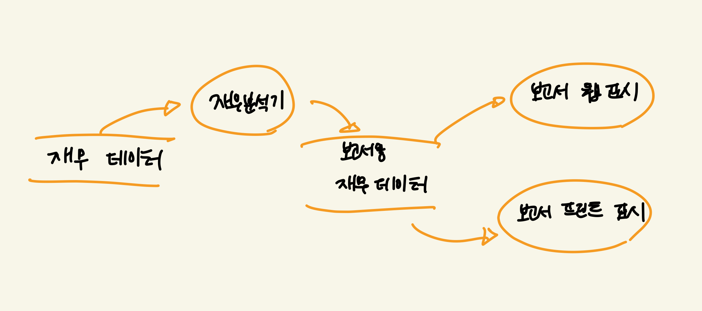
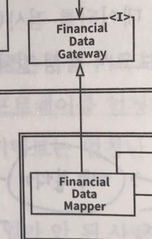
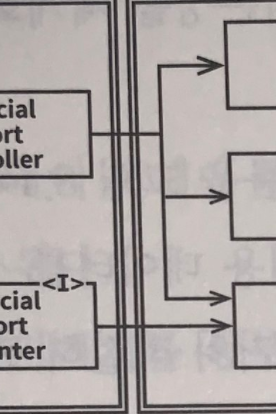
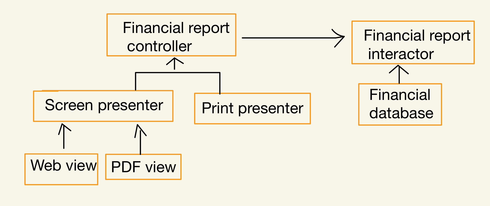
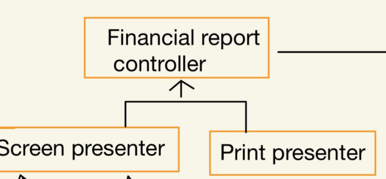
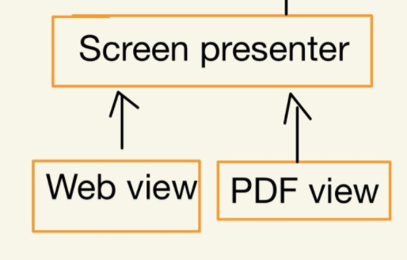
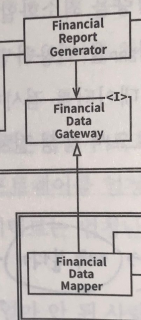
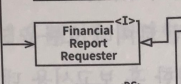

# 08장. 개방-폐쇄 원칙

# 개방-폐쇄 원칙이란?(OCP)

기존 코드를 수정하기보다는 반드시 새로운 코드를 추가하는 방식으로 시스템의 행위를 변경할 수 있도록 설계해야만 소프트웨어 시스템을 쉽게 변경할 수 있다는 것이 이 원칙의 요지입니다.

**소프트웨어 개체는 확장에는 열려 있어야 하고, 변경에는 닫혀 있어야 한다.**

즉, 소프트웨어 개체의 행위는 확장할 수 있어야 하지만, 이때 개체를 변경해서는 안 됩니다.

🤔 OCP는 그럼 클래스와 모듈을 설계할 때만 도움되는 원칙 인가요?

→ 아니요! 오히려 아키텍처 컴포넌트 수준에서 OCP를 고려할 때 휠씬 중요한 의미를 가집니다.

# 사고 실험

소프트웨어 아티텍처가 훌륭하다면 변경되는 코드의 양이 가능한 한 최소화 되어야 합니다.

이상적인 변경량은 0!!

🤯변경량이 0이라니... 어떻게 하면 될까요?

- 서로 다른 목적으로 변경되는 요소를 적절하게 분리(SRP)
- 요소 사이의 의존성을 체계화(DIP)

→ 이 두 법칙을 따르면 변경량을 최소화 할 수 있습니다.

재무재표를 웹 페이지로 보여주는 시스템에 요구사항이 추가되어 변경을 해보겠습니다.

이때, 변경량을 최소화해서 변경을 진행하겠습니다.😆

### SRP 적용하기

SRP를 적용해 데이터 흐름을 만들었습니다.

그림에서 볼 수 있듯이 보고서 생성이 두 개의 책임으로 분리가 됩니다.! 

- 보고서용 데이터를 계산하는 책임
- 이 데이터를 웹으로 보여주거나 종이로 프린트하기에 적합한 형태로 표현하는 책임

이렇게 책임이 분리되면 하나에서 변경이 일어나도 다른 하나는 변경이 안 되니 

- 소스 코드 의존성 확실한 조직화
- 새로 조직화한 구조에서 행위 확장 시 변경 발생하지 않은 보장

이런 목적들이 필요합니다.

### 처리 과정 클래스 단위 분활, 클래스 컴포넌트 단위 분리

SRP로 인한 목적들을 달성 위해

- 처리 관정 → 클래스 단위로 분할
- 분할된 클래스를 컴포넌트 단위로 구분

해야 합니다..!!

그럼 분할과 구분을 해 보겠습니다.

이렇게 클래스로 분할 한 다음, 클래스들을 컴포넌트 단위로 구분했습니다.

총 네 가지 컴포넌트가 존재합니다.

- `Controller`
- `Interactor`
- `Database`
- `Presenter`, `View`

💡  주목해야 할 점은 의존성이 소스 코드 의존성을 나타냅니다.

→ `FinanacialDataMapper`는 구현 관계를 통해 `FinanacialDataGateway`를 알고 있지만, `FinanacialDataGateway`는 `FinanacialDataMapper`에 대해 아무것도 모릅니다.

💡  주목해야 할 점은 이중선은 화살표와 오직 한 방향으로만 교차합니다.

→ 모든 컴포넌트 관계는 단 방향으로 이루어진다는 뜻입니다. 화살표는 변경으로부터 보호하려는 컴포넌트를 향하게 그려집니다.

### 컴포넌트 관계

컴포넌트들의 관계에 대해서 더 자세히 알아보겠습니다.

여기서, 주의할점은 A 컴포넌트에서 발생한 변경으로부터 B 컴포넌트를 보호하려면 반드시 A 컴포넌트가 B 컴포넌트에 의존해야 합니다.

- `Presenter`에서 발생한 변경으로 `Controller`를 보호하고자 한다면
- `View`에서 발생한 변경으로부터 `Presenter`를 보호하고자 한다면
- `Interator`는 다른 모든 것에서 발생한 변경으로부터 보호하고자 한다면

어떻게 해야 할까요?

1. `Presenter`에서 발생한 변경으로 `Controller`를 보호하고자 한다면

    `Presenter` 컴포넌트가 `Controller`에 의존해야 합니다.

    

2. `View`에서 발생한 변경으로부터 `Presenter`를 보호하고자 한다면

    `View` 컴포넌트가 `Presenter`에 의존해야 합니다.

    

3. `Interator`는 다른 모든 것에서 발생한 변경으로부터 보호하고자 한다면

    🤔 엇, 이부분은 어떻게 해결해야 하나요?

    일단, `Interator`는 OCP를 가장 잘 준수할 수 있는 곳에 위치합니다.

    → `Database`, `Contorller`, `Presenter`, `Veiw`에서 발생한 어떤 변경도 `Interator`에 영향을 주지 않기 때문입니다.

    🤔  그럼 왜, `Interator`은 특별한 위치에 있나요?

    바로 `Interator`가 업무 규칙을 포함하기 때문입니다. 애플리케이션에서 가장 높은 수준의 정책을 포함하고 `Interator` 이외의 컴포넌트는 모두 주변적인 문제를 처리합니다. 가장 중요한 문제는 `Interator`  가 담당합니다.

이 세 가지를 살펴보면 우리는 컴포넌트 계층 구조에 대해 알 수 있습니다.

### 컴포넌트 계층 구조

- `Interator` → `Controller` 부수적
- `Controller` → `Presenter`와 `View`에 비해 중식적인 문제 다룸
- `Presenter` → `View`에 비해 중심적인 문제 다룸

**'보호'와 '계층구조 수준'은 서로 연관이 됩니다.**

→ 가장 높은 수준의 개념(`Interator`)이면 최고의 보호를 받고 가장 낮은 수준의 개념 중 하나(`View`)이면 거의 보호를 받지 못합니다.

아키텍처 수준에서 OCP가 동작하는 방식으로 아키텍트는 기능이 어떻게, 왜, 언제 발생하는지에 따라 기능을 분리하고, 분리한 기능을 컴포넌트의 계층구조로 조직화 합니다.

결론은, 저수준 컴포넌트에서 발생한 변경으로부터 고수준 컴포넌트를 보호할 수 있습니다.👍

# 방향성 제어

이 부분을 보면  `FinancialDataGateway` 인터페이스는 `FinancialReportGenerator`와 `FinancialDataMapper` 사이에 위치합니다.

바로 의존성을 역전 시키기 위해서입니다.! 

만약, `FinancialDataGateway` 인터페이스가 없다면 의존성이 `Interator` 컴포넌트에서 `Database` 컴포넌트로 바로 향하게 되는 불상사가 발생하게 됩니다.🤯

# 정보 은닉

🤔 그럼 이 인터페이스도 의존성 역전 시키기 위함인가요?

→ 아니요! 이 `FinancialRepoertRequester` 인터페이스는 방향성 제어와는 다른 목적입니다.

소프트웨어 엔티티는 '자신이 직접 사용하지 않는 요소에는 절대로 의존해서는 안 된다' 라는 소프트웨어 원칙을 지키기 위해 존재하는데요

`Controller`에서 발생한 변경으로부터 `Interator`을 보호하고 반대로 `Interator`에서 발생한 변경으로 부터 `Controller`도 보호되기를 바랍니다! 그래서 `Interator` 내부를 은닉합니다.

# 결론

OCP는 시스템의 아키텍처를 떠받치는 원동력 중 하나입니다.

OCP의 목표는 시스템을 확장하기 쉬운 동시에 변경으로 인해 시스템이 너무 많은 영향을 받지 않도록 하는데 있습니다.

- 시스템을 컴포넌트 단위로 분리
- 저수준 컴포넌트에서 발생한 변경으로부터 고수준 컴포넌트를 보호할 수 있는 형태의 의존성 계층 구조