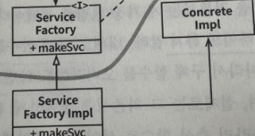

# 11장. 의존성 역전 원칙

`유연성이 극대화된 시스템` 이란 소스 코드 의존성이 추상에 의존하며 구체에는 의존하지 않는 시스템입니다.

정적 타입언어에서 이말을 해석하면 use import include 구문은 인터페이스, 추상 클래스 같은 추상적인 선언만을 참조해야 한다는 뜻 입니다. 즉, 구체적인 대상에는 절대로 의존해서는 안 됩니다.

하지만 소프트웨어 시스템이라면 구체적인 많은 장치에 반드시 의존하기에 비현실적인 규칙입니다.

그래서 DIP를 이야기 할때에는 운영체제나 플렛폼 같이 안정성이 보장된 환경에 대해서 무시하는 ㄴ입니다.

변경되지 않는다면 의존할 수 있다는 사실을 이미 알고 있기 때문입니다.

🤔 그럼 의존을 피하고자 하는 것은 무엇인가요?

바로, 변동성이 큰 구체적인 요소입니다. 이 요소는 개발하는 중이기에 자주 변경될 수 밖에 없는 모듈들 입니다.

# 안정된 추상화

추상 인터페이스에 변경이 생기면 이를 구체화한 구현체들도 수정이 필요해 집니다.
그럼 반대로 생각해보면 구현체들에게 변경이 발생해도 인터페이스는 변경이 필요 없습니다.

따라서 인터페이스는 구현체보다 변동성이 낮습니다.

안정된 소프트웨어 아키텍처란 변동성이 큰 구현체에 의존하는 일은 지향하고, 안정된 추상 인터페이스를 선호하는 아키텍처입니다.

- 변동성이 큰 구체 클래스를 참조하지 말라.

    → 추상 인터페이스를 참조해야 합니다. 이 규칙은 객체 생성 방식을 강하게 재약해 일반적으로 추상 팩토리를 사용하도록 강제합니다.

- 변동성이 큰 구체 클래스로부터 파생하지 말라.

    → 상속은 관계에서 뻣뻣해서 변경하기 어렵기에 진숭하게 사용해야 합니다.

- 구체 함수를 오버라이드 하지 말라.

    → 구체 함수는 소스 코드 의존성을 필요로 하기에 오버라이드 하면 의존성을 제거할 수 없고 상속하게 됩니다. 의존성을 제거하려면 추상 함수로 선언하고 구현체에서 용도에 맞게 구현해야 합니다.

- 구체적이며 변동성이 크다면 절대로 그 이름을 언급하지 말라.

# 팩토리

객체 지향 언어에서 좋지 못한 의존성을 처리할 때 추상 팩토리를 사용합니다.

위의 팩토리 패턴에서 곡선은 아키텍처의 경계를 뜻합니다. 

곡선은 구체적인 것들로부터 추상적인 것들을 분리하는데 소스 코드 의존성은 해당 곡선과 교차할 때 모두 한 방향, 즉 추상적인 쪽으로 향합니다.

- 추상 컴포넌트 : 애플리케이션의 모든 고수준 업무 규칙을 포함
- 구체 컴포넌트 : 업무 규칙을 다루기 위해 필요한 모든 세부사항 포함

제어흐름은 소스 코드 의존성과는 정반대 방향으로 곡선을 가로지릅니다.

즉, 소스 코드 의존성은 제어프름과는 반대 방향으로 역전됩니다.
→ 의존성 역전 원칙

# 구체 컴포넌트

위의 예제에서 보면 `ServiceFactoryImpl` 구체 클래스가 `ConcreteImpl` 구체 클래스에 의존합니다.

DIP 위배를 모두 없앨 수는 없지만 위배하는 클래스들은 적은 수의 구체 컴포넌트 내부로 모을 수 있고 이를 통해 시스템의 나머지 부분과 분리할 수 있습니다.

이러한 컴포넌트를 메인이라고 부루는데 `main` 함수를 포함하고 있기 때문입니다.

# 결론

📌 DIP는 아키텍처 다이어그램에서 가장 눈에 드러나는 원칙입니다.