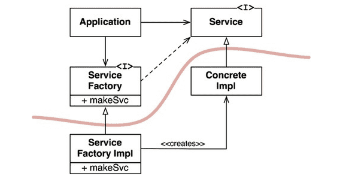

# 11장. DIP: 의존성 역전 원칙

의존성 역전 원칙에서 '유연성이 극대화된 시스템'

= 소스 코드 의존성이 추상(abstraction)에 의존하며 구체(concretion)에는 의존하지 않는 시스템

하지만, DIP를 논할 때에 운영체제, 플랫폼 같이 안정성이 보장된 환경에 대해서는 무시하는 편 (ex. Java의 String 구체 클래스)

= **변동성이 큰 구체적인 요소에는 의존하지 말아야한다. (구체적인 요소 = 우리가 열심히 개발하는 모듈)**

# 안정된 추상화

- 인터페이스는 구현체보다 변동성이 낮다.
    - 추상 인터페이스에 변경이 생기면 → 구현체 수정
    - 구현체에 변경이 생기면 → 추상 인터페이스는 수정 X
- 안정된 소프트웨어 아키텍처
    - 변동성이 큰 구현체에 의존하는 일은 지양하고, 안정된 추상 인터페이스를 선호하는 아키텍처

## 구체적인 코딩 실천법

- **변동성이 큰 구체 클래스를 참조하지 마라**
    - 대신 추상 인터페이스를 참조하라
- **변동성이 큰 구체 클래스로부터 파생하지 마라**
    - 상속은 뻣뻣하기 때문에 아주 신중하게 사용해야한다.
- **구체 함수를 오버라이드 하지 마라**
    - 구체 함수는 의존성을 필요로 한다.
    - 차라리 추상 함수로 선언하고 구현체들에서 각자의 용도에 맞게 구현하라
- **구체적이며 변동성이 크다면 그 이름을 언급하지 말라**
    - DIP 원칙을 다른 방식으로 풀어쓴 것임

# 팩토리

**변동성이 큰 구체적인 객체는 주의해서 생성해야한다.**

→ 자바에서는 의존성 관리를 위해 추상 팩토리 패턴을 사용한다.

여기서 곡선은 **아키텍처 경계**를 뜻한다.

- 구체적인 것들로부터 추상적인 것을 분리한다.
- 소스 코드 의존성은 해당 곡선과 교차할 때 모두 한 방향, 즉 추상적인 쪽으로 향한다.
- 곡선은 시스템을 추상 컴포넌트, 구체 컴포넌트로 분리한다.
    - 추상 컴포넌트는 애플리케이션의 모든 **고수준 업무 규칙**을 포함한다.
    - 구체 컴포넌트는 업무 규칙을 다루기 위해 필요한 **모든 세부사항**을 포함한다.
- 제어흐름은 소스 코드 의존성과는 정반대 방향으로 곡선을 가로지른다.

**→ 소스 코드 의존성은 제어 흐름과는 반대 방향으로 역전된다. = 의존성 역전**

# 구체 컴포넌트

🤔 ServiceFactoryImpl 구체 클래스가 ConcreateImpl 구체 클래스에 의존한다. 따라서 DIP에 위배되는 것이 아닌가?

🤓 DIP 위배를 모두 없앨 수는 없다. **하지만 DIP를 위배하는 클래스들은 적은 수의 구체 컴포넌트 내부로 모을 수 있고,** 이를 통해 시스템의 나머지 부분과 분리할 수 있다.

- 대다수의 시스템은 이러한 구체 컴포넌트를 최소한 하나 포함한다.
    - Main

# 결론

- 의존성은 아키텍처 경계를 기준으로, 더 추상적인 엔티티가 있는 쪽으로만 향한다.
- 이 규칙을 **의존성 규칙(Dependency Rule)**이라 부른다.