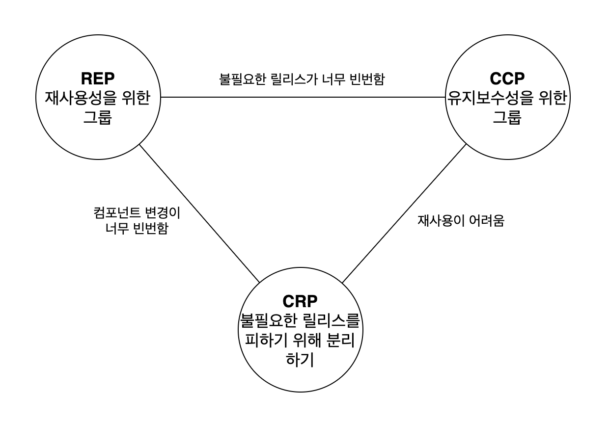

# 13장. 컴포넌트 응집도

- REP: 재사용/릴리스 등가 원칙(Reuse/Release Equivalence Principle)
- CCP: 공통 폐쇄 원칙(Common Closure Principle)
- CRP: 공통 재사용 원칙(Common Reuse Principle)

# REP: 재사용/릴리스 등가 원칙

> 재사용 단위는 릴리스 단위와 같다.

- 단일 컴포넌트는 응집성이 높은 클래스와 모듈들로 구성되어야 한다.
    - 컴포넌트를 구성하는 모든 모듈은 서로 공유하는 중요한 테마나 목적이 있어야 한다.
    - 하나의 컴포넌트로 묶인 클래스와 모듈은 반드시 함께 릴리스 할 수 있어야 한다.

# CCP: 공통 폐쇄 원칙

> 동일한 이유로 동일한 시점에 변경되는 클래스를 같은 컴포넌트로 묶어라. 서로 다른 시점에 다른 이유로 변경되는 클래스는 다른 컴포넌트로 분리하라.

- 단일 컴포넌트는 변경의 이유가 여러 개 있어서는 안 된다.
    - 대다수의 애플리케이션에서 유지보수성은 재사용성보다 훨씬 중요하다.
- 변경될 가능성이 있는 클래스들은 모두 한 곳으로 묶어야한다.
- OCP 원칙과도 밀접한 관련이 있다.

## SRP와 유사성

- CCP는 컴포넌트 수준의 SRP이다.
    - SRP → 서로 다른 이유로 변경되는 메서드를 서로 다른 클래스로 분리하라
    - CCP → 서로 다른 이유로 변경되는 클래스를 서로 다른 컴포넌트로 분리하라

# CRP: 공통 재사용 원칙

> 컴포넌트 사용자들을 필요하지 않는 것에 의존하게 강요하지 말라.

- 같이 재사용되는 경향이 있는 클래스와 모듈들은 같은 컴포넌트에 포함해야 한다.
- 의존하는 컴포넌트가 있다면 해당 컴포넌트의 모든 클래스에 대해 의존함을 확실히 인지해야 한다.
    - 한 컴포넌트에 속한 클래스들을 더 작게 그룹지을 수 없다.
    - 그 중 일부 클래스에만 의존하고 다른 클래스와는 독립적일 수 없음을 인지해야한다.
- 강하게 결합되지 않은 클래스들을 동일한 컴포넌트에 위치ㅣ시켜서는 안 된다.

## ISP와의 관계

- CRP는 인터페이스 분리 원칙(ISP)의 포괄적인 버전이다.
    - ISP → 사용하지 않는 메서드가 있는 클래스에 의존하지 말라고 조언
    - CRP → 사용하지 않는 클래스를 가진 컴포넌트에 의존하지 말라고 조언

    > 필요하지 않은 것에 의존하지 말라.

# 컴포넌트 응집도에 대한 균형 다이어그램

- 세 원칙은 서로 상충된다.
- REP와 CCP는 포함(inclusive) 원칙
    - 컴포넌트를 더욱 크게 만듬
- CRP는 배제(exclusive) 원칙
    - 컴포넌트를 더욱 작게 만듬

각 변(edge)은 반대쪽 꼭지점에 있는 원칙을 포기했을 때 감수해야하는 비용을 나타낸다.

일반적으로는 삼각형의 오른쪽에서부터 시작하며, 재사용만 희생하면 된다.

그러다 점차 왼쪽으로 이동해간다.

# 결론

- 재사용성과 개발 가능성의 상충 가능성을 반드시 고려해야 한다.
- 균형 잡는 것이 중요하고, 균형점은 항상 유동적이다.