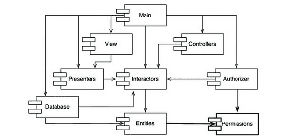

# 14장. 컴포넌트 결합

# ADP: 의존성 비순환 원칙

> 컴포넌트 의존성 그래프에 순환(cycle)이 있어서는 안 된다.

동일한 소스코드를 여러 사람이 수정하다 보면 서로의 코드에 의존성이 생긴다. 만약 내가 작성한 코드가 특정 컴포넌트에 의존해서 작동하고 있을 때, 누군가 그 컴포넌트를 잘못 건드리게 되면 내 코드까지 작동하지 않게 된다.

이를 해결하기 위한 방법이 두 가지 있다.

- 주 단위 빌드(weekly build)
- 의존성 비순환 원칙(Acyclic Dependencies Principle, ADP)

## 주 단위 빌드

- 중간 규모 프로젝트에서 흔하게 사용
- 진행 방법
    1. 모든 개발자는 일주일의 4일동안 각자 코딩한다.
    2. 금요일에 변경된 코드를 모두 통합하여 시스템을 빌드한다.
- 프로젝트가 커지면 금요일만에 끝내는게 불가능해짐

→ 통합에 들이는 시간이 길어지게 되고, 팀의 효율성이 나빠진다.

## 순환 의존성 제거하기

- 개발 환경을 릴리즈 가능한 컴포넌트 단위로 분리
- 진행 방법
    1. 자신만의 공간에서 컴포넌트 릴리즈
    2. 팀에서 새로운 릴리즈 컴포넌트를 쓸지말지 결정
- 단, 컴포넌트 사이의 의존성 구조에 순환이 있어서는 안 된다.

- 방향 그래프 형식이다.
- 컴포넌트는 정점(vertext)에 해당하고, 의존성 관계는 방향이 있는 간선(directed edge)에 해당한다.
- 어느 컴포넌트에서 시작하든, 의존성 관계를 따라가면서 최초의 컴포넌트로 돌아갈 수 없다.
- 이 구조는 순환이 없다. 즉, 비순환 방향 그래프(Directed Acyclic Graph, DAG)다.
- 시스템 전체를 릴리스해야 하면 상향식으로 진행된다.
    - Entities(컴파일, 테스트, 릴리스) → Database, Interators, → Presenters, View, Controllers, Authorizer ...
- 컴포넌트 구성요소 간 의존성을 파악하고 있으면 시스템을 빌드하는 방법과 순서를 알 수 있다.

## 순환이 컴포넌트 의존성 그래프에 미치는 영향

이렇게 되면 순환 의존성이 발생한다.

→ 순환을 하며 하나의 거대한 컴포넌트가 되어 버리고, 분리하기가 어려워진다. 또한 단위 테스트, 릴리즈 과정도 어려워지고, 이슈도 기하급수적으로 증가한다.

## 순환 끊기

1. 의존성 역전 원칙 적용하기. 아래 그림처럼 User가 필요로 하는 메서드를 제공하는 인터페이스를 생성한다. 그리고 이 인터페이스는 Entities에 위치시키고, Authorizer에서는 이 인터페이스를 상속받는다.

2. Entities와 Authorizer가 모두 의존하는 새로운 컴포넌트를 만들고, 두 컴포넌트가 모두 의존하는 클래스들을 새로운 컴포넌트로 이동시킨다.

## 흐트러짐

요구사항이 변경되면 컴포넌트 구조도 변경될 수 있다.

의존성 구조에 순환이 발생하는지 항상 관찰해야 한다.

# 하향식(top-down) 설계

- 컴포넌트 구조는 하향식으로 설계될 수 없다.
- 컴포넌트 의존성 다이어그램은 애플리케이션의 기능을 의미하지는 않고, 오히려 애플리케이션의 빌드 가능성(buuildability)과 유지보수성(maintainability)을 보여주는 지도(map)와 같다.
    - 빌드하거나 유지보수할 소프트웨어가 없다면 지도도 필요없기 때문에 프로젝트 초기에 설계할 필요가 없다.
- 의존성 구조와 관련된 최우선 관심사는 변동성을 격리하는 일이다.
    - 애플리케이션이 성장하면 CRP가 영향을 미치기 시작하고, 순환이 발생하면 ADP가 적용된다.
- 컴포넌트 의존성 구조는 시스템의 논리적 설계에 발맞춰 성장하며 또 진화해야 한다.
    - 아무런 클래스도 설계하지 않은 상태에서 컴포넌트 의존성 구조를 설계하려고 하면 실패를 할 것이다.

# SDP: 안정된 의존성 원칙

> 안정성의 방향으로(더 안정된 쪽에) 의존하라.

- 컴포넌트 중 일부는 변동성을 지니도록 설계된다.
- 변경이 쉽지 않은 컴포넌트가 변동이 예상되는 컴포넌트에 의존하게 만들어서는 절대로 안 된다.

## 안정성

- 쉽게 움직이지 않는
- 컴포넌트 안쪽으로 들어오는 의존성이 많아지면 안정적이다.

    

    x는 안정적인 컴포넌트이다.

    

    y는 상당히 불안정인 컴포넌트이다.

- 책임성과 안정성은 관련이 있다. 책임성이 높을 수록 안정성도 높아진다.

## 안정성 지표

- Fan-in
    - 안으로 들어오는 의존성
    - 이 지표는 컴포넌트 내부의 클래스에 의존하는 컴포넌트 외부의 클래스 개수를 나타낸다.
- Fan-out
    - 바깥으로 나가는 의존성
    - 이 지표는 컴포넌트 외부의 클래스에 의존하는 컴포넌트 내부의 클래스 개수를 나타낸다.
- I(불안정성)
    - I = `Fan-out / (Fan-in + Fan-out)`
    - 이 지표는 0 ~ 1 범위의 값을 갖는다.
    - I = 0 이면 최고로 안정된 컴포넌트라는 뜻이다.
    - I = 1 이면 최고로 불안정한 컴포넌트라는 뜻이다.

`Cc` 컴포넌트의 안정성을 계산해보자.

- `Cc` 내부의 클래스에 의존하며 `Cc` 외부에 있는 클래스는 세 개다. `Fan-in = 3`
- `Cc` 내부의 클래스가 의존하는 `Cc` 외부에 위치한 클래스는 한 개다. `Fan-out = 1`, `I = 1/4`

SDP(안정된 의존성 원칙)에서 컴포넌트의 I 지표는 그 컴포넌트가 의존하는 다른 컴포넌트들의 I 보다 커야 한다고 말한다.

→ **의존성 방향으로 갈수록 I 지표 값이 감소해야 한다.**

## 모든 컴포넌트가 안정적이어야 하는 것은 아니다

- 모든 컴포넌트의 I가 0이라면 변경이 불가능하다.
- 이상적인 구조

    

    - 위쪽에 변경 가능한 컴포넌트가 있고, 아래의 안정된 컴포넌트에 의존한다.
    - 다이어그램에서 불안정한 컴포넌트를 관례적으로 위쪽에 둔다.
    - 위로 향하는 화살표가 있으면 SDP를 위배하는(ADP도 위반하는) 상태가 되기 때문이다.

## 추상 컴포넌트

- 추상컴포넌트는 상당히 안정적이며, 덜 안정적인 컴포넌트가 의ㅣ존할 숫 있는 이상적인 대상이다.
- 동적 타입 언어에서의 의존성 구조는 훨씬 단순하다.

# SAP: 안정된 추상화 원칙

> 컴포넌트는 안정된 정도만큼만 추상화되어야 한다.

## 고수준 정책을 어디에 위치시켜야 하는가?

- 고수준 정책 같이 자주 변경되서는 절대로 안되는 소프트웨어는 안정된 위치에 있어야한다.
    - 하지만 유연성을 잃게 된다.
    - OCP에서 해답을 찾을 수 있다.
    - 추상 클래스!

## 안정된 추상화 원칙

안정된 추상화 원칙(Stable Abstractions Principle, SAP)은 안정성(stability)과 추상화 정도(abstractness) 사이의 관계를 정의한다.

- 안정된 컴포넌트는 **추상 컴포넌트**여야 하며, 안정성이 컴포넌트를 확장하는 일을 방해해서는 안 된다.
- 불안정한 컴포넌트는 반드시 **구체 컴포넌트**여야 하며, 불안정하므로 컴포넌트 내부의 구체적인 코드를 쉽게 변경할 수 있어야 하기 때문이다.
- SAP + SDP = 컴포넌트에 대한 DIP
    - DIP는 클래스에 대한 원칙
    - 컴포넌트는 어떤 부분은 추상적이면서 다른 부분은 안정적일 수 있다.

## 추상화 정도 측정하기

다음은 컴포넌트의 클래스 총 수 대비 인터페이스와 추상 클래스의 개수를 단순히 계산한 값이다.

- NC: 컴포넌트의 클래스 개수
- Na: 컴포넌트의 추상 클래스와 인터페이스의 개수
- A: 추상화 정도. `A = Na / Nc`
    - A가 0이면 추상 클래스가 한개도 없다.
    - A가 1이면 오로지 추상 클래스만 있다.

## 주계열

아래 그림은 안정성(I)과 추상화 정도(A) 사이의 관계 그래프다.

- 최고로 안정적이며 추상화된 컴포넌트는 좌측 상단(0, 1)에 위치한다.
- 최고로 불안정하며 구체화된 컴포넌트는 우측 하단(1, 0)에 위치한다.

배제 구역을 제외하고 주계열에 존재하도록 하는게 좋다.

## 고통의 구역

- 매우 안정적이고 구체적이고 뻣뻣하다.
- 추상적이지 않아 확장할 수 없고, 안정적이므로 변경하기도 어렵다.
- 데이터베이스 스키마, 유틸리티 라이브러리가 여기에 위치한다.
- 변동성이 없는 컴포넌트는 여기에 위치해도 해롭지 않다.
    - 하지만 변동성이 있는 컴포넌트라면 ... ??

## 쓸모없는 구역

- 최고로 추상적이지만, 누구도 컴포넌트에 의존하지 않는다.
    - like 폐기물

## 배제 구역 벗어나기

- 주계열이 가장 이상적이다.
- 가장 바람직한 곳은 주계열의 두 종점이다.

## 주계열과의 거리

- `D = |A + I - 1|`
    - D는 0~1 사이이다.
    - D가 0이면 컴포넌트가 주계열 바로 위에 위치한다.
    - D가 1이면 컴포넌트가 주계열로부터 멀리 위치한다.

    → 0에 가깝게 만들자!

# 결론

의존성 관리 지표는 설계의 의존성과 추상화 정도가 저자가 '훌륭한' 패턴이라고 생각하는 수준에 얼마나 잘 부합하는지를 측정한다.

- 좋은 의존성도, 좋지 않은 의존성도 있다.