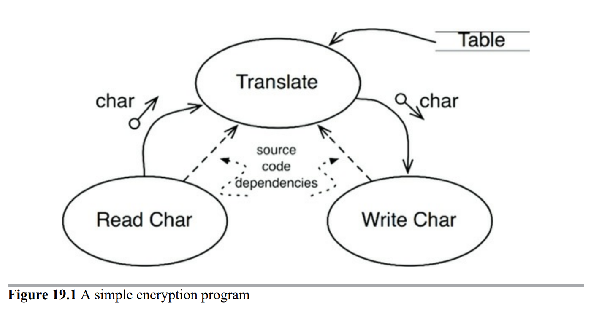

# 19장. 정책과 수준

동일한 이유로 동일한 시점에 변경되는 정책 → 동일한 수준에 위치 & 동일한 컴포넌트

서로 다른 이유로, 혹은 다른 시점에 변경되는 정잭 → 다른 수준에 위치 & 다른 컴포넌트로 분리

좋은 아키텍처?

= 각 컴포넌트를 연결할 때 의존성 방향이 컴포넌트의 수준을 기반으로 연결되도록 만들어야한다.

= **저수준 컴포넌트가 고수준 컴포넌트에 의존하게 설계되어야 한다.**

# 수준

수준 = 입력과 출력까지의 거리

예시) 암호화 프로그램

1. 입력 장치에서 문자를 읽고
2. 테이블을 참조하여 문자 번역
3. 번역된 문자를 출력 장치로 기록

누가 봐도 입출력 장치가 변경될 가능성이 암호화 알고리즘이 변경될 가능성보다 높아보인다.

- Translate (번역)
    - 최고 수준의 컴포넌트
    - 입력과 출력에서 가장 멀리 떨어져 있기 때문이다.
- Read Char (입력)
- Write Char (출력)

데이터의 흐름과 소스 코드 의존성이 항상 같은 방향을 가리키지는 않는다.

= 번역(Translate)이 입력(Read Char)이나 출력(Write Char)에 의존하면 안 된다.

= **소스 코드 의존성은 그 수준에 따라 결합되어야하며, 데이터 흐름을 기준으로 결합되어서는 안 된다.**

가장 좋은 구조는

Encypt

|

ㅡ  ㅡ ㅡ ㅡ ㅡ ㅡ ㅡ ㅡ  ㅡ

|                                   |

Char Reader(I)  Char Writer(I)

^                                ^

ㅣ                              ㅣ

Console Reader    Console Writer

이렇게 하면 읽기/쓰기 방식이 바뀌어도 Encrypt에게는 영향이 가지 않는다는 장점이 있다.