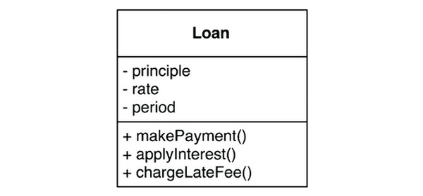

# 20장. 업무 규칙

업무 규칙?

- 사업적으로 수익을 얻거나 비용을 줄일 수 있는 규칙 또는 절차
- 컴퓨터상으로 구현했는지, 아닌지는 상관 없다.
- 핵심 규칙을만들기 위해서는 **핵심 업무 데이터**가 필요함
    - 대출 잔액, 이자율, 지급 일정
- 핵심 규칙 + 핵심 데이터 = **엔티티(Entity)**

# 엔티티

컴퓨터 시스템 내부의 객체

- 핵심 업무 데이터를 직접 포함하거나, **핵심 업무 데이터**에 매우 쉽게 접근할 수 있다.
- 엔티티의 인터페이스는 **핵심 업무 규칙을 구현한 함수**들로 구성된다.

세 가지 핵심 업무 데이터(principle, rate, period)와

세 가지 핵심 업무 규칙(makePayment(), applyInterest(), chargeLateFee())를 인터페이스로 제공

엔티티는 DB, 사용자 인터페이스, 서드파티 프레임워크에 대한 **고려사항들로 오염되어서는 안된다. 순전히 업무에 대한 것이여야 한다.**

# 유스케이스

자동화된 시스템으로 수익을 얻거나 비용을 줄일 수도 있다. → **유스케이스**라고 한다.

엔티티와는 반대로 유스케이스는 **애플리케이션에 특화된 업무 규칙**을 설명한다.

유스케이스는 객체이며, 특화된 업무 규칙을 구현하는 하나 이상의 함수를 제공한다. 또한 유스케이스는 입력 데이터, 출력 데이터, 유스케이스가 상호작용하는 엔티티에 대한 참조 데이터 등의 데이터 요소를 포함한다.

엔티티(고수준)는 자신을 제어하는 유스케이스(저수준)에 대해 아무것도 알지 못한다.

🧐 왜 유스케이스는 저수준이고, 엔티티는 고수준일까?

유스케이스는 단일 애플리케이션에 특화되어있으며, 입력과 출력에 보다 가깝게 위치해있기 때문이다.

# 요청 및 응답 모델

**요청 및 응답 모델은 독립적이여야 한다.** 특히 엔티티 객체를 참조하를 요청 및 응답 데이터 구조에 포함시키지 않게 주의하자! 두 객체의 목적은 완전히 다르다.

# 결론

업무 규칙은 소프트웨어 시스템이 존재하는 이유이자 핵심적인 기능이다. 업무 규칙은 수익을 내고 비용을 줄이는 코드를 수반한다.

업무 규칙은 저수준 관심사(사용자 인터페이스, 데이터베이스)로 인해 오염되어서는 안 되며, 원래 그대로의 모습으로 남아 있어야 한다.