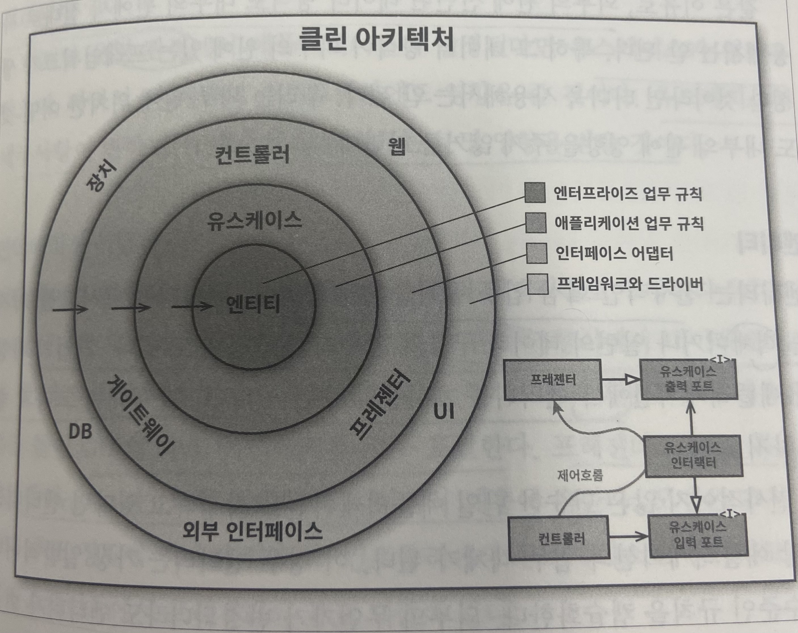
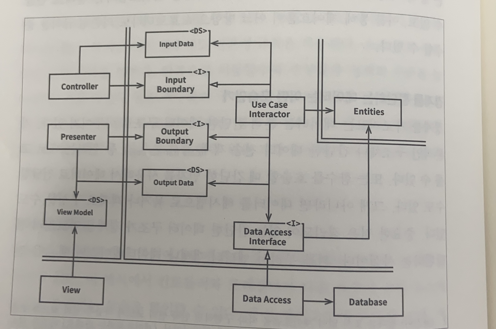

# 22장. 클린 아키텍처

수십 년간 시스템 아키텍처와 관련된 여러가지 아이디어의 목표는 모두 관심사의 분리였습니다.

모두 소프트웨어를 계층으로 분리함으로써 관심사의 분리라는 목표를 달성합니다.

각 아키텍처는 최소한 업무 규칙을 휘나 계층 하나와, 사용자와 시스템 인터페이스를 위한 또 다른 계층 하나를 반드시 포함합니다.

- 프레임워크 독립성
- 테스트 용의성
- UI 독립성
- 데이터베이스 독립성
- 모든 외부 에이전시에 대한 독립성



위 다이어그램은 이들 아키텍처 전부를 실행 가능한 하나의 아이디어로 통합하려는 시도입니다.

# 의존성 규칙

```
소스 코드 의존성은 반드시 안쪽으로, 고수준의 정책을 향해야 한다.
```

아키텍처가 동작하도록 하는 가장 중요한 규칙은 의존성 규칙이고 내부의 우너에 속한 요소는 외부의 원에 속한 어떤 것도 알 수 없습니다.

외부의 원에 선언된 데이터 형식도 내부의 원에서 절대로 사용해서는 안 됩니다.

### 엔티티

엔티티는 메서드를 가지는 객체이거나 일련의 데이터 구조와 함수의 집합으로 전사적인 핵심 업무 규칙을 캡슐화합니다.

외부의 무언가가 변경되더라도 엔티티가 변경될 가능성은 지극히 낮습니다.

운영 관점에서 특정 애플리케이션에 무언가 변경이 필요하더라도 엔티티 계층에는 절대로 영향을 주어서는 안 됩니다.

### 유스케이스

유스케이스 계층의 소프트웨어는 애플리케이션에 특화된 업무 규칙을 포함하고 시스템의 모든 유스케이스를 캡슐화하고 구현합니다.

엔티티로 들어오고 나가는 데이터 흐름을 조정합니다.

이 계층에서 발생한 변경이 엔티티에 영향을 줘서는 안 됩니다.

→유스케이스 계층은 이러한 관심사로부터 격리되어 있습니다

운영 관점에서 애플리케이션이 변경된다면 유스케이스가 영향을 받기때문에 이 계층의 소프트웨어에도 영향이 있습니다.

 즉, 유스케이스의 세부사항이 변하면 이 계층의 코드 일부는 분명 영향을 받을 것입니다.

### 인터페이스 어댑터

인터페이스 어댑터 계층은 일련의 어댑터들로 구성됩니다.

어댑터는 데이터를 유스케이스와 엔티티에게 가장 편리한 형식에서 데이터베이스나 웹 같은 외부 에이전시에게 가장 편리한 형식으로 변환합니다.

→ 프레젠터, 뷰, 컨트롤러는 모두 인터페이스 어댑터 계층에 속합니다.
(모델은 그저 데이터 구조로 컨트롤러에서 유스케이스로 전달되고, 다시 유스케이스에서 프레젠터와 뷰로 되돌아 갑니다.)

### 프레임워크와 드라이버

가장 바깥쪽 계층은 일반적으로 데이터베이스나 웹 프레임워크 같은 프레임워크 도구들로 구성됩니다.

→ 안쪽 원과 통신하기 위한 접합 코드 외에 특별한 코드 많지 않습니다.

모든 세부사항이 위치하는 곳으로 웹, 데이터베이스 등 이 해당됩니다.

### 원은 네 개여야만 하나?

원은 네 개 보다 더 많은 수 있습니다.

→ 하지만 어떤 경우에도 의존성 규칙은 적용됩니다. 즉, 소스 코드 의종성은 항상 안쪽을 향하게 됩니다.

안쪽으로 이동할수록 추상화와 정책의 수준은 높아지고 소프트웨어는 점점 추상화되며 더 높은 수준의 정책들을 캠슐화합니다. (가장 범용적이며 높은 수준)

바깥쪽으로 이동할수록 저수준의 구체적인 세부사항으로 구성됩니다.

### 경계 횡단하기

제어흐름과 의존성의 방향이 반대여야 하는 경우는 의존성 역적 원칙을 사용해 해결합니다.

동적 다형성을 이요해 소스 코드 의존성을 제어흐름관느 반대로 만들 수 있고, 이를 통해 제어흐름이 어느 방향으로 흐르더라도 의존성 규칙을 준수할 수 있습니다.

### 경계를 횡단하는 데이터는 어떤 모습인가

경계를 가로지르는 데이터는 기본적인 구조체나 간단한 데이터 전송 객체 등 간단한 데이터 구졸 이루어져 있고 원하는 대로 고를 수 있습니다.

중요한 점은 격리되어 있는 간단한 데이터 구조가 경계를 가로질러 전달된다는 사실입니다.

경계를 가로질러 데이터를 전달 할 떄, 데이터는 항상 내부의 원에서 사용하기에 가장 편리한 형태를 가져야만 합니다.

# 전형적인 시나리오




# 결론

📌  소프트웨어를 계층으로 분리하고 의존성 규칙을 준수하면 본질적으로 테스트하기 쉬운 시스템을 만들 수 있습니다.