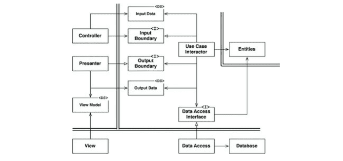

# 22장. 클린 아키텍처

> 관심사의 분리

그리고 아래와 같은 특징을 지니도록 한다.

- 프레임워크 독립성 : 프레임워크에 의존하지 않는다.
- 테스트 용이성 : 외부 요소(UI, DB, 웹 서버 ...) 없이도 테스트 할 수 있다.
- UI 독립성 : 시스템의 나머지 부분을 변경하지 않고도 UI를 쉽게 변경할 수 있다. (ex. 웹 → 콘솔)
- 데이터베이스 독립성 : DB를 쉽게 변경할 수 있다. 업무 규칙은 DB에 결합되지 않는다.
- 모든 외부 에이전시에 대한 독립성 : 업무 규칙은 외부 세계와의 인터페이스에 대해 전혀 알지 못한다.

# 의존성 규칙

바깥쪽 원은 메커니즘, 안쪽 원은 정책이다.

> 소스 코드의 의존성은 반드시 안쪽으로, 고수준의 정책을 향해야 한다.

- 내부의 원에 속한 요소는 외부의 원에 속한 어떤 것도 알지 못한다. (ex. 함수, 클래스, 변수, 엔티티 ...)
- 외부의 원에 선언된 데이터 형식도 내부의 원에서 절대로 사용해선 안 된다.

# 엔티티

전사적인 핵심 업무를 캡슐화 한다. → 외부의 무언가가 변경되더라도 엔티티가 변경될 가능성은 현저히 낮다.

운영 관점에서 특정 애플리케이션에 무언가 변경이 필요하더라도 엔티티 계층에는 절대로 영향을 주어서는 안된다.

# 유스케이스

유유스케이스 계층의 소프트웨어는 애플리케이션에 특화된 업무 규칙을 포함한다. 즉, 시스템의 모든 유스케이스를 캡슐화하고 구현한다.

→  엔티티가 자신의 핵심 업무 규칙을 사용해서 유스케이스의 목적을 달성하도록 이끈다.

여기서 발생한 변경은 엔티티에게 영향을 주면 안되고, 유스케이스 바깥에 있는 외부 요소에서 발생한 변경 역시도 유스케이스에게 영향을 주면 안된다.

# 인터페이스 어댑터

인터페이스 어댑터 계층은 일련의 어댑터들로 구성되고 어댑터는 데이터를 유스케이스와 엔티티에게 가장 편리한 형식에서 데이터페이스나 웹 같은 외부 에이전시에게 가장 편리한 형식으로 변환한다.

→ MVC 아키텍처를 모두 포괄한다. 프레젠터, 뷰, 컨트롤러는 모두 인터페이스 어댑터 계층에 속한다.

이 계층에서는 외부적인 형식에서 유스케이스나 엔티티에서 사용되는 내부적인 형식으로 변환하는 또 다른 어댑터가 필요하다.

# 프레임워크와 드라이버

가장 바깥쪽 계층. 세부사항(프레임워크, DB)이 위치하는 곳이다

# 원은 네 개여야만 하나?

ㄴㄴ 그런건 아님. 하지만 어떤 경우에도 의존성 규칙은 적용되고, 의존성 규칙은 항상 안쪽을 향한다.

가장 안쪽 원은 가장 범용적이며 높은 수준을 가진다.

# 경계 횡단하기

제어흐름과 의존성의 방향이 명백히 반대여야 하는 경우, 대체로 의존성 역전 원칙을 사용하여 해결한다.

동적 다형성을 이용하면 소스 코드 의존성을 제어흐름과는 반대로 반들 수 있고, 이를 통해 제어흐름이 어느 방향으로 흐르더라도 의존성 규칙을 준수할 수 있다.

# 경계를 횡단하는 데이터는 어떤 모습인가

격리되어 있는 간단한 데이터 구조가 경계를 가로질러 전달된다. 

내부의 원에서 외부 원의 무언가를 알지 못하도록 항상 내부의 원에서 사용하기에 가장 편리한 형태를 가져야만 한다.

# 전형적인 시나리오

의존성 방향에 주목하라. 모든 의존성은 경계선을 안쪽으로 가로지르며, 따라서 의존성 규칙을 준수한다.

# 결론

소프트웨어를 계층으로 분리하고 의존성 규칙을 준수하면 본질적으로 테스트하기 쉬운 시스템을 만들게 될 것이며, 그에 따른 이점을 누릴 수 있다. (ex. 세부사항을 쉽게 교체할 수 있다.)