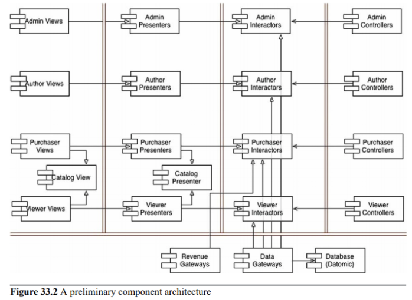
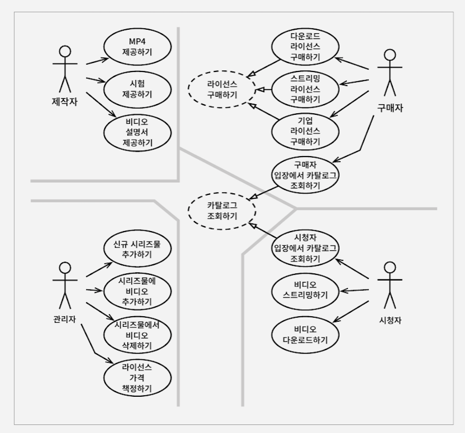

# 33장. 사례 연구 : 비디오 판매

# 제품

웹 사이트에서 비디오를 판매하는 소프트웨어!

- 비디오들이 있고, 웹을 통해 기업과 개인에게 판매한다.
- 비디오 파일과 설명서, 기타 파일들을 포함한다.
- 개인은 단품 가격을 지불해 스트리밍으로 보거나, 추가금을 내고 영구 소장이 가능하다.
- 기업은 스트리밍 전용이고, 대량 구매를 하면 할인을 받을 수 있다.

# 유스케이스 분석

시스템이 변경되어야 할 네가지 주요 근원은

- 제작자
- 구매자
- 관리자
- 시청자

만약 기능 추가, 또는 변경을 해야한다면 이들 액터 중 하나에게 해당 기능을 제공하기 위해서이다.

그렇기 때문에 우리는 시스템을 분할해서 특정 액터를 위한 변경이 나머지에게 영향을 미치지 않게 해야한다.

점선으로 표시한 부분은 추상 유스케이스이다. 범용적인 정책을 담고 있으며, 다른 유스케이스에서 이를 더 구체화한다.

- 시청자 입장의 카탈로그 조회하기
- 구매자 입장에서 카탈로그 조회하기

모두 '카탈로그 조회하기'라는 추상 유스케이스를 상속받는다.

# 컴포넌트 아키텍처

이중으로 된 선은 아키텍처 경계를 나타낸다. (뷰, 프레젠터, 인터랙터, 컨트롤러)

# 의존성 관리

대부분은 제어 흐름은 오른쪽에서 왼쪽으로 이동한다. 

사용 관계(열림 화살표)는 제어흐름과 같은 방향을 가리키며, 상속 관계(닫힌 화살표)는 제어 흐름과는 반대 방향을 가리킨다. →  개방 폐쇄 원칙을 적용했다.

# 결론

코드를 구조화 하면 시스템을 실제로 배포하는 방식은 다양하게 선택할 수 있게 된다,