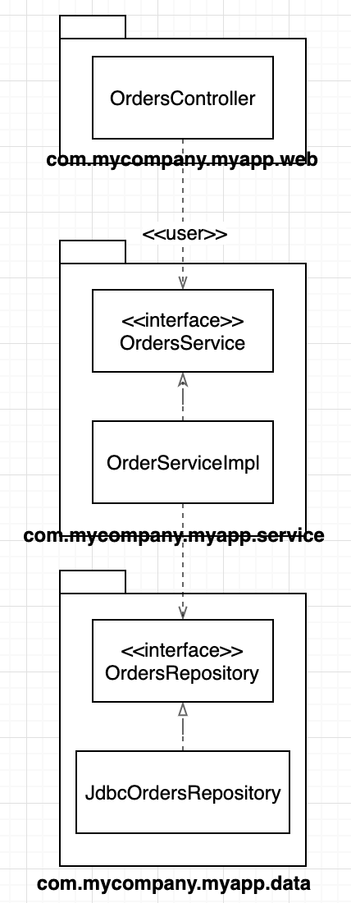
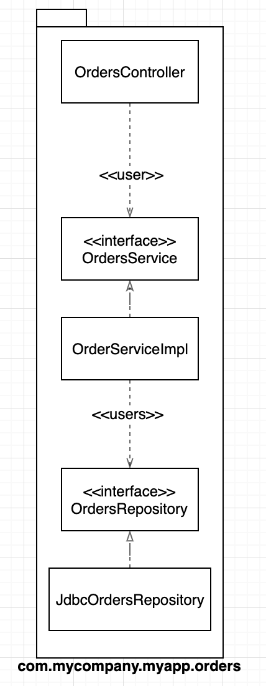
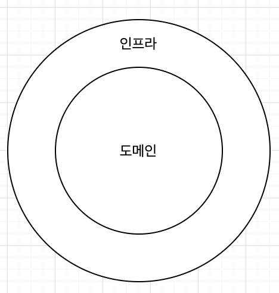
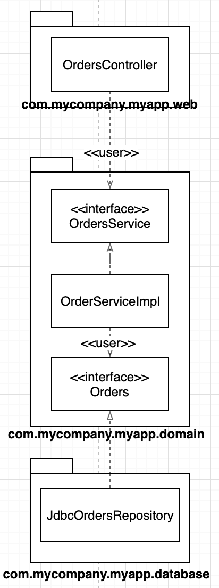
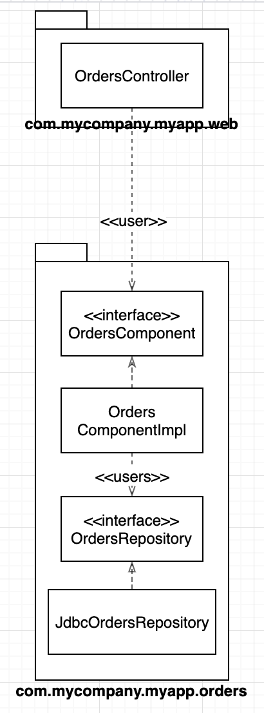
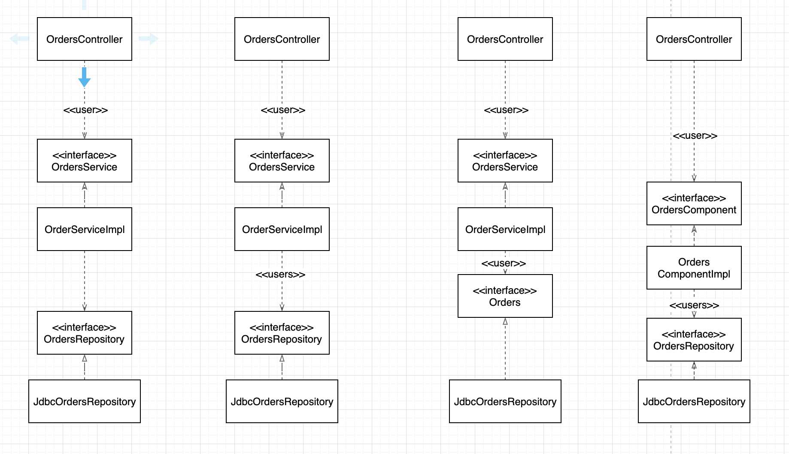
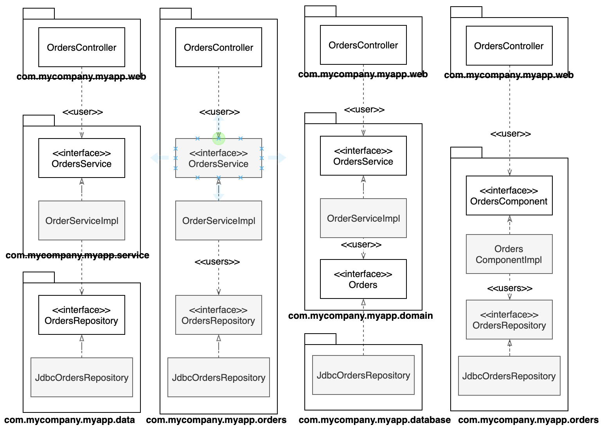

# 34장. 빠져 있는 장

# 계층 기반 패키지

- 웹
    - OrdersController
- 업무 규칙
    - OrdersService : 주문 관련 '업무 규칙'을 정의하는 인터페이스
- 영속성 코드
    - OrderRepository

를 위한 계층이 각각 하나씩 존재한다.

엄청난 복잡함을 겪지 않고도 무언가를 작동시켜 주는 아주 빠른 방법.

단, 소프트웨어가 커지고 복잡해지면 모든 코드를 담기 부족하다.

# 기능 기반 패키지

서로 연관된 기능, 도메인 개념, 또는 애그리거트에 기반해서 얇은 조각으로 코드를 나누는 방식

- 모든 타입이 하나의 자바 패키지 않에 속함
- 코드의 상위 수준 구조가 업무 도메인에 대해 알려줌
- 하나의 유스케이스(주문)를 변경해야할 코드가 모두 한 패키지에 담김

이것 역시도 차선책이다.

# 포트와 어댑터

- 내부(도메인) : 도메인 개념을 모두 포함
- 외부(인프라) : 외부 세계(DB, UI, 서드파티)와의 상호작용을 포함

외부는 내부에 의존하며, 내부는 외부에 의존하면 안 된다.

여기서 domain 패키지는 내부, 나머지는 외부이다.

# 컴포넌트 기반 패키지

## 엄격한 계층형 아키텍처

- 의존성 화살표는 반드시 아래를 향해야 한다.
- 각 계층은 반드시 바로 아래 계층에 의존해야 한다.

## 완화된 계층형 아키텍처

- 계층과 인접한 계층들을 건너뛰는 것을 허용한다.
- 의존성 화살표는 반드시 아래를 향해야 한다.
- 경우에 따라서는 의도한다.
    - CQRS패턴 (변경조회 분리)
    - 이외에는 바람직하지 못한다. 특히 인증된 접근만을 허용하는 일을 업무 로직이 책임지는 경우라면 더더욱

## 예방책

- 아키텍처 원칙이 필요하다.
- 정적 분석 도구 사용 가능 (NDepend, Structure101, Checkstyle)
- 컴파일러를 사용할 수도 있다.

큰 단위의 단일 컴포넌트와 관련된 모든 책임을 하나의 자바 패키지로 묶는데 주안점을 둔다.

> 컴포넌트는 멋지고 깔끔한 인터페이스로 감싸진 연관된 기능들의 묶음으로, 애플리케이션과 같은 실행 환경 내부에 존재한다.

소프트웨어 시스템

- 하나 이상의 컨테이너
    - 하나 이상의 컴포넌트

# 구현 세부사항에는 항상 문제가 있다

모든 타입에서 public 지시자를 사용한다는 건 사용하는 프로그래밍 언어가 제공하는 캡슐화 관련 이점을 활용하지 않겠다는 뜻이다.

# 조직화 vs 캡슐화

모든 타입을 public 으로 선언한다면, 우리가 실제로 갖게 되는 것은 수평적 계층형 아키텍처를 표현하는 네 가지 방식에 지나지 않는다.

자바에서 접근 지시자를 적절하게 사용하면, 다이어그램은 상당히 인상적으로 변한다.

# 결론

최적의 설계를 했더라도 구현 전략에 얽힌 복잡함을 고려하자. 가능하다면 선택사항을 열어두되, 실용적으로 행동해야 한다. 또한 선택된 아키텍처 스타일을 강제하는데 컴파일러의 도움을 받을수 있을지 고민하며, 데이터 모델과 같은 다른 영역에 결합되지 않도록 주의하자. 구현 세부사항에는 항상 문제가 있는 법이다.