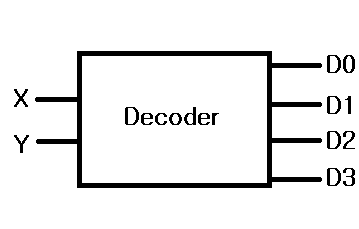

# 2장. 전자회로의 조합 논리

# 디지털 컴퓨터의 사례

가장 처음에는 톱니바퀴를 기반으로 계산을 함

→ 계산자(slide rule) : 고정된 x의 로그 눈금과 이동 가능한 y의 로그 눈금으로 곱계산 가능

→ 차분 기관(difference engine) : 요구하는 정밀도가 그 당시 기술로는 제작 불가능

## 아날로그와 디지털의 차이

- 계산자(아날로그)
    - 소수점 표현 가능
    - 연속적이다.
    - 정확한 수를 선택하기 어렵다. (ex. 9.105) → 크기를 키우면 되긴 하지만, 키울수록 이동이 어렵다.
- 손가락(디지털)
    - 소수점 표현 불가능
    - 이산적이다.
    

## 하드웨어에서 속도가 중요한 이유

컴퓨터에서 전자의 시간을 최소화하는 방법 → 부품을 가능한 가깝게 이동한다.

가까울수록 필요한 에너지 양이 줄어든다. → 저전력소모 & 열발생감소

## 디지털을 사용하면 더 안정적인 장치를 만들 수 있다

작아지면 속도는 빨라지지만, 서로가 간섭하기 쉬워진다.

디지털은 중간값이 없지만 아날로그는 중간값이 있다. 즉, 디지털이 더 안정적이다.

그렇다면 아날로그 세계를 어떻게 조작해서 디지털적 동작을 얻을 수 있을까?

## 아날로그 세상에서 디지털 만들기

전이 함수

- 아날로그 → 선형 영역을 크게 만들기 위해 노력하는 것
- 디지털 → 직선부를 가능한 작게 만드는 것

하단부 영역이나 상단부 영역을 유지하는게 중간 상태에서 균형을 유지하는 것보다 쉽다.

## 10진 숫자 대신 비트를 사용하는 이유

- 숫자 대신 비트를 사용하면 100배 이상 효율이 좋아진다.
- 숫자는 전이 함수를 각기 다른 10가지 문턱값으로 구분할 수 있는 방법이 없다.
- 비트가 전이함수가 더 가파르기 때문에 차단(하단부 영역)에서 포화(상단부 영역)으로 빠르게 움직일 수 있다.

# 간단한 전기 이론 가이드

## 전기는 수도 배관과 유사하다

AND 연산을 구현하는 배관 → 직렬 연결

OR 연산을 구현하는 배관 → 병렬 연결

### 용어

- 전기선
    - 도체 : 내부에 있는 금속 (파이프로 치면 파이프 내부)
    - 부도체 : 금속 바깥쪽을 둘러싼 부분 (파이프로 치면 파이프 자체)
- 옴의 법칙
    - 전압 : 전기의 압력 / 단위 → 볼트(V)
    - 전류 : 전기 흐름의 양 / 단위 → 암페어(A)
    - 저항 : 전기의 양을 제한하는 양 / 단위 → 옴(Ω)
    - 옴의 법칙 : $I = V|R$ = 전류는 저항을 전압으로 나눈 값과 같다.
    

## 전기 스위치

전기는 스위치가 열려있으면 흐르지 못한다.

스위치가 닫히면 전류가 전원에서 나와 스위치를 통과한 다음 전구를 흐르고 다시 전원으로 돌아간다.

# 비트를 처리하기 위한 하드웨어

## 릴레이

스위치를 움직이기 위해 전자석(선을 둥글게 감아 코일로 만들고 전기를 흘려보낼 수 있는 것)을 사용하는 장치.

- 두 릴레이가 모두 활성화돼야 두 선이 연결된다 (AND)
- 두 릴레이 중 어느 하나가 활성화되면 선이 연결된다 (OR)

릴레이를 사용하면 NOT 함수를 구현하는 인버터를 만들 수 있다.

→ 하지만 느리고, 전기를 많이 소모하며, 이물질이 스위치 접점에 있으면 제대로 작동하지 않는다.

## 진공관

- 캐소드
- 히터: 캐소드를 가열하는 역할을 한다.
- 애노드: 캐소드에서 발생한 전자는 진공관 속에서 애노드로 날아간다.
- 그리드: ‘타자' 역할을 한다.

히터는 캐소드를 가열해 전자가 튀어 나가게 하고, 그리드가 방해하지 않으면전자가 애노드에 도달한다. 그리드 = 스위치 손잡이

→ 아주 뜨겁고 깨지기 쉽다.

## 트랜지스터

진공관가 비슷하지만 반도체(도체, 부도체 사이를 오갈 수 있는 물질)를 사용한다. 트랜지스터는 작지만 쉽게 녹을 수 있어 열을 제거하는 일은 아주 중요하다.

- 기판 또는 슬랩 위에 만들어진다.
- 개별적으로 생산되는 물체가 아닌, 트랜지스터 그림을 실리콘 웨이퍼 위에 투영해서 현상하는 광식각이라는 과정을 통해 만들어진다.

## 집적 회로

트랜지스터는 좋지만, 간단한 회로를 만들 때에도 부품이 너무 많이 필요하다.

집적 회로는 복잡한 시스템을 트랜지스터 하나를 만드는 정도의 비용으로 만들 수 있다.

# 게이트를 조합한 복잡한 회로

## 가산기

### 반가산기

가산기란 덧셈 연산을 수행하기 위한 논리회로이다. 반가산기는 한 자릿수 이진수를 연산하고, 자리올림수는 carry로 출력한다.

→ 두 비트를 더할 때는 반가산기만으로 충분하지만, 올림을 처리하려면 세 번째 입력이 필요하다. 

### 전가산기

전가산기는 하위의 자리올림수 입력을 포함하여 한 자릿수 이진수를 연산한다. 하위의 자리올림수를 포함하여 연산하므로 n자릿수의 이진수 덧셈이 가능하다.

→ 전가산기를 통해 여러 비트를 더하는 가산기를 만들 수 있다.

### 리플 자리올림 가산기

자리올림이 아래쪽 비트 → 위쪽 비트로 물결이 퍼져나가는 것 처럼 전달되어 보여 붙은 이름. 

→ 비트를 하나 처리할 때마다 게이트 2개에 해당하는 출력 시간 지연이 발생한다. 올림 예측 가산기를 사용하면 출력 시간 지연을 없앨 수 있다. 

## 디코더

인코딩된 수를 개별 비트의 집합으로 만들어주는 것. 디코더를 사용하면 디멀티플렉서(디먹스)를 만들 수 있다. 디먹스는 입력 신호를 디코더 입력에 따라 여러가지 출력 중 하나로 전달한다.

## 실렉터

게이트를 사용하면 실렉터 또는 멀티플렉서를 만들 수 있다.